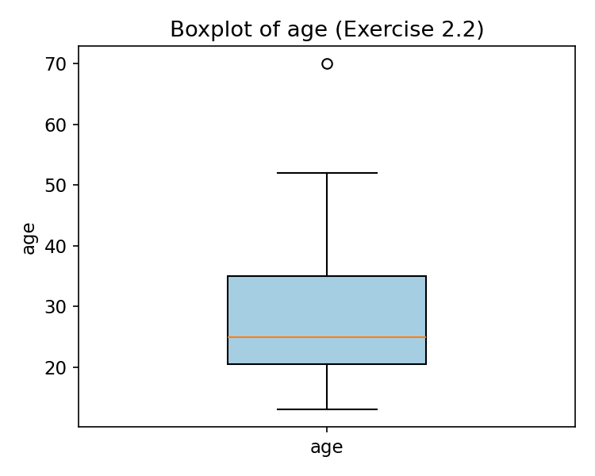
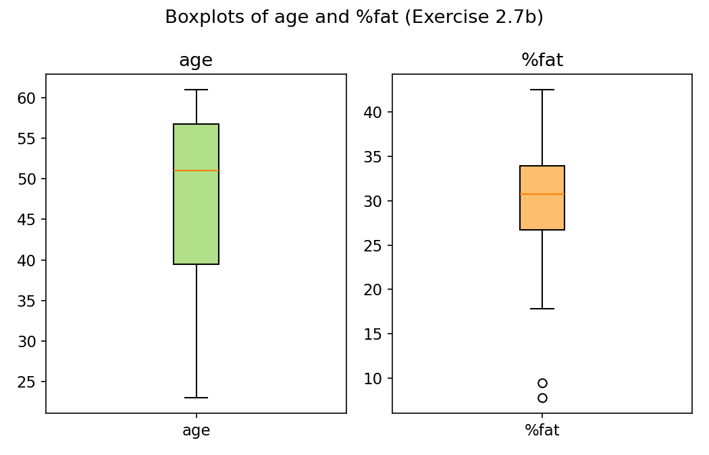
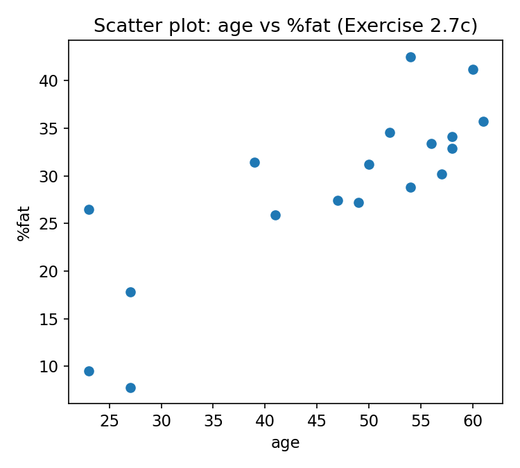
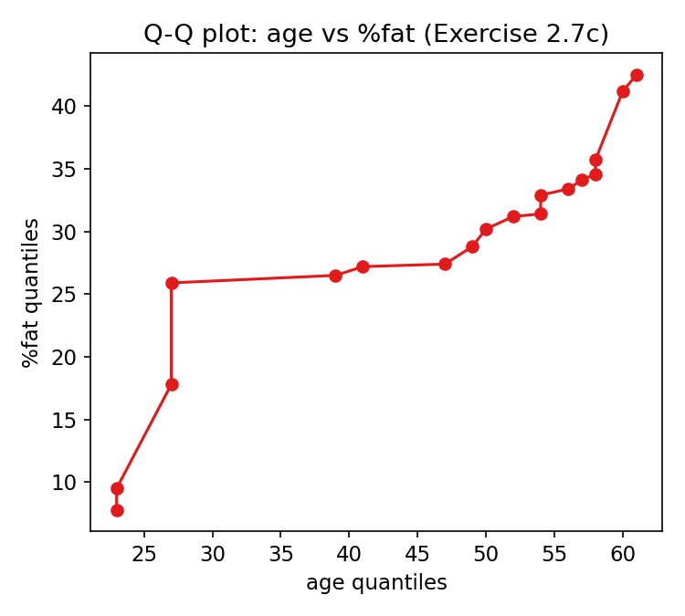
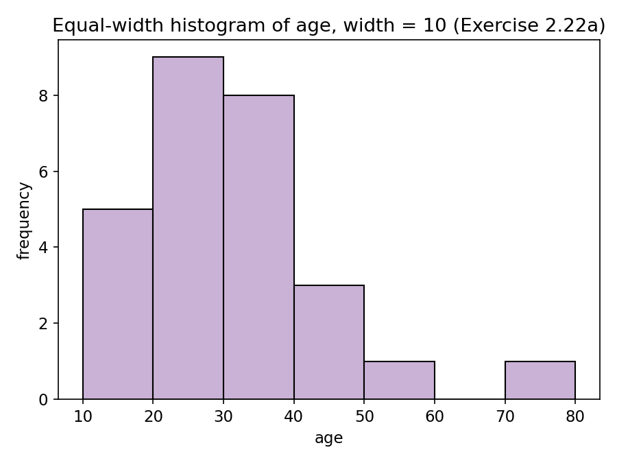

# Lời giải Bài tập Chương 2 — Data, Measurements, and Data Preprocessing

## 2.1. Ba độ đo thống kê bổ sung cho độ phân tán dữ liệu

Ba độ đo dispersion chưa được trình bày trong chương: **Mean Absolute Deviation (MAD)**, **Coefficient of Variation (CV)**, và **Median Absolute Deviation (MAD_median)**.

| Độ đo | Công thức | Loại | Tính hiệu quả trên big data |
|---|---|---|---|
| Mean Absolute Deviation | $MAD=\frac{1}{n}\sum_i \lvert x_i-\bar x\rvert$ | 2‑pass algebraic | Pass 1: MapReduce tính (Σx, n) → x̄ (distributive). Pass 2: MapReduce tính Σ\|xᵢ−x̄\| → chia n. O(n), song song hoàn toàn. |
| Coefficient of Variation | $CV=\dfrac{s}{\bar x}\times100\%$ | Algebraic | Suy ra trực tiếp từ (Σx, Σx², n) — các đại lượng distributive tính trong **1 lượt quét**, gộp bằng phép cộng giữa các partition; có thể cập nhật incremental (Welford). |
| Median Absolute Deviation | $MAD_{med}=\text{median}(\lvert x_i-\text{median}(X)\rvert)$ | Holistic | Không thể gộp từ các sub‑aggregate cỡ cố định. Trên dữ liệu lớn dùng **approximate quantile sketch** (Greenwald–Khanna, t‑digest, KLL) chạy 1 lượt, bộ nhớ O((1/ε)log(εn)), mergeable giữa các partition — thay cho sắp xếp toàn bộ O(n log n). |

**Nguyên tắc chung:** phân loại độ đo theo *distributive → algebraic → holistic* (giống cách chương phân loại variance là "algebraic, scalable"). Đại lượng distributive/algebraic tính bằng 1–2 lượt MapReduce/Spark; đại lượng holistic cần sketch xấp xỉ hoặc lấy mẫu để tránh chi phí sắp xếp toàn cục.

---

## 2.2. Dữ liệu age (27 giá trị, đã sắp xếp)

`13, 15, 16, 16, 19, 20, 20, 21, 22, 22, 25, 25, 25, 25, 30, 33, 33, 35, 35, 35, 35, 36, 40, 45, 46, 52, 70`

**a. Mean và Median**

- Tổng = 809, n = 27 → **Mean = 809/27 ≈ 29.96**
- n lẻ → median là giá trị thứ (27+1)/2 = 14 → **Median = 25**

**b. Mode**

Tần suất: 25 xuất hiện 4 lần, 35 xuất hiện 4 lần (nhiều nhất). Các giá trị khác xuất hiện ≤ 2 lần.
→ **Mode = {25, 35} — dữ liệu là bimodal** (hai đỉnh, phân bố không đơn giản là một cụm tập trung quanh một giá trị).

**c. Midrange**

Midrange = (min + max)/2 = (13 + 70)/2 = **41.5**

**d. Q1 và Q3 (ước lượng)**

Dùng công thức hạng vị trí (n+1)/4:
- Vị trí Q1 = (27+1)/4 = 7 → **Q1 = 20** (giá trị thứ 7)
- Vị trí Q3 = 3(27+1)/4 = 21 → **Q3 = 35** (giá trị thứ 21)

**e. Five-number summary**

**Min = 13, Q1 = 20, Median = 25, Q3 = 35, Max = 70**

**f. Boxplot**

IQR = 35 − 20 = 15; ngưỡng outlier = Q3 + 1.5×IQR = 35 + 22.5 = 57.5 → giá trị 70 vượt ngưỡng, được vẽ như một điểm outlier riêng lẻ, râu trên (whisker) chỉ kéo tới 52 (giá trị lớn nhất không phải outlier).



---

## 2.3. Median xấp xỉ cho dữ liệu nhóm

| Khoảng age | Tần suất | Tần suất tích lũy |
|---|---|---|
| 1–5 | 200 | 200 |
| 6–15 | 450 | 650 |
| 16–20 | 300 | 950 |
| **21–50** | **1500** | 2450 |
| 51–80 | 700 | 3150 |
| 81–110 | 44 | 3194 |

Tổng n = 3194 → n/2 = 1597. Khoảng chứa median là **21–50** (vì 950 < 1597 < 2450).

Công thức nội suy:
$$median \approx L_1 + \left(\frac{n/2-\sum freq_{before}}{freq_{median}}\right)\times width$$

Với L1 = 21, width = 30, Σfreq_before = 950, freq_median = 1500:

$$median \approx 21 + \frac{1597-950}{1500}\times 30 = 21 + 12.94 \approx \mathbf{33.94}$$

---

## 2.4. Quantile plot khác Quantile-Quantile (Q-Q) plot như thế nào?

- **Quantile plot**: chỉ dùng cho **một** biến. Mỗi giá trị xᵢ (đã sắp xếp) được gắn với fᵢ — tỉ lệ phần trăm dữ liệu ≤ xᵢ. Cho thấy hình dạng phân phối và các giá trị bất thường của một biến duy nhất.
- **Q-Q plot**: so sánh **hai** phân phối (hai biến, hoặc một biến với một phân phối lý thuyết) bằng cách vẽ các quantile tương ứng của phân phối này với phân phối kia. Dùng để phát hiện có sự **dịch chuyển (shift)** hoặc khác biệt về scale/shape giữa hai phân phối hay không (nếu hai phân phối giống nhau, các điểm nằm gần đường y = x).

---

## 2.5. Vì sao công thức sample variance khác population variance (chia n−1 thay vì n)?

Khi tính variance từ **mẫu** (sample), ta dùng x̄ (trung bình mẫu) thay cho µ (trung bình thật của population, thường không biết). Nhưng x̄ được tính **từ chính dữ liệu mẫu đó**, nên nó luôn làm tổng bình phương độ lệch Σ(xᵢ−x̄)² **nhỏ nhất có thể** so với bất kỳ hằng số nào khác — điều này khiến ước lượng dùng divisor = n bị **thiên lệch (biased)**, hệ thống đánh giá thấp variance thực của population.

Về mặt bậc tự do (degrees of freedom): trong n độ lệch (xᵢ−x̄), chỉ có (n−1) độ lệch độc lập vì chúng luôn thỏa ràng buộc Σ(xᵢ−x̄) = 0 — độ lệch cuối cùng bị xác định bởi (n−1) độ lệch còn lại. Chia cho (n−1) thay vì n là "hiệu chỉnh Bessel", giúp s² trở thành **ước lượng không thiên lệch (unbiased estimator)** của σ².

---

## 2.6. Vì sao variance/standard deviation tính hiệu quả trên dữ liệu rất lớn?

Vì variance là một **độ đo algebraic**: nó có thể tính hoàn toàn từ ba đại lượng **distributive**:
- n (đếm số phần tử),
- Σx (tổng),
- Σx² (tổng bình phương),

theo công thức $\sigma^2=\frac{1}{n}\sum x_i^2-\bar x^2$ (hoặc chia n−1 cho sample variance).

Ba đại lượng này:
1. Chỉ cần **một lượt quét (single pass)** qua dữ liệu để tính.
2. Có thể tính **song song trên từng partition/node** (mỗi node tính (n_local, Σx_local, Σx²_local)) rồi **gộp bằng phép cộng đơn giản** ở bước reduce — phù hợp tự nhiên với MapReduce/Spark.
3. Có thể cập nhật **incremental/streaming** (thuật toán Welford hoặc thuật toán song song Chan et al.) khi có dữ liệu mới, không cần tính lại từ đầu.

→ Không cần lưu toàn bộ dữ liệu thô hay quét nhiều lần, nên rất phù hợp cho cơ sở dữ liệu/big data cực lớn.

---

## 2.7. Dữ liệu age & %fat (18 người)

age: 23,23,27,27,39,41,47,49,50,52,54,54,56,57,58,58,60,61
%fat: 9.5,26.5,7.8,17.8,31.4,25.9,27.4,27.2,31.2,34.6,42.5,28.8,33.4,30.2,34.1,32.9,41.2,35.7

**a. Mean, Median, Standard deviation**

| | age | %fat |
|---|---|---|
| Σ | 836 | 518.1 |
| Mean | 836/18 = **46.44** | 518.1/18 = **28.78** |
| Median (TB 2 giá trị giữa, n=18) | (50+52)/2 = **51** | (30.2+31.2)/2 = **30.7** |
| Sample variance s² | 2970.44/17 = 174.73 | 1455.95/17 = 85.64 |
| Sample std s | **≈ 13.22** | **≈ 9.25** |

**b. Boxplots**

Five-number summary (dùng phương pháp median-of-halves):
- age: Min 23, Q1 39, Median 51, Q3 57, Max 61 → IQR = 18, không có outlier.
- %fat: Min 7.8, Q1 26.5, Median 30.7, Q3 34.1, Max 42.5 → IQR = 7.6, ngưỡng dưới = 26.5 − 1.5×7.6 = 15.1 → **7.8 và 9.5 là outlier thấp**.



**c. Scatter plot và Q-Q plot**





Nhận xét: scatter plot cho thấy xu hướng **tương quan dương** khá rõ giữa age và %fat (age càng lớn, %fat có xu hướng càng cao). Q-Q plot gần như là một đường tăng dần đều, không lệch mạnh khỏi tuyến tính, cho thấy hai phân phối có hình dạng khá tương đồng (cùng có xu hướng tăng đơn điệu theo quantile).

---

## 2.8. Tính độ phi tương tự (dissimilarity) giữa các đối tượng

**a. Thuộc tính nominal:** dùng phương pháp *simple matching*:
$$d(i,j)=\frac{p-m}{p}$$
với p = tổng số thuộc tính, m = số thuộc tính có giá trị trùng nhau. (Hoặc chuyển mỗi thuộc tính nominal thành một tập thuộc tính nhị phân bằng one-hot encoding rồi áp dụng cách tính cho thuộc tính binary.)

**b. Thuộc tính binary bất đối xứng (asymmetric):** chỉ đếm các trường hợp "cả hai cùng 1" là có ý nghĩa, bỏ qua trường hợp "cả hai cùng 0" (negative match không mang thông tin). Dùng hệ số Jaccard:
$$d(i,j)=\frac{r+s}{q+r+s}$$
với q = số thuộc tính cả hai đều 1, r = i=1,j=0, s = i=0,j=1 (t = cả hai đều 0, bị loại khỏi mẫu số).

**c. Thuộc tính numeric:** dùng họ khoảng cách Minkowski (Euclidean h=2, Manhattan h=1, supremum h=∞); nên **chuẩn hóa** (z-score hoặc min-max) trước để các thuộc tính có scale khác nhau không lấn át nhau.

**d. Term-frequency vector:** thường dùng **cosine dissimilarity**:
$$d(i,j)=1-\cos(\theta)=1-\frac{\vec v_i\cdot \vec v_j}{\lVert \vec v_i\rVert\,\lVert \vec v_j\rVert}$$
phù hợp vì vector tần suất từ thường có số chiều rất lớn, thưa (sparse), và độ dài văn bản (magnitude) không nên ảnh hưởng đến độ tương tự về nội dung.

---

## 2.9. Khoảng cách giữa (22, 1, 42, 10) và (20, 0, 36, 8)

Độ lệch từng chiều: (2, 1, 6, 2)

- **a. Euclidean**: $\sqrt{2^2+1^2+6^2+2^2}=\sqrt{45}\approx \mathbf{6.708}$
- **b. Manhattan**: $2+1+6+2=\mathbf{11}$
- **c. Minkowski (h=3)**: $(2^3+1^3+6^3+2^3)^{1/3}=(233)^{1/3}\approx \mathbf{6.153}$
- **d. Supremum**: $\max(2,1,6,2)=\mathbf{6}$

---

## 2.10. Các phương pháp ước lượng Median

| Phương pháp | Độ phức tạp | Độ chính xác |
|---|---|---|
| Sort đầy đủ | O(n log n) | Chính xác tuyệt đối |
| Quickselect / median-of-medians | O(n) trung bình / O(n) tệ nhất | Chính xác tuyệt đối, nhưng cần truy cập toàn bộ dữ liệu, khó song song hóa trực tiếp |
| Histogram (equal-width/equal-depth) + nội suy | O(n) build + O(#bucket) | Xấp xỉ, sai số phụ thuộc độ rộng bucket |
| Lấy mẫu ngẫu nhiên (sampling), tính median mẫu | O(k log k), k = cỡ mẫu | Sai số ~ O(1/√k), có thể điều chỉnh k |
| Sketch xấp xỉ quantile (Greenwald–Khanna, t-digest, q-digest, KLL) | 1 lượt quét, bộ nhớ O((1/ε)log(εn)) | ε-đảm bảo sai số hạng (rank error), mergeable trên hệ phân tán |

**Chiến lược heuristic cân bằng accuracy/complexity:** dùng chiến lược **hai giai đoạn (coarse-to-fine)** — trước tiên dùng phương pháp rẻ (histogram thô hoặc mẫu nhỏ) để thu hẹp nhanh khoảng chứa median về một "bucket"/khoảng hẹp; sau đó chỉ tinh chỉnh (quickselect, hoặc tăng cỡ mẫu/độ chính xác sketch) **trong phạm vi hẹp đó**, tránh phải sort/xử lý toàn bộ n phần tử. Áp dụng: với histogram — tăng dần số bucket ở vùng nghi chứa median; với sampling — tăng dần cỡ mẫu (kiểu bootstrap) cho tới khi khoảng tin cậy của ước lượng đủ hẹp theo yêu cầu ứng dụng; với sketch — giảm dần ε ở vùng cục bộ quanh ước lượng ban đầu.

---

## 2.11. Bộ dữ liệu 2D và độ tương tự

Dữ liệu: x1=(1.5,1.7), x2=(2,1.9), x3=(1.6,1.8), x4=(1.2,1.5), x5=(1.5,1.0). Query x=(1.4,1.6).

**a. Xếp hạng theo từng độ đo** (khoảng cách nhỏ / cosine lớn = giống hơn):

| Điểm | Euclidean | Manhattan | Supremum | Cosine similarity |
|---|---|---|---|---|
| x1 | 0.141 | 0.2 | 0.1 | 0.9997 |
| x2 | 0.671 | 0.9 | 0.6 | 0.9958 |
| x3 | 0.283 | 0.4 | 0.2 | 0.9999 |
| x4 | 0.224 | 0.3 | 0.2 | 0.9987 |
| x5 | 0.608 | 0.7 | 0.6 | 0.9652 |

- Euclidean: **x1 < x4 < x3 < x5 < x2**
- Manhattan: **x1 < x4 < x3 < x5 < x2** (giống Euclidean)
- Supremum: **x1 < (x3 = x4) < (x2 = x5)** (có hòa)
- Cosine similarity (giảm dần): **x3 > x1 > x4 > x2 > x5**

→ Euclidean và Manhattan cho cùng thứ tự trên tập này, nhưng **cosine similarity cho thứ tự khác** (x3 vượt lên trên x1), vì cosine chỉ quan tâm **hướng** của vector, không quan tâm độ lớn/khoảng cách tuyệt đối.

**b. Chuẩn hóa để norm = 1, rồi tính lại Euclidean distance**

Sau khi chuẩn hóa L2 (xᵢ' = xᵢ/‖xᵢ‖) và chuẩn hóa luôn query q' = q/‖q‖, khoảng cách Euclidean trên dữ liệu đã chuẩn hóa:

| Điểm | Euclidean (đã chuẩn hóa) |
|---|---|
| x1' | 0.004 |
| x2' | 0.092 |
| x3' | 0.008 |
| x4' | 0.044 |
| x5' | 0.263 |

Thứ tự: **x1' ≈ x3' < x4' < x2' < x5'** — thứ tự này gần như trùng khớp với thứ tự theo **cosine similarity** ở câu (a) (x1 và x3 gần như ngang nhau, đứng đầu). Điều này minh họa: **Euclidean distance trên vector đã chuẩn hóa norm = 1 tương đương (đơn điệu) với cosine similarity** — chuẩn hóa đã "gỡ bỏ" ảnh hưởng của độ lớn vector, chỉ còn ảnh hưởng của hướng.

---

## 2.12. Data quality và intended use

- **Accuracy**: dữ liệu địa chỉ khách hàng có sai số nhỏ ở số nhà có thể **chấp nhận được** cho phân tích nhân khẩu học theo khu vực, nhưng **không chấp nhận được** khi dùng để giao hàng thực tế (bưu điện cần chính xác tuyệt đối).
- **Completeness**: thiếu trường "tên đệm" có thể không ảnh hưởng gì tới báo cáo thống kê tổng quát, nhưng thiếu trường "thu nhập" ở phần lớn bản ghi sẽ làm sai lệch nghiêm trọng một mô hình chấm điểm tín dụng (credit scoring).
- **Consistency**: một hệ thống vận hành đơn lẻ có thể chấp nhận "NY" và "New York" cùng tồn tại, nhưng khi **tích hợp dữ liệu** từ nhiều nguồn để khai phá dữ liệu, sự không nhất quán này có thể tạo ra các thực thể trùng lặp giả hoặc kết quả gộp nhóm sai.

**Hai khía cạnh khác của data quality:**
- **Timeliness (tính kịp thời)**: dữ liệu giá cổ phiếu trễ vài giây là vô dụng cho giao dịch, nhưng vẫn đủ tốt cho báo cáo hàng năm.
- **Believability/Interpretability (độ tin cậy & khả năng diễn giải)**: dữ liệu phải có nguồn gốc rõ ràng, đơn vị đo/metadata đầy đủ (VD: mã tiền tệ) để người phân tích hiểu và tin dùng đúng cách.

---

## 2.13. Các phương pháp xử lý giá trị thiếu (missing values)

1. **Bỏ qua bản ghi (tuple)**: đơn giản, nhưng mất dữ liệu — chỉ nên dùng khi tỉ lệ thiếu nhỏ và không thiên lệch.
2. **Điền tay (manual)**: chính xác nhất nhưng tốn thời gian, không khả thi với dữ liệu lớn.
3. **Điền bằng một hằng số toàn cục** (VD: "Unknown", hoặc −∞): đơn giản nhưng có thể khiến thuật toán khai phá coi "Unknown" là một giá trị/nhóm có ý nghĩa.
4. **Điền bằng độ đo xu hướng trung tâm của thuộc tính** (mean cho phân phối đối xứng, median cho phân phối lệch).
5. **Điền bằng mean/median của thuộc tính đó tính riêng trong từng lớp (class)** — tận dụng mối liên hệ giữa thuộc tính và nhãn lớp, chính xác hơn cách 4.
6. **Điền bằng giá trị khả dĩ nhất (most probable value)**: dùng hồi quy, cây quyết định, hoặc suy diễn Bayes/thuật toán EM để dự đoán giá trị thiếu dựa trên các thuộc tính khác — chính xác nhất, tận dụng đầy đủ thông tin sẵn có.

---

## 2.14. Dữ liệu age (2.2), làm mịn theo bin means

**a. Equal-frequency bins kích thước 3, smoothing by bin means**

| Bin | Giá trị gốc | Bin mean (giá trị thay thế) |
|---|---|---|
| 1 | 13, 15, 16 | 14.67 |
| 2 | 16, 19, 20 | 18.33 |
| 3 | 20, 21, 22 | 21.00 |
| 4 | 22, 25, 25 | 24.00 |
| 5 | 25, 25, 30 | 26.67 |
| 6 | 33, 33, 35 | 33.67 |
| 7 | 35, 35, 35 | 35.00 |
| 8 | 36, 40, 45 | 40.33 |
| 9 | 46, 52, 70 | 56.00 |

**Nhận xét:** kỹ thuật này làm mịn nhiễu cục bộ khá tốt cho các bin có giá trị đồng đều (VD bin 7: 35,35,35 → không đổi), nhưng ở **bin 9** (46, 52, 70), giá trị outlier 70 kéo trung bình lên 56, làm **méo** cả 3 giá trị (46 và 52 vốn không cực đoan lại bị thay bằng 56) — cho thấy smoothing by bin means khá **nhạy cảm với outlier** khi chúng rơi cùng bin với giá trị bình thường.

**b. Xác định outliers**

Dùng phương pháp boxplot (2.2e): IQR = Q3−Q1 = 35−20 = 15, ngưỡng trên = Q3+1.5×IQR = 57.5. Giá trị **70 > 57.5 → là outlier**. (Có thể kiểm tra thêm bằng z-score: |z| > 2~3 độ lệch chuẩn so với mean, hoặc bằng phương pháp phân cụm/clustering để phát hiện điểm nằm xa các cụm chính.)

**c. Các phương pháp data smoothing khác**

- **Binning bằng bin boundaries** (thay giá trị bằng biên gần nhất của bin thay vì trung bình bin).
- **Regression**: khớp dữ liệu vào một hàm (tuyến tính/đa biến), dùng giá trị dự đoán từ hàm để làm mịn.
- **Outlier analysis / Clustering**: nhóm dữ liệu thành cụm, các điểm nằm ngoài mọi cụm được xem là outlier và xử lý riêng (loại bỏ hoặc điều chỉnh).
- **Kết hợp kiểm tra máy tính và con người**: máy phát hiện nghi vấn, chuyên gia xác nhận và xử lý thủ công các trường hợp bất thường.

---

## 2.15. Các vấn đề cần lưu ý khi tích hợp dữ liệu (data integration)

- **Entity identification / schema integration**: đối chiếu các thực thể/thuộc tính tương đương giữa các nguồn khác nhau (VD: `cust_id` ở nguồn A và `customer_number` ở nguồn B có cùng ý nghĩa hay không) — cần dựa vào metadata (tên, ý nghĩa, kiểu dữ liệu, miền giá trị, ràng buộc null).
- **Redundancy và correlation analysis**: một thuộc tính có thể dư thừa nếu suy ra được từ thuộc tính khác (VD: doanh thu năm suy ra được từ tổng doanh thu 12 tháng) — dùng phân tích tương quan/hiệp phương sai/kiểm định χ² để phát hiện.
- **Phát hiện và giải quyết xung đột giá trị dữ liệu**: cùng một thực thể thực tế nhưng giá trị thuộc tính khác nhau giữa các nguồn do khác biệt về đơn vị đo, thang đo, hoặc quy ước mã hóa (VD: cân nặng kg vs lb, tiền tệ VND vs USD, thang đánh giá 1–5 vs 1–10) — cần quy tắc chuẩn hóa/quy đổi thống nhất.
- **Trùng lặp bản ghi (duplicate tuples)** sau khi gộp dữ liệu từ nhiều nguồn, cần khử trùng (deduplication).

---

## 2.16. Khoảng giá trị của các phương pháp normalization

- **a. Min-max normalization**: khoảng **[new_min, new_max]** do người dùng chỉ định (thường là [0, 1]).
- **b. Z-score normalization**: về lý thuyết **không giới hạn (−∞, +∞)**, nhưng trên thực tế phần lớn giá trị rơi trong khoảng **khoảng [−3, 3] hoặc [−4, 4]** đối với phân phối xấp xỉ chuẩn (do quy tắc 68-95-99.7%).
- **c. Z-score dùng mean absolute deviation (MAD) thay cho độ lệch chuẩn**: cũng không giới hạn cứng, nhưng vì MAD thường **nhỏ hơn** độ lệch chuẩn (ít nhạy với outlier hơn), giá trị chuẩn hóa theo cách này thường **có biên độ lớn hơn** so với dùng std, đặc biệt với các điểm outlier.
- **d. Decimal scaling**: khoảng **(−1, 1)**.

---

## 2.17. Chuẩn hóa dữ liệu 200, 300, 400, 600, 1000

**a. Min-max, [0, 1]**: min=200, max=1000 → v' = (v−200)/800

| v | 200 | 300 | 400 | 600 | 1000 |
|---|---|---|---|---|---|
| v' | 0 | 0.125 | 0.25 | 0.5 | 1.0 |

**b. Z-score**: mean = 500, (population) std σ = √80000 ≈ 282.84

| v | 200 | 300 | 400 | 600 | 1000 |
|---|---|---|---|---|---|
| z | −1.061 | −0.707 | −0.354 | 0.354 | 1.768 |

**c. Z-score dùng MAD**: MAD = mean(|v−500|) = (300+200+100+100+500)/5 = 240

| v | 200 | 300 | 400 | 600 | 1000 |
|---|---|---|---|---|---|
| z' | −1.25 | −0.833 | −0.417 | 0.417 | 2.083 |

**d. Decimal scaling**: max|v| = 1000 → cần chia cho 10^j với j = 4 (để 1000/10^4 = 0.1 < 1)

| v | 200 | 300 | 400 | 600 | 1000 |
|---|---|---|---|---|---|
| v' | 0.02 | 0.03 | 0.04 | 0.06 | 0.10 |

---

## 2.18. Chuẩn hóa giá trị age = 35 (dữ liệu bài 2.14, std = 12.70)

Từ bài 2.2: min = 13, max = 70, mean ≈ 29.96

- **a. Min-max → [0,1]**: (35−13)/(70−13) = 22/57 ≈ **0.386**
- **b. Z-score**: (35−29.96)/12.70 ≈ **0.397**
- **c. Decimal scaling**: max|v| = 70 → j = 2 (70/100 = 0.7 < 1) → 35/100 = **0.35**
- **d. Nhận xét**: Nên ưu tiên **z-score normalization** cho tập dữ liệu này, vì min-max và decimal scaling đều bị **méo bởi outlier 70** (giá trị lớn nhất kéo giãn toàn bộ khoảng chuẩn hóa, khiến các giá trị bình thường bị "nén" gần 0). Z-score dựa trên mean và std nên ít nhạy hơn với một outlier đơn lẻ. (Nếu ứng dụng bắt buộc cần khoảng giá trị cố định như [0,1], có thể cân nhắc loại/giới hạn outlier trước khi dùng min-max.)

---

## 2.19. Chuẩn hóa age & %fat (bài 2.7) và tính tương quan

**a. Z-score normalization**: dùng mean_age=46.44, s_age=13.22, mean_fat=28.78, s_fat=9.25 (từ bài 2.7a), áp dụng z = (x−mean)/s cho từng cặp giá trị (18 cặp) — công thức áp dụng riêng lẻ như minh họa ở bài 2.17b.

**b. Correlation coefficient (Pearson) và Covariance**

$$Cov(age,fat)=\frac{1}{n-1}\sum (age_i-\overline{age})(fat_i-\overline{fat}) = \frac{1700.42}{17}\approx \mathbf{100.03}$$

$$r=\frac{Cov(age,fat)}{s_{age}\cdot s_{fat}}=\frac{100.03}{13.22\times 9.25}\approx \mathbf{0.82}$$

→ **r ≈ 0.82 > 0**: age và %fat **tương quan dương khá mạnh** — người lớn tuổi hơn trong mẫu này có xu hướng có tỉ lệ mỡ cơ thể cao hơn. Covariance dương (≈100.03) cũng xác nhận hai biến cùng tăng/giảm theo nhau.

---

## 2.20. Phân bin 12 giá trị sales price

`5, 10, 11, 13, 15, 35, 50, 55, 72, 92, 204, 215`

**a. Equal-frequency (equal-depth), 3 bin (4 giá trị/bin)**

- Bin 1: 5, 10, 11, 13
- Bin 2: 15, 35, 50, 55
- Bin 3: 72, 92, 204, 215

**b. Equal-width, 3 bin**

Range = 215−5 = 210 → width = 70 → biên: [5,75), [75,145), [145,215]

- Bin 1 [5,75): 5, 10, 11, 13, 15, 35, 50, 55, 72 (9 giá trị)
- Bin 2 [75,145): 92 (1 giá trị)
- Bin 3 [145,215]: 204, 215 (2 giá trị)

**c. Clustering (phân nhóm theo khoảng cách tự nhiên)**

Quan sát các "khe hở" lớn trong dữ liệu (5→15 sát nhau, khoảng cách lớn tới 35; rồi 35→92 tương đối gần nhau; khoảng cách lớn tới 204):

- Cluster 1: 5, 10, 11, 13, 15
- Cluster 2: 35, 50, 55, 72, 92
- Cluster 3: 204, 215

---

## 2.21. Flowchart cho attribute subset selection

**a. Stepwise forward selection**

```
[Bắt đầu: tập thuộc tính đã chọn S = ∅]
        │
        ▼
[Với mỗi thuộc tính chưa chọn: thử thêm vào S, đánh giá tiêu chí]
        │
        ▼
[Chọn thuộc tính cải thiện tiêu chí NHIỀU NHẤT, thêm vào S]
        │
        ▼
  <Tiêu chí còn cải thiện đáng kể?> --No--> [Dừng, trả về S]
        │Yes
        └──────────────► (quay lại bước "Với mỗi thuộc tính chưa chọn")
```

**b. Stepwise backward elimination**

```
[Bắt đầu: S = toàn bộ tập thuộc tính]
        │
        ▼
[Với mỗi thuộc tính đang có trong S: thử loại bỏ, đánh giá tiêu chí]
        │
        ▼
[Loại bỏ thuộc tính làm tiêu chí giảm ÍT NHẤT (ít cần thiết nhất)]
        │
        ▼
  <Loại tiếp có làm giảm tiêu chí đáng kể không?> --No--> (quay lại loại tiếp)
        │Yes
        ▼
   [Dừng, trả về S]
```

**c. Kết hợp forward + backward**

```
[Bắt đầu: S = ∅]
        │
        ▼
[Ở mỗi bước: đồng thời xét (i) thêm thuộc tính tốt nhất chưa có trong S,
              và (ii) loại thuộc tính kém nhất đang có trong S]
        │
        ▼
[Thực hiện thao tác cải thiện tiêu chí nhiều nhất (thêm hoặc bớt)]
        │
        ▼
  <Còn cải thiện được không?> --Yes--> (quay lại bước trên)
        │No
        ▼
   [Dừng, trả về S]
```

---

## 2.22. Dữ liệu age (bài 2.14)

**a. Equal-width histogram, width = 10**



| Khoảng | Tần suất |
|---|---|
| [10,20) | 5 |
| [20,30) | 9 |
| [30,40) | 8 |
| [40,50) | 3 |
| [50,60) | 1 |
| [60,70) | 0 |
| [70,80) | 1 |

**b. Ví dụ các kỹ thuật lấy mẫu (cỡ mẫu = 5)**

Định nghĩa strata theo age: **youth** (<25), **middle-aged** (25–45), **senior** (>45).

- **SRSWOR (Simple Random Sampling Without Replacement)**: chọn ngẫu nhiên 5 bản ghi từ 27 bản ghi, mỗi bản ghi chỉ được chọn tối đa 1 lần. VD: {16, 22, 33, 40, 52}.
- **SRSWR (Simple Random Sampling With Replacement)**: chọn ngẫu nhiên 5 lần, mỗi lần chọn từ toàn bộ 27 bản ghi (có thể trùng). VD: {25, 25, 35, 46, 20} (25 xuất hiện 2 lần vì được "trả lại" sau khi chọn).
- **Cluster sampling**: chia dữ liệu thành các cụm (VD: theo nhóm chỉ số bản ghi liên tiếp/theo cách thu thập), rồi chọn ngẫu nhiên **toàn bộ** một hoặc vài cụm nhỏ làm mẫu, thay vì chọn từng cá thể riêng lẻ. VD: chọn nguyên cụm 5 bản ghi liên tiếp {30,33,33,35,35}.
- **Stratified sampling**: chia dữ liệu theo 3 strata (youth/middle-aged/senior), rồi lấy mẫu tỉ lệ từ mỗi strata để đảm bảo đại diện đủ mỗi nhóm. VD với tổng mẫu 5: youth {16, 22}, middle-aged {33, 40}, senior {52} (tỉ lệ gần với tỉ lệ số lượng thực tế của mỗi nhóm trong 27 bản ghi).

---

## 2.23. Thuật toán tự động data cleaning & loading

**Mục tiêu**: dữ liệu bẩn (thiếu giá trị, sai kiểu, sai miền giá trị) không được nạp nhầm vào CSDL chính; các bản ghi lỗi phải được đánh dấu và cách ly thay vì làm hỏng batch load.

```
ALGORITHM RobustLoad(inputStream, schema, rules):
  for each record r in inputStream:
      errors = []

      # 1. Kiểm tra schema / kiểu dữ liệu
      for each field f in schema:
          if r[f] không tồn tại (missing):
              if f is mandatory: errors.append("MISSING:"+f)
              else: apply imputation rule (constant/mean/class-mean) hoặc để null
          else if type(r[f]) không khớp schema[f].type:
              try coerce r[f] to schema[f].type
              if coercion fails: errors.append("TYPE_ERROR:"+f)

      # 2. Kiểm tra miền giá trị (range/domain constraints)
      for each field f có định nghĩa min/max hoặc danh sách domain hợp lệ:
          if r[f] ngoài [min,max] hoặc không thuộc domain:
              errors.append("RANGE_ERROR:"+f)

      # 3. Kiểm tra ràng buộc liên trường / tham chiếu
      for each rule in rules.crossFieldRules:      # vd start_date <= end_date
          if not rule.check(r): errors.append("CONSISTENCY_ERROR:"+rule.name)
      for each foreignKey fk in schema.foreignKeys:
          if r[fk] không tồn tại trong bảng tham chiếu:
              errors.append("REFERENTIAL_ERROR:"+fk)

      # 4. Phát hiện trùng lặp gần đúng
      if approxDuplicateExists(r, existingRecords):
          errors.append("DUPLICATE_SUSPECT")

      # 5. (Tùy chọn) Gắn cờ outlier thống kê để review, không chặn load
      for each numeric field f:
          if |zscore(r[f])| > threshold hoặc r[f] ngoài [Q1-1.5IQR, Q3+1.5IQR]:
              r.flag("STAT_OUTLIER:"+f)     # không reject, chỉ đánh dấu

      # 6. Định tuyến bản ghi
      if errors rỗng:
          insert r vào bảng chính
      else:
          insert r + errors vào bảng quarantine/log kèm mã lỗi
  end for

  # 7. Báo cáo cuối batch
  generate DataQualitySummary(số bản ghi sạch, số quarantine, phân bố loại lỗi)
```

**Điểm mấu chốt**: xử lý theo kiểu **fault-tolerant, per-record** — một bản ghi lỗi chỉ bị cách ly riêng nó (vào bảng quarantine kèm mã lỗi để xử lý/soát xét sau) chứ không làm dừng/hủy toàn bộ batch; đồng thời tách biệt "lỗi cứng" (missing bắt buộc, sai kiểu, sai miền, vi phạm ràng buộc — phải chặn) với "cảnh báo mềm" (outlier thống kê — chỉ gắn cờ để con người xem xét, không tự động loại bỏ vì có thể là giá trị thật hợp lệ).
