# SƠ ĐỒ HOẠT ĐỘNG (ACTIVITY DIAGRAM)
## Website quản lý bài tập và chấm chữa bài tiếng Anh thông minh

Tài liệu này mô tả **sơ đồ hoạt động (Activity Diagram)** cho từng ca sử dụng trong tổng số 36 Use Case, được xây dựng dựa trên:
- `use_cases_36_website_tieng_anh.md` — danh sách tổng hợp và sơ đồ Use Case tổng quát.
- `Detailed_UseCase_Specifications.md` — đặc tả chi tiết dòng sự kiện chính và các dòng sự kiện phụ.
- `2_DangNhap.png` — mẫu activity diagram dạng swimlane (Người dùng | Hệ thống) dùng làm chuẩn định dạng cho các sơ đồ còn lại.

Mỗi sơ đồ được trình bày theo 2 làn bơi (swimlane): **Tác nhân** (Người dùng/Quản lý/Giáo viên/Học viên) và **Hệ thống**, thể hiện luồng chính, các điểm quyết định (decision) và các luồng rẽ nhánh (alternative flow) tương ứng với đặc tả use case.

---

## UC1. Đăng nhập

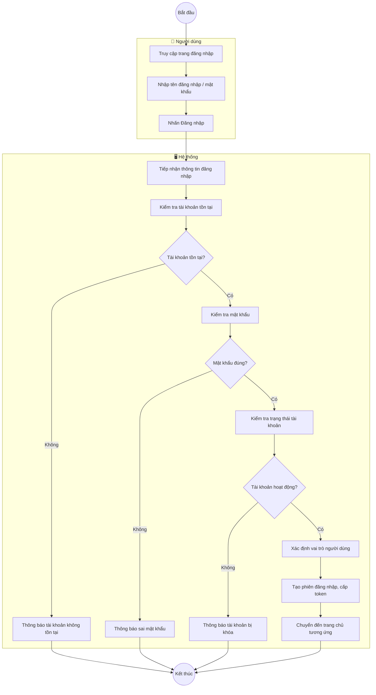
```mermaid
flowchart TD
    Start((Bắt đầu))
    subgraph ACTOR["👤 Người dùng"]
        a1[Truy cập trang đăng nhập]
        a2[Nhập tên đăng nhập / mật khẩu]
        a3[Nhấn Đăng nhập]
    end
    subgraph SYS["🖥️ Hệ thống"]
        s1[Tiếp nhận thông tin đăng nhập]
        s2[Kiểm tra tài khoản tồn tại]
        d1{Tài khoản tồn tại?}
        s3[Thông báo tài khoản không tồn tại]
        s4[Kiểm tra mật khẩu]
        d2{Mật khẩu đúng?}
        s5[Thông báo sai mật khẩu]
        s6[Kiểm tra trạng thái tài khoản]
        d3{Tài khoản hoạt động?}
        s7[Thông báo tài khoản bị khóa]
        s8[Xác định vai trò người dùng]
        s9[Tạo phiên đăng nhập, cấp token]
        s10[Chuyển đến trang chủ tương ứng]
    end
    End((Kết thúc))

    Start --> a1 --> a2 --> a3 --> s1 --> s2 --> d1
    d1 -->|Không| s3 --> End
    d1 -->|Có| s4 --> d2
    d2 -->|Không| s5 --> End
    d2 -->|Có| s6 --> d3
    d3 -->|Không| s7 --> End
    d3 -->|Có| s8 --> s9 --> s10 --> End
```

---

## UC2. Đăng xuất

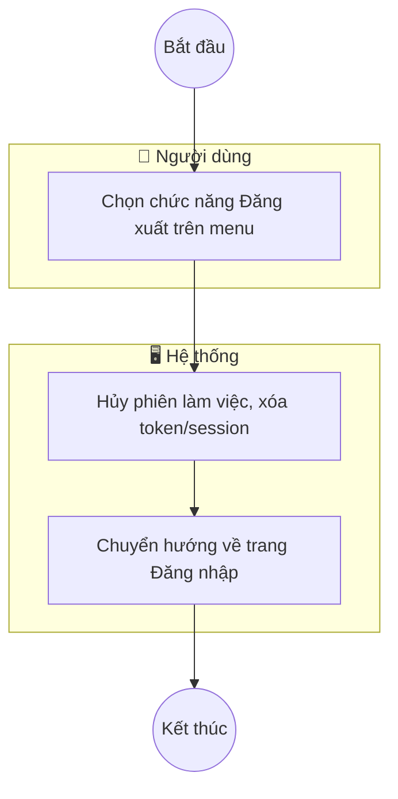
```mermaid
flowchart TD
    Start((Bắt đầu))
    subgraph ACTOR["👤 Người dùng"]
        a1[Chọn chức năng Đăng xuất trên menu]
    end
    subgraph SYS["🖥️ Hệ thống"]
        s1[Hủy phiên làm việc, xóa token/session]
        s2[Chuyển hướng về trang Đăng nhập]
    end
    End((Kết thúc))

    Start --> a1 --> s1 --> s2 --> End
```

---

## UC3. Quản lý tài khoản cá nhân

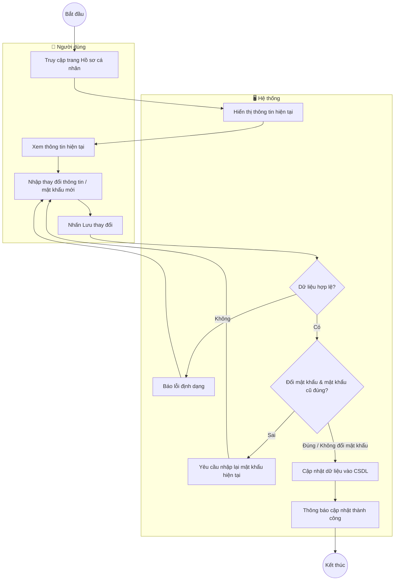
```mermaid
flowchart TD
    Start((Bắt đầu))
    subgraph ACTOR["👤 Người dùng"]
        a1[Truy cập trang Hồ sơ cá nhân]
        a2[Xem thông tin hiện tại]
        a3[Nhập thay đổi thông tin / mật khẩu mới]
        a4[Nhấn Lưu thay đổi]
    end
    subgraph SYS["🖥️ Hệ thống"]
        s1[Hiển thị thông tin hiện tại]
        d1{Dữ liệu hợp lệ?}
        s2[Báo lỗi định dạng]
        d2{Đổi mật khẩu &amp; mật khẩu cũ đúng?}
        s3[Yêu cầu nhập lại mật khẩu hiện tại]
        s4[Cập nhật dữ liệu vào CSDL]
        s5[Thông báo cập nhật thành công]
    end
    End((Kết thúc))

    Start --> a1 --> s1 --> a2 --> a3 --> a4 --> d1
    d1 -->|Không| s2 --> a3
    d1 -->|Có| d2
    d2 -->|Sai| s3 --> a3
    d2 -->|Đúng / Không đổi mật khẩu| s4 --> s5 --> End
```

---

## UC4. Quản lý tài khoản người dùng

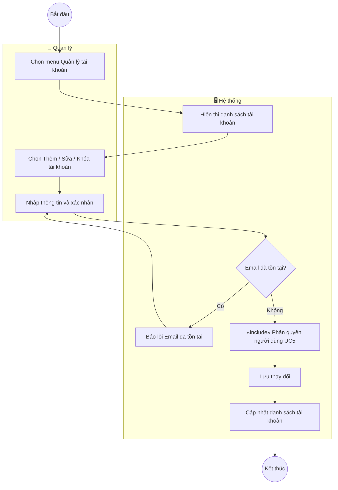
```mermaid
flowchart TD
    Start((Bắt đầu))
    subgraph ACTOR["👤 Quản lý"]
        a1[Chọn menu Quản lý tài khoản]
        a2[Chọn Thêm / Sửa / Khóa tài khoản]
        a3[Nhập thông tin và xác nhận]
    end
    subgraph SYS["🖥️ Hệ thống"]
        s1[Hiển thị danh sách tài khoản]
        d1{Email đã tồn tại?}
        s2[Báo lỗi Email đã tồn tại]
        s3[«include» Phân quyền người dùng UC5]
        s4[Lưu thay đổi]
        s5[Cập nhật danh sách tài khoản]
    end
    End((Kết thúc))

    Start --> a1 --> s1 --> a2 --> a3 --> d1
    d1 -->|Có| s2 --> a3
    d1 -->|Không| s3 --> s4 --> s5 --> End
```

---

## UC5. Phân quyền người dùng

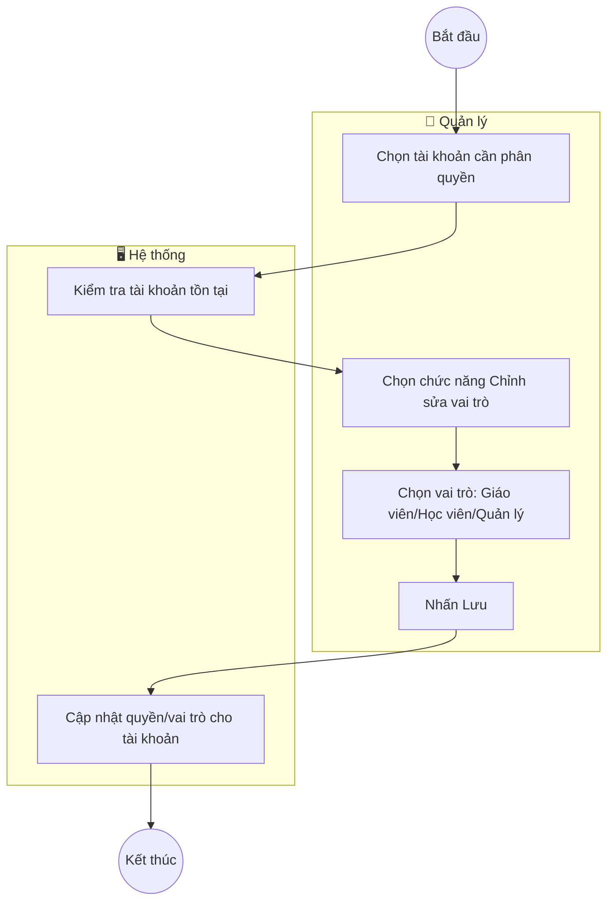
```mermaid
flowchart TD
    Start((Bắt đầu))
    subgraph ACTOR["👤 Quản lý"]
        a1[Chọn tài khoản cần phân quyền]
        a2[Chọn chức năng Chỉnh sửa vai trò]
        a3[Chọn vai trò: Giáo viên/Học viên/Quản lý]
        a4[Nhấn Lưu]
    end
    subgraph SYS["🖥️ Hệ thống"]
        s1[Kiểm tra tài khoản tồn tại]
        s2[Cập nhật quyền/vai trò cho tài khoản]
    end
    End((Kết thúc))

    Start --> a1 --> s1 --> a2 --> a3 --> a4 --> s2 --> End
```

---

## UC6. Quản lý giáo viên

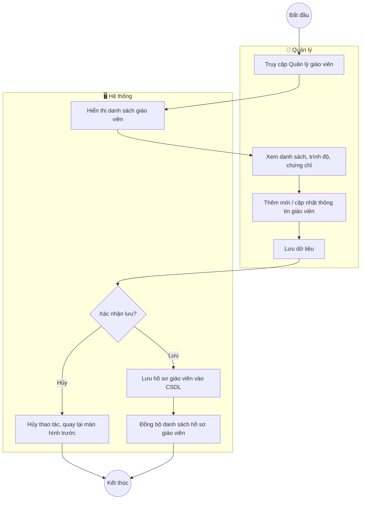
```mermaid
flowchart TD
    Start((Bắt đầu))
    subgraph ACTOR["👤 Quản lý"]
        a1[Truy cập Quản lý giáo viên]
        a2[Xem danh sách, trình độ, chứng chỉ]
        a3[Thêm mới / cập nhật thông tin giáo viên]
        a4[Lưu dữ liệu]
    end
    subgraph SYS["🖥️ Hệ thống"]
        s1[Hiển thị danh sách giáo viên]
        d1{Xác nhận lưu?}
        s2[Hủy thao tác, quay lại màn hình trước]
        s3[Lưu hồ sơ giáo viên vào CSDL]
        s4[Đồng bộ danh sách hồ sơ giáo viên]
    end
    End((Kết thúc))

    Start --> a1 --> s1 --> a2 --> a3 --> a4 --> d1
    d1 -->|Hủy| s2 --> End
    d1 -->|Lưu| s3 --> s4 --> End
```

---

## UC7. Quản lý học viên

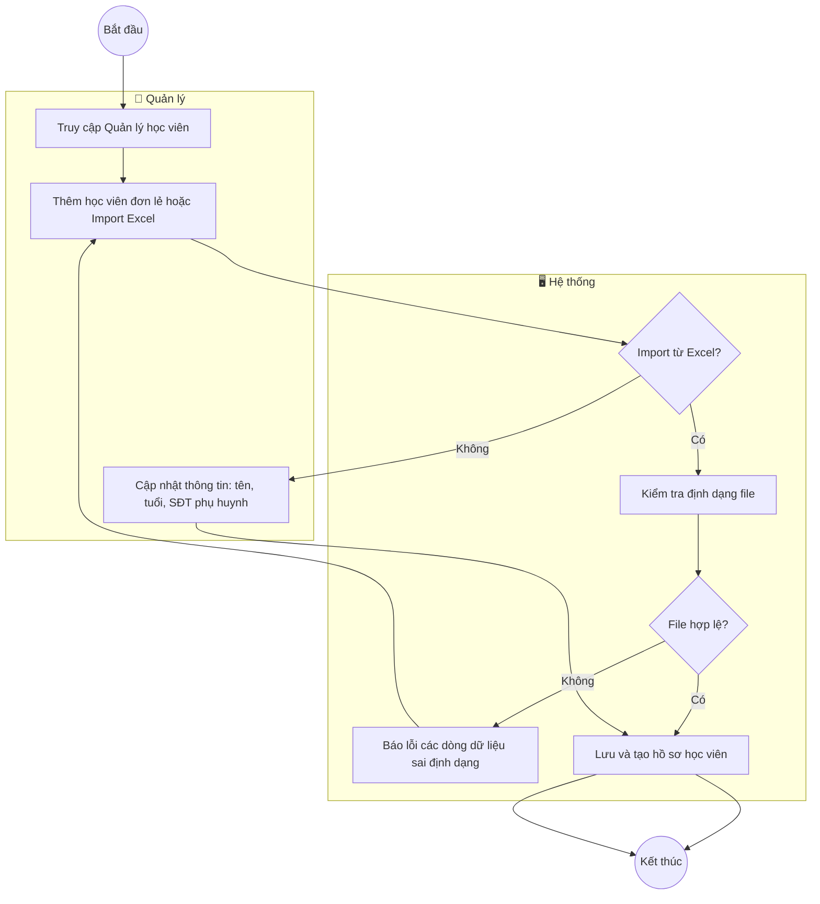
```mermaid
flowchart TD
    Start((Bắt đầu))
    subgraph ACTOR["👤 Quản lý"]
        a1[Truy cập Quản lý học viên]
        a2[Thêm học viên đơn lẻ hoặc Import Excel]
        a3[Cập nhật thông tin: tên, tuổi, SĐT phụ huynh]
    end
    subgraph SYS["🖥️ Hệ thống"]
        d1{Import từ Excel?}
        s1[Kiểm tra định dạng file]
        d2{File hợp lệ?}
        s2[Báo lỗi các dòng dữ liệu sai định dạng]
        s3[Lưu và tạo hồ sơ học viên]
    end
    End((Kết thúc))

    Start --> a1 --> a2 --> d1
    d1 -->|Có| s1 --> d2
    d2 -->|Không| s2 --> a2
    d2 -->|Có| s3 --> End
    d1 -->|Không| a3 --> s3 --> End
```

---

## UC8. Quản lý lớp học

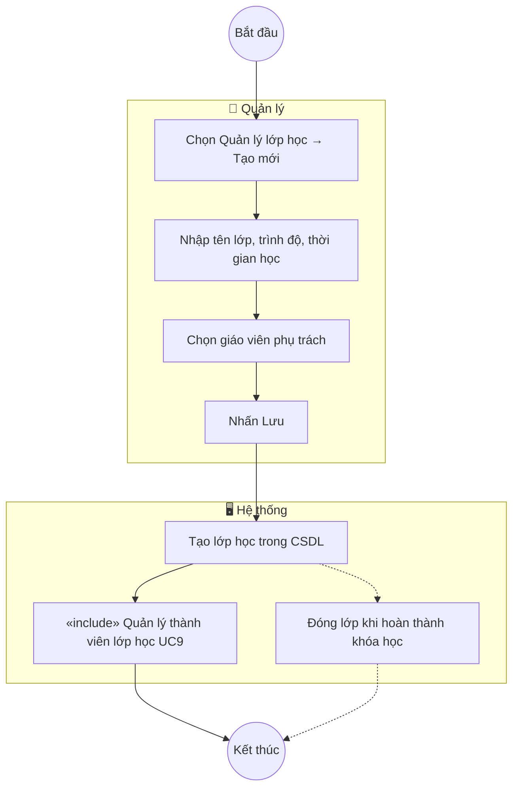
```mermaid
flowchart TD
    Start((Bắt đầu))
    subgraph ACTOR["👤 Quản lý"]
        a1[Chọn Quản lý lớp học → Tạo mới]
        a2[Nhập tên lớp, trình độ, thời gian học]
        a3[Chọn giáo viên phụ trách]
        a4[Nhấn Lưu]
    end
    subgraph SYS["🖥️ Hệ thống"]
        s1[«include» Quản lý thành viên lớp học UC9]
        s2[Tạo lớp học trong CSDL]
        s3[Đóng lớp khi hoàn thành khóa học]
    end
    End((Kết thúc))

    Start --> a1 --> a2 --> a3 --> a4 --> s2 --> s1 --> End
    s2 -.-> s3 -.-> End
```

---

## UC9. Quản lý thành viên lớp học

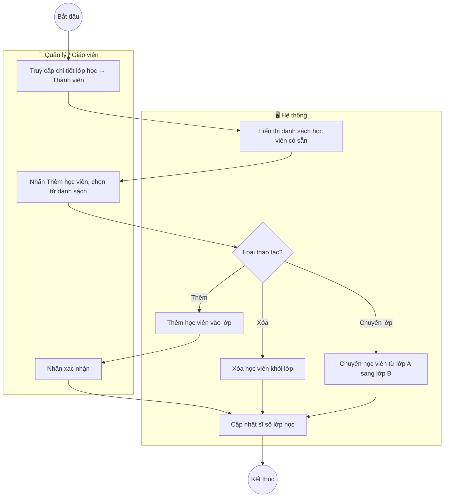
```mermaid
flowchart TD
    Start((Bắt đầu))
    subgraph ACTOR["👤 Quản lý / Giáo viên"]
        a1[Truy cập chi tiết lớp học → Thành viên]
        a2[Nhấn Thêm học viên, chọn từ danh sách]
        a3[Nhấn xác nhận]
    end
    subgraph SYS["🖥️ Hệ thống"]
        s1[Hiển thị danh sách học viên có sẵn]
        d1{Loại thao tác?}
        s2[Thêm học viên vào lớp]
        s3[Xóa học viên khỏi lớp]
        s4[Chuyển học viên từ lớp A sang lớp B]
        s5[Cập nhật sĩ số lớp học]
    end
    End((Kết thúc))

    Start --> a1 --> s1 --> a2 --> d1
    d1 -->|Thêm| s2 --> a3 --> s5 --> End
    d1 -->|Xóa| s3 --> s5
    d1 -->|Chuyển lớp| s4 --> s5
```

---

## UC10. Xem danh sách lớp học

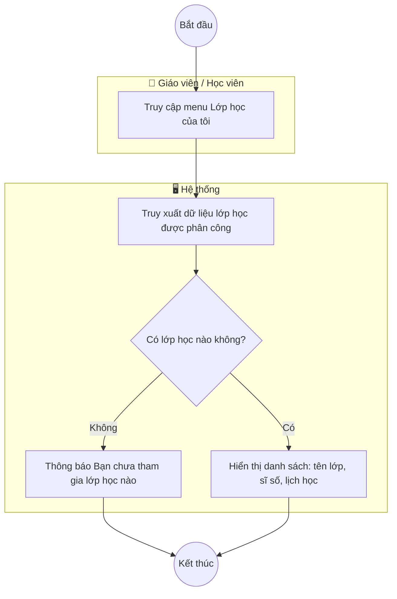
```mermaid
flowchart TD
    Start((Bắt đầu))
    subgraph ACTOR["👤 Giáo viên / Học viên"]
        a1[Truy cập menu Lớp học của tôi]
    end
    subgraph SYS["🖥️ Hệ thống"]
        s1[Truy xuất dữ liệu lớp học được phân công]
        d1{Có lớp học nào không?}
        s2[Thông báo Bạn chưa tham gia lớp học nào]
        s3[Hiển thị danh sách: tên lớp, sĩ số, lịch học]
    end
    End((Kết thúc))

    Start --> a1 --> s1 --> d1
    d1 -->|Không| s2 --> End
    d1 -->|Có| s3 --> End
```

---

## UC11. Quản lý bài tập

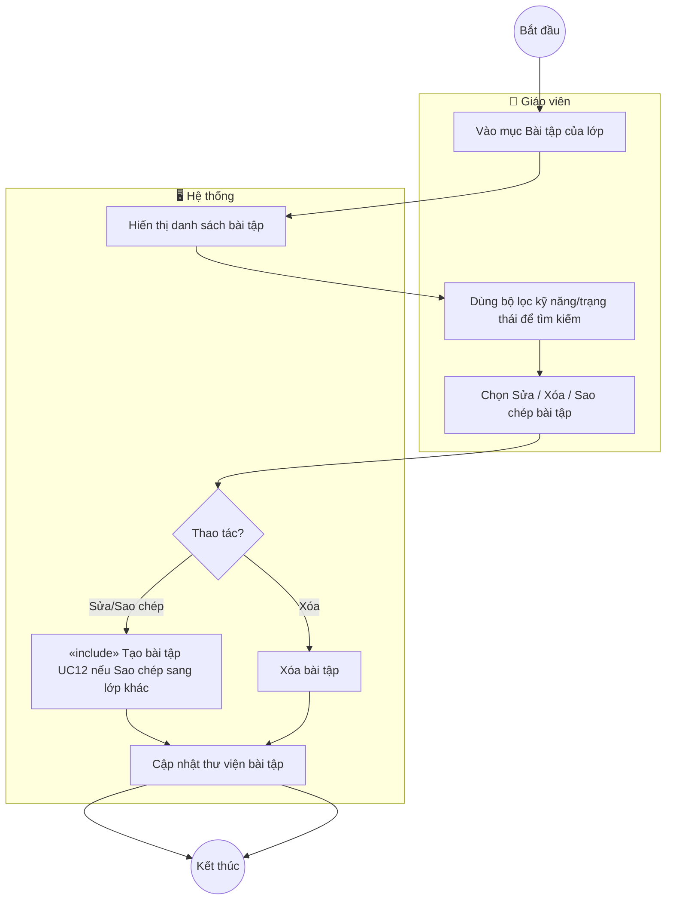
```mermaid
flowchart TD
    Start((Bắt đầu))
    subgraph ACTOR["👤 Giáo viên"]
        a1[Vào mục Bài tập của lớp]
        a2[Dùng bộ lọc kỹ năng/trạng thái để tìm kiếm]
        a3[Chọn Sửa / Xóa / Sao chép bài tập]
    end
    subgraph SYS["🖥️ Hệ thống"]
        s1[Hiển thị danh sách bài tập]
        d1{Thao tác?}
        s2[«include» Tạo bài tập UC12 nếu Sao chép sang lớp khác]
        s3[Xóa bài tập]
        s4[Cập nhật thư viện bài tập]
    end
    End((Kết thúc))

    Start --> a1 --> s1 --> a2 --> a3 --> d1
    d1 -->|Sửa/Sao chép| s2 --> s4 --> End
    d1 -->|Xóa| s3 --> s4 --> End
```

---

## UC12. Tạo bài tập

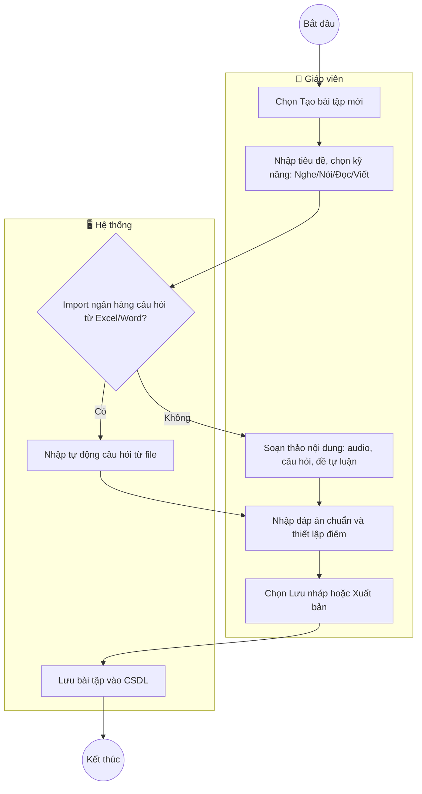
```mermaid
flowchart TD
    Start((Bắt đầu))
    subgraph ACTOR["👤 Giáo viên"]
        a1[Chọn Tạo bài tập mới]
        a2[Nhập tiêu đề, chọn kỹ năng: Nghe/Nói/Đọc/Viết]
        a3[Soạn thảo nội dung: audio, câu hỏi, đề tự luận]
        a4[Nhập đáp án chuẩn và thiết lập điểm]
        a5[Chọn Lưu nháp hoặc Xuất bản]
    end
    subgraph SYS["🖥️ Hệ thống"]
        d1{Import ngân hàng câu hỏi từ Excel/Word?}
        s1[Nhập tự động câu hỏi từ file]
        s2[Lưu bài tập vào CSDL]
    end
    End((Kết thúc))

    Start --> a1 --> a2 --> d1
    d1 -->|Có| s1 --> a4
    d1 -->|Không| a3 --> a4
    a4 --> a5 --> s2 --> End
```

---

## UC13. Mở bài tập

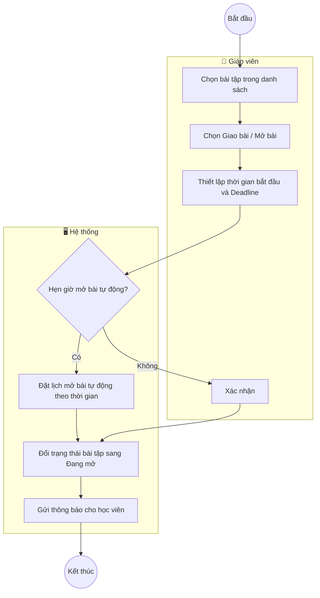
```mermaid
flowchart TD
    Start((Bắt đầu))
    subgraph ACTOR["👤 Giáo viên"]
        a1[Chọn bài tập trong danh sách]
        a2[Chọn Giao bài / Mở bài]
        a3[Thiết lập thời gian bắt đầu và Deadline]
        a4[Xác nhận]
    end
    subgraph SYS["🖥️ Hệ thống"]
        d1{Hẹn giờ mở bài tự động?}
        s1[Đặt lịch mở bài tự động theo thời gian]
        s2[Đổi trạng thái bài tập sang Đang mở]
        s3[Gửi thông báo cho học viên]
    end
    End((Kết thúc))

    Start --> a1 --> a2 --> a3 --> d1
    d1 -->|Có| s1 --> s2
    d1 -->|Không| a4 --> s2
    s2 --> s3 --> End
```

---

## UC14. Khóa bài tập

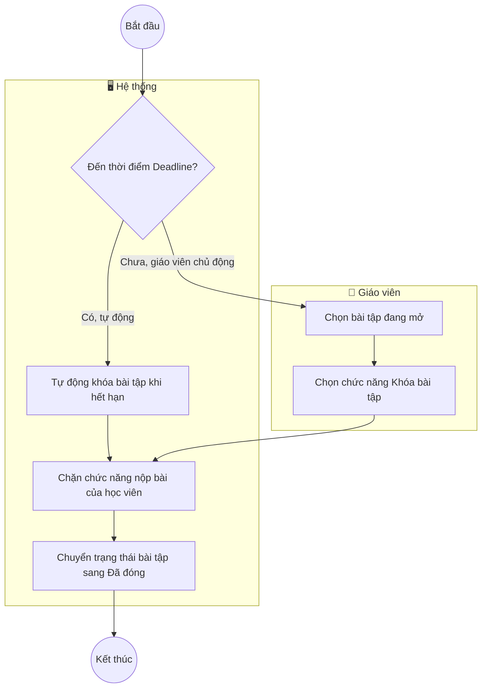
```mermaid
flowchart TD
    Start((Bắt đầu))
    subgraph ACTOR["👤 Giáo viên"]
        a1[Chọn bài tập đang mở]
        a2[Chọn chức năng Khóa bài tập]
    end
    subgraph SYS["🖥️ Hệ thống"]
        d1{Đến thời điểm Deadline?}
        s1[Tự động khóa bài tập khi hết hạn]
        s2[Chặn chức năng nộp bài của học viên]
        s3[Chuyển trạng thái bài tập sang Đã đóng]
    end
    End((Kết thúc))

    Start --> d1
    d1 -->|Có, tự động| s1 --> s2
    d1 -->|Chưa, giáo viên chủ động| a1 --> a2 --> s2
    s2 --> s3 --> End
```

---

## UC15. Xem bài tập

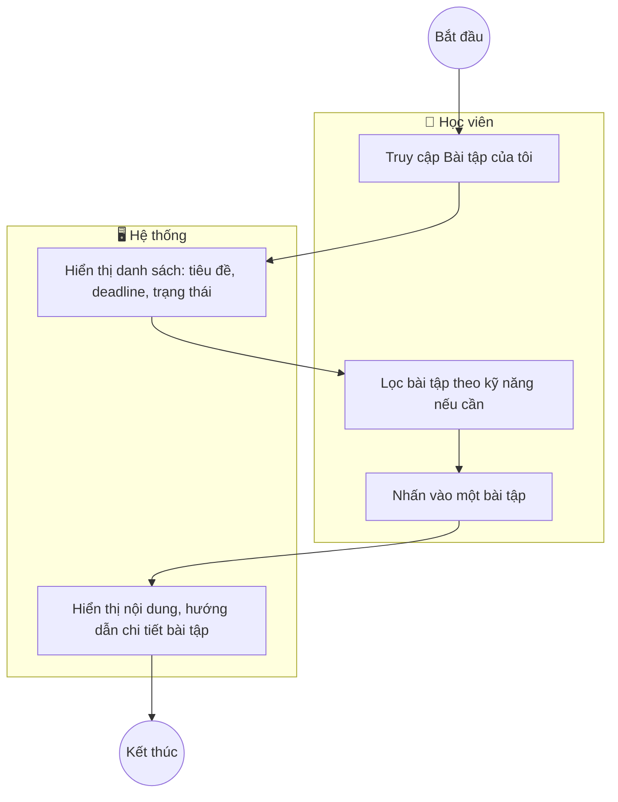
```mermaid
flowchart TD
    Start((Bắt đầu))
    subgraph ACTOR["👤 Học viên"]
        a1[Truy cập Bài tập của tôi]
        a2[Lọc bài tập theo kỹ năng nếu cần]
        a3[Nhấn vào một bài tập]
    end
    subgraph SYS["🖥️ Hệ thống"]
        s1[Hiển thị danh sách: tiêu đề, deadline, trạng thái]
        s2[Hiển thị nội dung, hướng dẫn chi tiết bài tập]
    end
    End((Kết thúc))

    Start --> a1 --> s1 --> a2 --> a3 --> s2 --> End
```

---

## UC16. Làm bài tập viết (Writing)

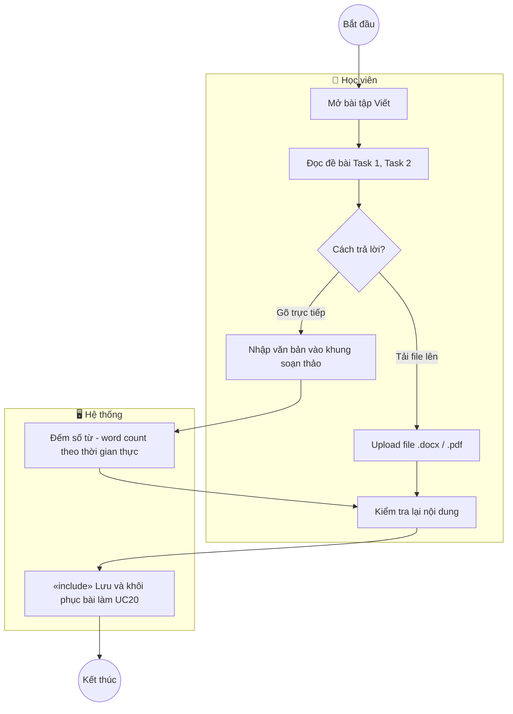
```mermaid
flowchart TD
    Start((Bắt đầu))
    subgraph ACTOR["👤 Học viên"]
        a1[Mở bài tập Viết]
        a2[Đọc đề bài Task 1, Task 2]
        d1{Cách trả lời?}
        a3[Nhập văn bản vào khung soạn thảo]
        a4[Upload file .docx / .pdf]
        a5[Kiểm tra lại nội dung]
    end
    subgraph SYS["🖥️ Hệ thống"]
        s1[Đếm số từ - word count theo thời gian thực]
        s2[«include» Lưu và khôi phục bài làm UC20]
    end
    End((Kết thúc))

    Start --> a1 --> a2 --> d1
    d1 -->|Gõ trực tiếp| a3 --> s1 --> a5
    d1 -->|Tải file lên| a4 --> a5
    a5 --> s2 --> End
```

---

## UC17. Làm bài tập nói (Speaking)

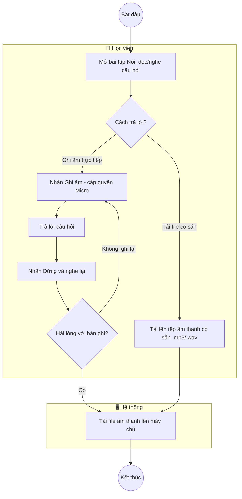
```mermaid
flowchart TD
    Start((Bắt đầu))
    subgraph ACTOR["👤 Học viên"]
        a1[Mở bài tập Nói, đọc/nghe câu hỏi]
        d1{Cách trả lời?}
        a2[Nhấn Ghi âm - cấp quyền Micro]
        a3[Trả lời câu hỏi]
        a4[Nhấn Dừng và nghe lại]
        d2{Hài lòng với bản ghi?}
        a5[Tải lên tệp âm thanh có sẵn .mp3/.wav]
    end
    subgraph SYS["🖥️ Hệ thống"]
        s1[Tải file âm thanh lên máy chủ]
    end
    End((Kết thúc))

    Start --> a1 --> d1
    d1 -->|Ghi âm trực tiếp| a2 --> a3 --> a4 --> d2
    d2 -->|Không, ghi lại| a2
    d2 -->|Có| s1 --> End
    d1 -->|Tải file có sẵn| a5 --> s1
```

---

## UC18. Làm bài tập đọc (Reading)

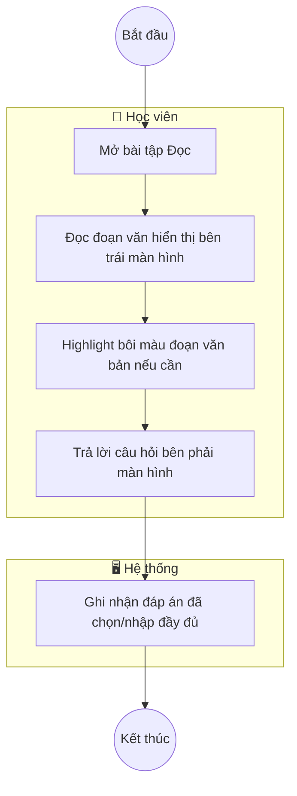
```mermaid
flowchart TD
    Start((Bắt đầu))
    subgraph ACTOR["👤 Học viên"]
        a1[Mở bài tập Đọc]
        a2[Đọc đoạn văn hiển thị bên trái màn hình]
        a3[Highlight bôi màu đoạn văn bản nếu cần]
        a4[Trả lời câu hỏi bên phải màn hình]
    end
    subgraph SYS["🖥️ Hệ thống"]
        s1[Ghi nhận đáp án đã chọn/nhập đầy đủ]
    end
    End((Kết thúc))

    Start --> a1 --> a2 --> a3 --> a4 --> s1 --> End
```

---

## UC19. Làm bài tập nghe (Listening)

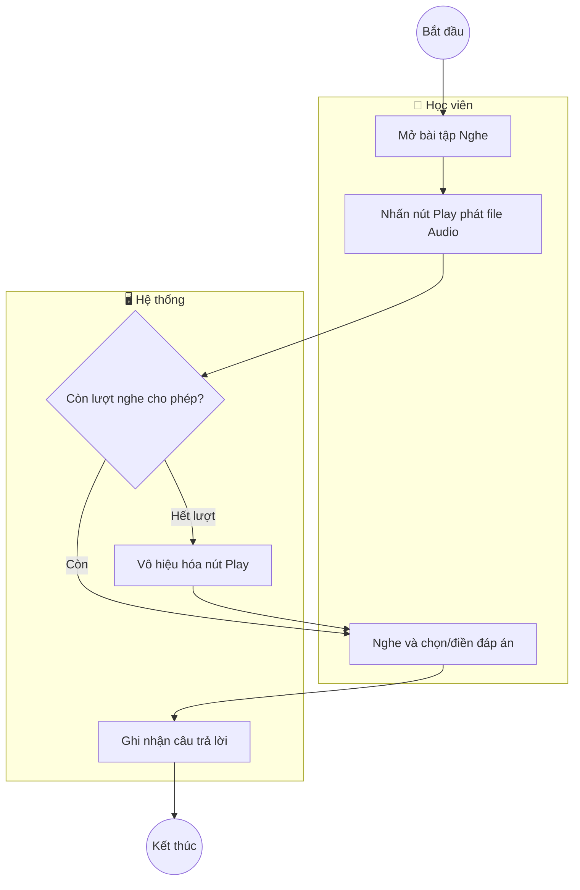
```mermaid
flowchart TD
    Start((Bắt đầu))
    subgraph ACTOR["👤 Học viên"]
        a1[Mở bài tập Nghe]
        a2[Nhấn nút Play phát file Audio]
        a3[Nghe và chọn/điền đáp án]
    end
    subgraph SYS["🖥️ Hệ thống"]
        d1{Còn lượt nghe cho phép?}
        s1[Vô hiệu hóa nút Play]
        s2[Ghi nhận câu trả lời]
    end
    End((Kết thúc))

    Start --> a1 --> a2 --> d1
    d1 -->|Còn| a3 --> s2 --> End
    d1 -->|Hết lượt| s1 --> a3
```

---

## UC20. Lưu và khôi phục bài làm

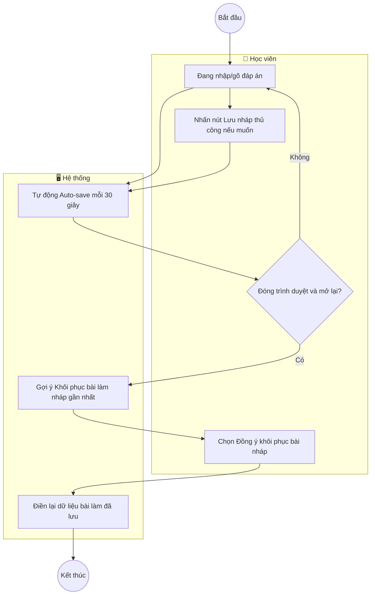
```mermaid
flowchart TD
    Start((Bắt đầu))
    subgraph ACTOR["👤 Học viên"]
        a1[Đang nhập/gõ đáp án]
        a2[Nhấn nút Lưu nháp thủ công nếu muốn]
        d1{Đóng trình duyệt và mở lại?}
        a3[Chọn Đồng ý khôi phục bài nháp]
    end
    subgraph SYS["🖥️ Hệ thống"]
        s1[Tự động Auto-save mỗi 30 giây]
        s2[Gợi ý Khôi phục bài làm nháp gần nhất]
        s3[Điền lại dữ liệu bài làm đã lưu]
    end
    End((Kết thúc))

    Start --> a1 --> s1
    a1 --> a2 --> s1
    s1 --> d1
    d1 -->|Không| a1
    d1 -->|Có| s2 --> a3 --> s3 --> End
```

---

## UC21. Nộp bài tập

```mermaid
flowchart TD
    Start((Bắt đầu))
    subgraph ACTOR["👤 Học viên"]
        a1[Nhấn nút Nộp bài]
        a2[Nhấn Xác nhận]
    end
    subgraph SYS["🖥️ Hệ thống"]
        d1{Bài tập đã bị khóa?}
        s0[Thông báo bài tập đã đóng, không thể nộp]
        s1[Hiển thị popup xác nhận nộp bài]
        d2{Còn câu hỏi chưa làm?}
        s2[Cảnh báo Còn X câu chưa làm, vẫn tiếp tục?]
        s3[Ghi nhận trạng thái nộp, thời gian nộp]
        s4[Khóa bài làm của học viên]
    end
    End((Kết thúc))

    Start --> d1
    d1 -->|Có| s0 --> End
    d1 -->|Không| a1 --> s1 --> d2
    d2 -->|Có| s2 --> a2
    d2 -->|Không| a2
    a2 --> s3 --> s4 --> End
```

---

## UC22. Quản lý lần làm và nộp lại bài

```mermaid
flowchart TD
    Start((Bắt đầu))
    subgraph ACTOR["👤 Học viên"]
        a1[Đã nộp bài lần 1]
        a2[Vào lại bài tập]
        a3[Chọn Làm lại bài]
        a4[Thực hiện và nộp bài lần kế tiếp]
    end
    subgraph SYS["🖥️ Hệ thống"]
        d1{Còn lượt làm lại?}
        s1[Ẩn nút làm lại]
        s2[Hiển thị nút Làm lại bài, còn X lượt]
        s3[Tạo form bài làm mới]
        s4[«include» Nộp bài tập UC21]
        s5[Lưu trữ lịch sử tất cả các lần nộp]
    end
    End((Kết thúc))

    Start --> a1 --> a2 --> d1
    d1 -->|Hết lượt| s1 --> End
    d1 -->|Còn lượt| s2 --> a3 --> s3 --> a4 --> s4 --> s5 --> End
```

---

## UC23. Xem trạng thái bài làm

```mermaid
flowchart TD
    Start((Bắt đầu))
    subgraph ACTOR["👤 Học viên"]
        a1[Truy cập Dashboard hoặc danh sách bài tập]
    end
    subgraph SYS["🖥️ Hệ thống"]
        s1[Xác định trạng thái: Chưa làm/Đang làm/Đã nộp/Đang chấm/Đã chấm]
        s2[Hiển thị nhãn trạng thái Status tag theo màu sắc]
    end
    End((Kết thúc))

    Start --> a1 --> s1 --> s2 --> End
```

---

## UC24. Chấm bài

```mermaid
flowchart TD
    Start((Bắt đầu))
    subgraph ACTOR["👤 Giáo viên"]
        a1[Chọn danh sách bài Chờ chấm]
        a2[Mở bài làm của 1 học viên]
        a3[Đọc/nghe bài làm, nhập điểm từng câu/phần]
        a4[Ghi chú, nhận xét inline hoặc nhận xét chung]
        d1{Hoàn tất chấm hay lưu nháp?}
        a5[Nhấn Xác nhận và Trả bài]
        a6[Lưu nháp kết quả chấm]
    end
    subgraph SYS["🖥️ Hệ thống"]
        s0a[«include» Hỗ trợ chấm chữa bài bằng AI UC25]
        s0b[«include» Chấm bài đọc UC28]
        s0c[«include» Chấm bài nghe UC29]
        s1[Cập nhật trạng thái Đã chấm]
        s2[Gửi thông báo điểm cho học viên]
    end
    End((Kết thúc))

    Start --> a1 --> a2 --> s0a
    s0a -.-> s0b -.-> s0c -.-> a3 --> a4 --> d1
    d1 -->|Lưu nháp| a6 --> a2
    d1 -->|Hoàn tất| a5 --> s1 --> s2 --> End
```

---

## UC25. Hỗ trợ chấm chữa bài bằng AI

```mermaid
flowchart TD
    Start((Bắt đầu))
    subgraph ACTOR["👤 Giáo viên"]
        a1[Mở bài làm của học viên]
        a2[Nhấn Gợi ý chấm bằng AI]
        a3[Kiểm tra và sửa lại điểm AI đề xuất nếu cần]
        a4[Xác nhận kết quả cuối]
    end
    subgraph SYS["🖥️ Hệ thống AI"]
        s1[Gửi dữ liệu bài làm lên AI model]
        d1{Kết nối AI thành công?}
        s2[Báo lỗi Hệ thống AI đang gián đoạn, chấm thủ công]
        s3{Kỹ năng bài làm?}
        s4[«include» Hỗ trợ chấm chữa bài viết bằng AI UC26]
        s5[«include» Hỗ trợ chấm chữa bài nói bằng AI UC27]
        s6[Hiển thị điểm đề xuất và các lỗi highlight]
        s7[Lưu kết quả đánh giá sơ bộ từ AI]
    end
    End((Kết thúc))

    Start --> a1 --> a2 --> s1 --> d1
    d1 -->|Không| s2 --> End
    d1 -->|Có| s3
    s3 -->|Viết| s4 --> s6
    s3 -->|Nói| s5 --> s6
    s6 --> a3 --> a4 --> s7 --> End
```

---

## UC26. Hỗ trợ chấm chữa bài viết bằng AI

```mermaid
flowchart TD
    Start((Bắt đầu))
    subgraph SYS["🖥️ Hệ thống AI"]
        s1[Gửi text bài viết lên AI]
        s2[Bôi đỏ lỗi chính tả, bôi vàng lỗi ngữ pháp, bôi xanh từ vựng chưa hay]
        s3[Đề xuất cách sửa Rewrite suggestion cho từng câu lỗi]
        s4[Tổng hợp điểm theo từng tiêu chí Grammar/Lexical/Coherence/Task]
        d1{Phát hiện đạo văn?}
        s5[Cảnh báo đỏ 100% Plagiarism]
    end
    subgraph ACTOR["👤 Giáo viên"]
        a1[Duyệt gợi ý AI: Accept hoặc Reject]
    end
    End((Kết thúc))

    Start --> s1 --> s2 --> s3 --> s4 --> d1
    d1 -->|Có| s5 --> a1
    d1 -->|Không| a1 --> End
```

---

## UC27. Hỗ trợ chấm chữa bài nói bằng AI

```mermaid
flowchart TD
    Start((Bắt đầu))
    subgraph SYS["🖥️ Hệ thống AI"]
        s1[Gửi file Audio lên AI]
        d1{Chất lượng âm thanh đạt?}
        s2[Trả về cảnh báo: chất lượng âm thanh quá thấp]
        s3[Bóc băng Transcript đoạn nói của học viên]
        s4[Phân tích và highlight đỏ từ phát âm sai]
        s5[Đánh giá nhịp điệu Intonation và độ ngập ngừng]
        s6[Đề xuất điểm]
    end
    subgraph ACTOR["👤 Giáo viên"]
        a1[Nghe lại bài nói và chốt điểm cuối]
    end
    End((Kết thúc))

    Start --> s1 --> d1
    d1 -->|Không đạt| s2 --> End
    d1 -->|Đạt| s3 --> s4 --> s5 --> s6 --> a1 --> End
```

---

## UC28. Chấm bài đọc (Reading)

```mermaid
flowchart TD
    Start((Bắt đầu))
    subgraph ACTOR["👤 Học viên"]
        a1[Nộp bài Đọc]
    end
    subgraph SYS["🖥️ Hệ thống"]
        s1[So sánh từng câu trả lời với Answer key]
        d1{Câu trả lời dạng điền từ, tương đối đúng?}
        s2[Gán trạng thái Cần giáo viên duyệt lại]
        s3[Tính tổng số câu đúng, quy đổi điểm hệ 10/IELTS/TOEIC]
        s4[Lưu điểm vào hệ thống]
    end
    End((Kết thúc))

    Start --> a1 --> s1 --> d1
    d1 -->|Có| s2 --> s4
    d1 -->|Không| s3 --> s4 --> End
```

---

## UC29. Chấm bài nghe (Listening)

```mermaid
flowchart TD
    Start((Bắt đầu))
    subgraph ACTOR["👤 Học viên"]
        a1[Nộp bài Nghe]
    end
    subgraph SYS["🖥️ Hệ thống"]
        s1[Tự động chấm câu trắc nghiệm, điền từ]
        d1{Sai viết hoa/thường nhưng đúng từ?}
        s2[Tính là Đúng theo cấu hình cho phép]
        s3[Đưa ra điểm tự động]
        s4[Ghi nhận điểm Listening]
    end
    End((Kết thúc))

    Start --> a1 --> s1 --> d1
    d1 -->|Có, được cấu hình cho phép| s2 --> s3
    d1 -->|Không| s3
    s3 --> s4 --> End
```

---

## UC30. Xem điểm số

```mermaid
flowchart TD
    Start((Bắt đầu))
    subgraph ACTOR["👤 Học viên / Giáo viên"]
        a1[Truy cập mục Bảng điểm / Kết quả]
    end
    subgraph SYS["🖥️ Hệ thống"]
        d1{Bài đã được chấm và công bố?}
        s1[Chưa hiển thị điểm]
        s2[Hiển thị danh sách bài tập kèm điểm đạt được / điểm tối đa]
    end
    End((Kết thúc))

    Start --> a1 --> d1
    d1 -->|Chưa| s1 --> End
    d1 -->|Rồi| s2 --> End
```

---

## UC31. Quản lý điểm số

```mermaid
flowchart TD
    Start((Bắt đầu))
    subgraph ACTOR["👤 Giáo viên"]
        a1[Vào mục Quản lý điểm số của 1 lớp]
        a2[Click vào ô điểm để sửa thủ công, kèm lý do sửa]
        d1{Xuất file Excel?}
        a3[Nhấn Xuất Excel]
    end
    subgraph SYS["🖥️ Hệ thống"]
        s1[Hiển thị bảng Matrix Học viên x Bài tập]
        s2[Lưu thay đổi điểm]
        s3[Ghi lại lịch sử thay đổi Audit log]
        s4[Xuất file Excel bảng điểm]
    end
    End((Kết thúc))

    Start --> a1 --> s1 --> a2 --> s2 --> s3 --> d1
    d1 -->|Có| a3 --> s4 --> End
    d1 -->|Không| End
```

---

## UC32. Xem kết quả học tập

```mermaid
flowchart TD
    Start((Bắt đầu))
    subgraph ACTOR["👤 Học viên"]
        a1[Chọn mục Tiến độ học tập]
    end
    subgraph SYS["🖥️ Hệ thống"]
        s1[Render biểu đồ radar 4 kỹ năng Nghe-Nói-Đọc-Viết]
        s2[Tính và hiển thị điểm trung bình toàn khóa]
    end
    End((Kết thúc))

    Start --> a1 --> s1 --> s2 --> End
```

---

## UC33. Xem bài chữa

```mermaid
flowchart TD
    Start((Bắt đầu))
    subgraph ACTOR["👤 Học viên"]
        a1[Click Chi tiết bài chữa của bài đã có điểm]
        a2[Đọc/nghe phần nhận xét Feedback]
        a3[Xem đáp án chuẩn Answer key/Sample answer]
    end
    subgraph SYS["🖥️ Hệ thống"]
        d1{Bài đã được chấm?}
        s1[Không cho phép xem bài chữa]
        s2[Hiển thị bài làm kèm highlight lỗi]
    end
    End((Kết thúc))

    Start --> a1 --> d1
    d1 -->|Chưa| s1 --> End
    d1 -->|Rồi| s2 --> a2 --> a3 --> End
```

---

## UC34. Xem và đánh giá kết quả học viên

```mermaid
flowchart TD
    Start((Bắt đầu))
    subgraph ACTOR["👤 Giáo viên"]
        a1[Chọn một học viên trong danh sách lớp]
        a2[Xem lịch sử làm bài, biểu đồ điểm số theo kỹ năng]
        a3[Viết đánh giá tổng quan về thái độ và năng lực]
        a4[Gửi đánh giá cho học viên]
    end
    subgraph SYS["🖥️ Hệ thống"]
        s1[«include» Xem kết quả học tập UC32]
        s2[Lưu báo cáo đánh giá vào hồ sơ học viên]
    end
    End((Kết thúc))

    Start --> a1 --> s1 --> a2 --> a3 --> a4 --> s2 --> End
```

---

## UC35. Theo dõi tiến độ học tập

```mermaid
flowchart TD
    Start((Bắt đầu))
    subgraph ACTOR["👤 Giáo viên"]
        a1[Truy cập Báo cáo lớp học]
        a2[Xem Dashboard: tỷ lệ hoàn thành, tỷ lệ dưới trung bình]
        a3[Điều chỉnh phương pháp giảng dạy]
    end
    subgraph SYS["🖥️ Hệ thống"]
        s1[Tổng hợp tỷ lệ hoàn thành bài tập %]
        s2[Tổng hợp tỷ lệ học viên dưới trung bình]
        s3[Hiển thị Dashboard tiến độ lớp học]
    end
    End((Kết thúc))

    Start --> a1 --> s1 --> s2 --> s3 --> a2 --> a3 --> End
```

---

## UC36. Xem báo cáo và thống kê học tập

```mermaid
flowchart TD
    Start((Bắt đầu))
    subgraph ACTOR["👤 Quản lý / Giáo viên"]
        a1[Truy cập Thống kê báo cáo]
        a2[Thiết lập bộ lọc: thời gian, chi nhánh/lớp/giáo viên]
        a3[Nhấn Xuất PDF/Excel]
    end
    subgraph SYS["🖥️ Hệ thống"]
        s1[Tổng hợp số liệu theo bộ lọc]
        d1{Có dữ liệu trong khoảng đã chọn?}
        s2[Hiển thị Không có dữ liệu]
        s3[Xuất báo cáo dạng số liệu và biểu đồ KPI]
        s4[Tạo và tải về file báo cáo]
    end
    End((Kết thúc))

    Start --> a1 --> a2 --> s1 --> d1
    d1 -->|Không| s2 --> a2
    d1 -->|Có| s3 --> a3 --> s4 --> End
```

---

## Ghi chú chung

- Mỗi sơ đồ tuân theo cấu trúc swimlane 2 làn: **Tác nhân** (bên trái, thực hiện các hành động khởi tạo) và **Hệ thống** (bên phải, xử lý logic nghiệp vụ, kiểm tra điều kiện và phản hồi).
- Các điểm quyết định (hình thoi `{...}`) được xây dựng dựa trên mục **"Các dòng sự kiện phụ (Alternative courses)"** trong đặc tả use case.
- Quan hệ `«include»` giữa các use case (ví dụ UC4→UC5, UC8→UC9, UC24→UC25/UC28/UC29, UC25→UC26/UC27) được thể hiện bằng một node tham chiếu tới sơ đồ hoạt động tương ứng, nhằm tránh lặp lại toàn bộ logic chi tiết.
- Định dạng và quy ước ký hiệu (vòng tròn đen = điểm bắt đầu/kết thúc, hình chữ nhật bo góc = hành động, hình thoi = quyết định) được thống nhất theo mẫu activity diagram của UC1 - Đăng nhập (`2_DangNhap.png`).
