# ACTIVITY DIAGRAM — CODE PLANTUML CHO 36 USE CASE
## Website quản lý bài tập và chấm chữa bài tiếng Anh thông minh — Group 4

Chuyển đổi 1:1 từ bộ Mermaid activity diagram (`Activity_Diagrams_36_UseCase_v3_ERD_Compliant.md`) sang code PlantUML activity diagram (cú pháp mới: `|Swimlane|`, `if/then/else/endif`, `switch/case/endswitch`, `label`/`goto` cho các vòng lặp quay lại bước trước). Giữ nguyên toàn bộ logic, tên bảng/cột ERD và các quyết định đã chốt theo file giải trình.

> Cách dùng: copy từng khối code trong thẻ ```plantuml``` vào [PlantUML online editor](https://www.plantuml.com/plantuml/uml/) hoặc plugin PlantUML (VS Code/IntelliJ) để render hình.

---

## UC1. Đăng nhập

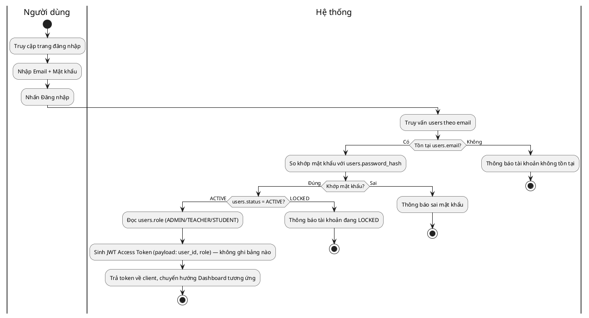

---

## UC2. Đăng xuất

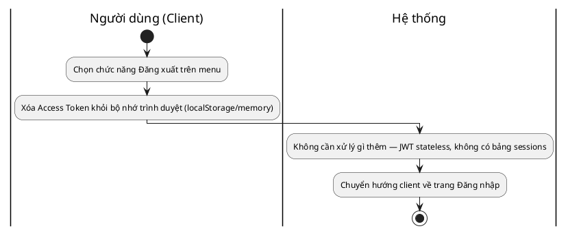

---

## UC3. Quản lý tài khoản cá nhân

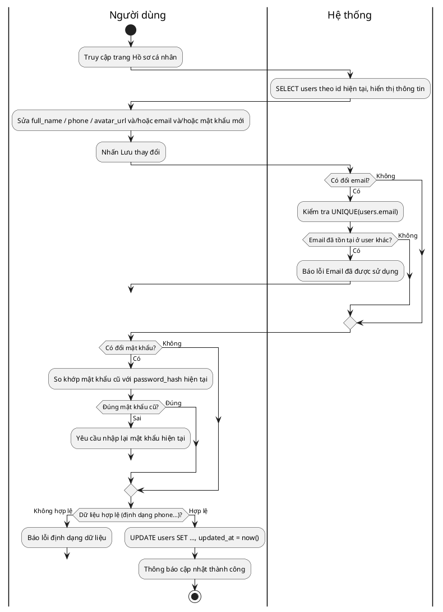

---

## UC4. Quản lý tài khoản người dùng

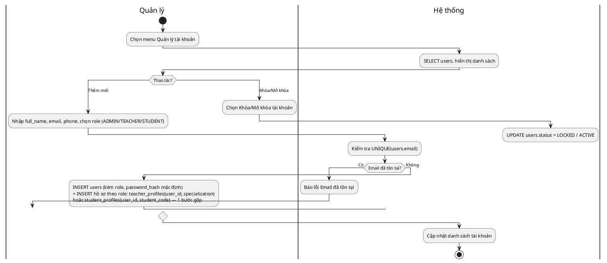

---

## UC5. Phân quyền người dùng

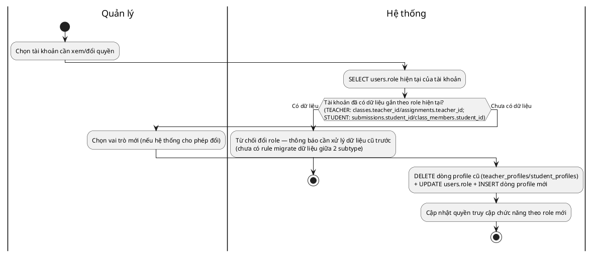

---

## UC6. Quản lý giáo viên

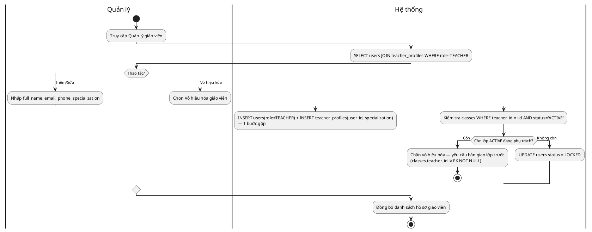

---

## UC7. Quản lý học viên

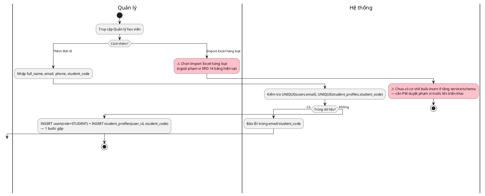

---

## UC8. Quản lý lớp học

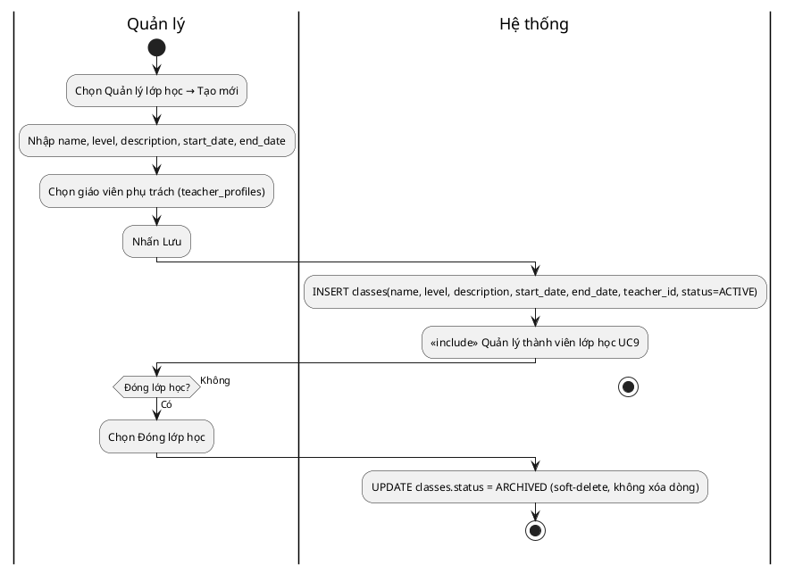

---

## UC9. Quản lý thành viên lớp học

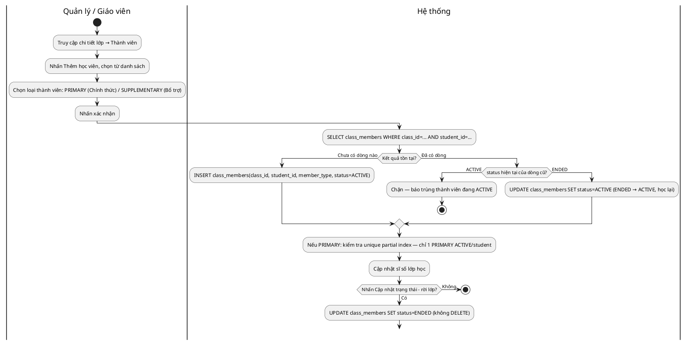

---

## UC10. Xem danh sách lớp học

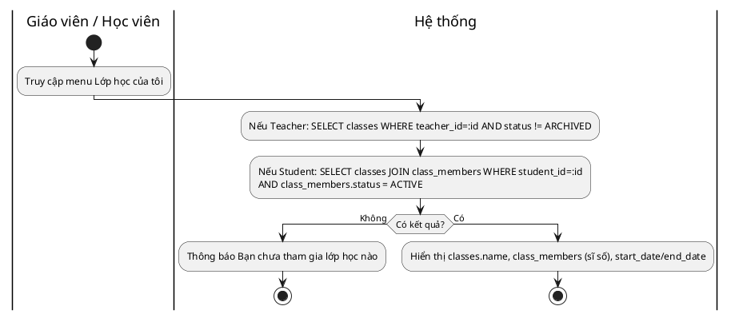

---

## UC11. Quản lý bài tập

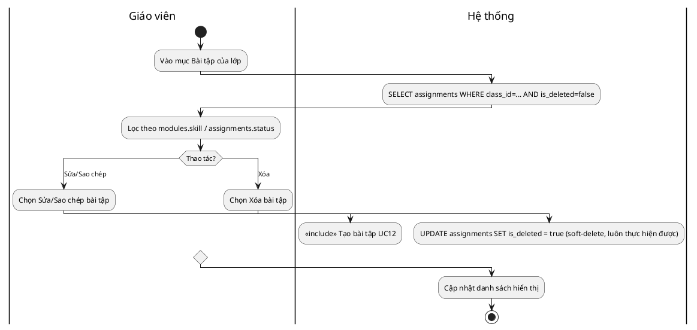

---

## UC12. Tạo bài tập

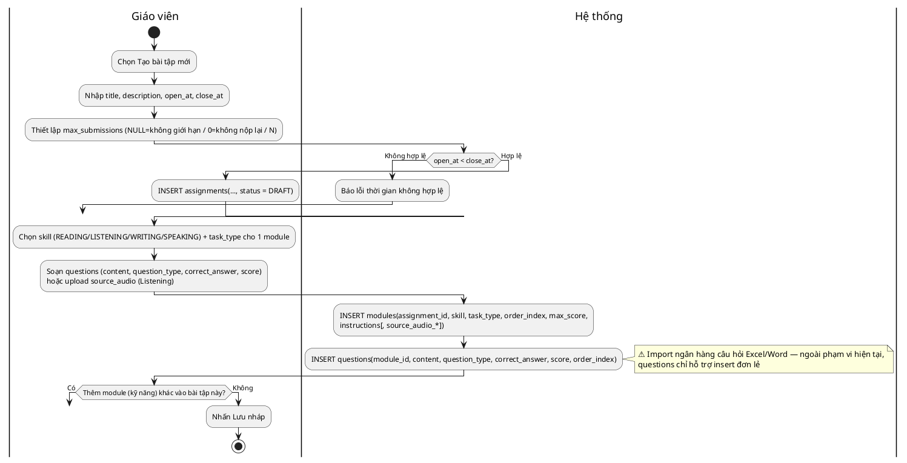

---

## UC13. Mở bài tập

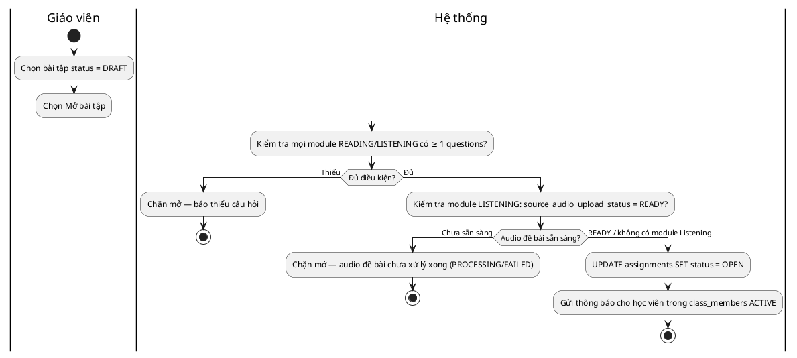

---

## UC14. Khóa bài tập

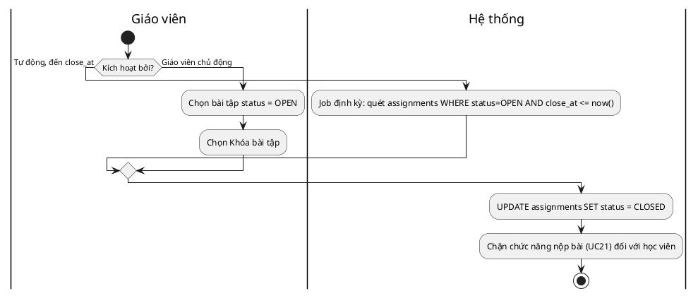

---

## UC15. Xem bài tập

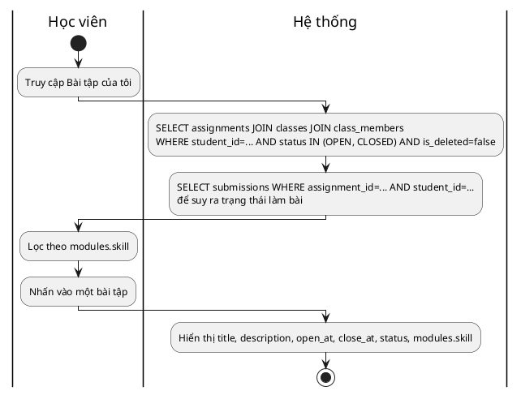

---

## UC16. Làm bài tập viết (Writing)

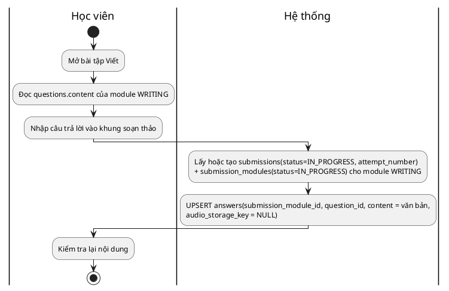

---

## UC17. Làm bài tập nói (Speaking)

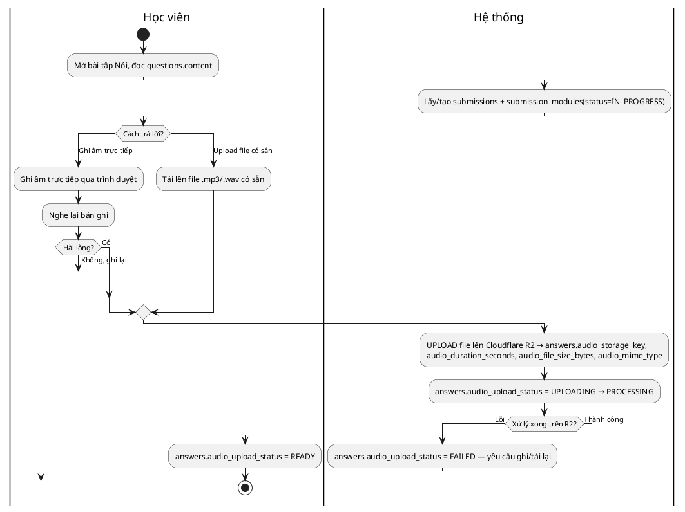

---

## UC18. Làm bài tập đọc (Reading)

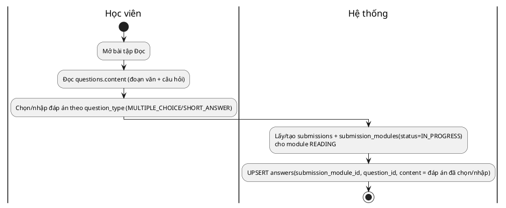

---

## UC19. Làm bài tập nghe (Listening)

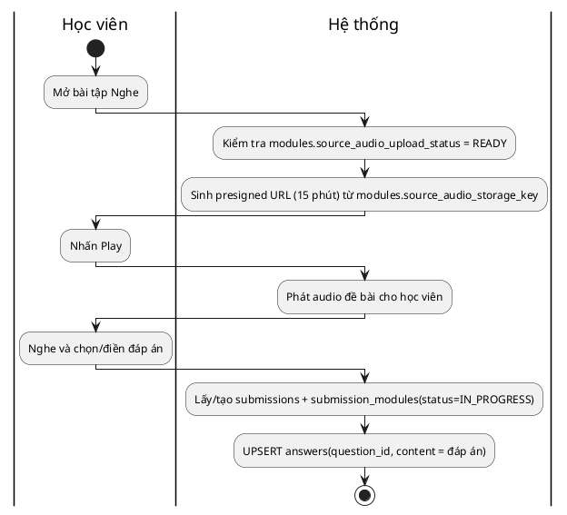

---

## UC20. Kiểm tra và xem lại bài làm trước khi nộp

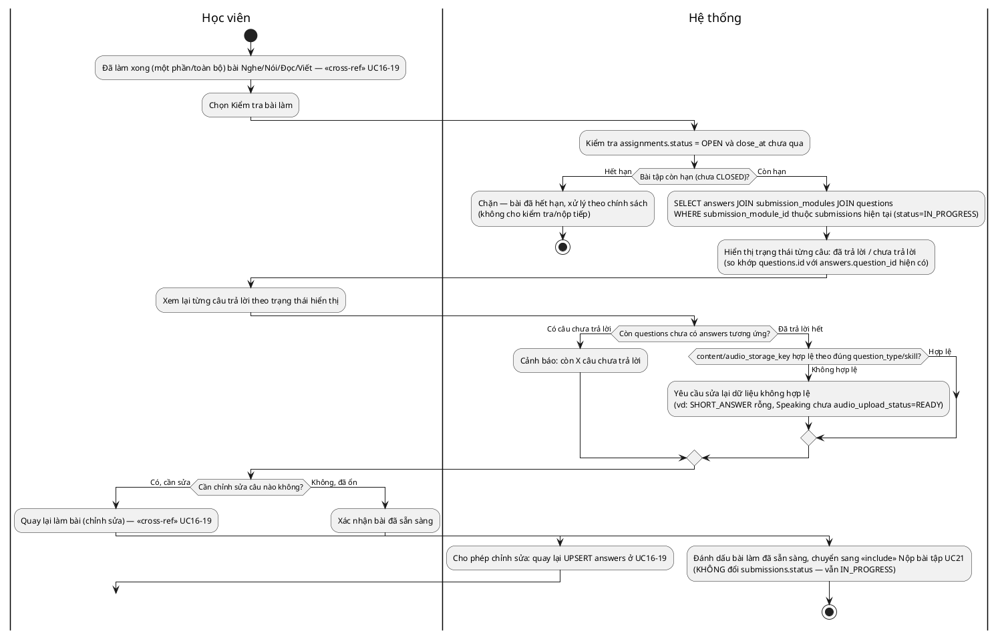

---

## UC21. Nộp bài tập

```plantuml
@startuml
|Học viên|
start
:Nhấn nút Nộp bài;
|Hệ thống|
if (assignments.status = OPEN?) then (CLOSED)
  :Chặn nộp — bài đã CLOSED;
  stop
else (OPEN)
  if (submissions.attempt_number < assignments.max_submissions?\n(NULL=không giới hạn, 0=không cho nộp)) then (Hết lượt)
    :Chặn — hết lượt nộp;
    stop
  else (Còn lượt)
    if (Còn questions chưa có answers tương ứng?) then (Có)
      :Cảnh báo Còn X câu chưa làm, vẫn tiếp tục?;
    else (Không)
    endif
  endif
endif
|Học viên|
:Nhấn Xác nhận;
|Hệ thống|
:UPDATE submissions SET status=SUBMITTED, submitted_at=now()\n(XÁC NHẬN, không phải tạo mới);
:UPDATE submission_modules SET status=SUBMITTED;
:INSERT gradings(submission_module_id, status=PENDING) cho mỗi submission_module;
stop
@enduml
```

---

## UC22. Quản lý lần làm và nộp lại bài

```plantuml
@startuml
|Học viên|
start
:Đã nộp bài — submissions.status=SUBMITTED, attempt_number=N;
|Hệ thống|
if (attempt_number < assignments.max_submissions?) then (Hết lượt)
  :Ẩn nút Làm lại;
  stop
else (Còn lượt)
  :Hiển thị nút Làm lại (còn X lượt, tính từ max_submissions - attempt_number);
endif
|Học viên|
:Vào lại bài tập;
:Chọn Làm lại bài;
|Hệ thống|
:INSERT submissions(assignment_id, student_id, attempt_number = N+1, status=IN_PROGRESS)\n— UNIQUE(assignment_id, student_id, attempt_number);
|Học viên|
:«include» Làm bài (UC16-19) → «include» Nộp bài tập UC21;
stop
@enduml
```

---

## UC23. Xem trạng thái bài làm

```plantuml
@startuml
|Học viên|
start
:Truy cập Dashboard/danh sách bài tập;
|Hệ thống|
:Nếu chưa có submissions → Chưa làm;
:submissions.status = IN_PROGRESS → Đang làm;
:submissions.status = SUBMITTED → Đã nộp / Đang chấm (tùy gradings.status);
:Tất cả gradings liên quan status = COMPLETED → Đã chấm / Đã có bài chữa;
:Hiển thị Status tag theo màu tương ứng;
stop
@enduml
```

---

## UC24. Chấm bài

```plantuml
@startuml
|Giáo viên|
start
:Chọn ds submission_modules WHERE status=SUBMITTED;
:Mở bài làm của 1 học viên;
switch (Kỹ năng của module?)
case (READING)
  |Hệ thống|
  :«include» Chấm bài đọc UC28 (AUTO);
case (LISTENING)
  |Hệ thống|
  :«include» Chấm bài nghe UC29 (AUTO);
case (WRITING/SPEAKING - dùng AI)
  |Hệ thống|
  :«include» Hỗ trợ chấm chữa bài bằng AI UC25;
case (WRITING/SPEAKING - chấm tay)
  |Giáo viên|
  :Nhập final_score, final_feedback thủ công;
endswitch
|Hệ thống|
:UPDATE gradings SET max_score_snapshot = modules.max_score\n(chốt tại thời điểm chấm, tránh sai hồi tố);
:UPDATE gradings SET final_score, final_feedback, reviewed_by, reviewed_at, status=COMPLETED;
|Giáo viên|
:Nhấn Xác nhận và Trả bài;
|Hệ thống|
:UPDATE submission_modules.status = GRADED;\nnếu đủ mọi module → submissions.status = GRADED;
:Gửi thông báo học viên có điểm;
stop
@enduml
```

---

## UC25. Hỗ trợ chấm chữa bài bằng AI

```plantuml
@startuml
|Giáo viên|
start
:Mở bài làm, nhấn Gợi ý chấm bằng AI;
|Hệ thống|
:INSERT gradings(method=AI, status=PENDING);
|AI|
:Nhận dữ liệu bài làm (answers);
switch (Kỹ năng?)
case (Viết)
  :«include» UC26 - chấm Viết bằng AI;
case (Nói)
  :«include» UC27 - chấm Nói bằng AI;
endswitch
if (Kết nối/xử lý AI thành công?) then (Lỗi)
  |Hệ thống|
  :UPDATE gradings SET status=FAILED, method giữ nguyên = AI\n(KHÔNG merge vào nhánh thành công);
  :Báo Hệ thống AI đang gián đoạn, cần chấm thủ công;
  |Giáo viên|
  :Vào chấm thủ công (nếu AI lỗi);
  |Hệ thống|
  :UPDATE gradings SET method=TEACHER_MANUAL, status=PENDING\n(chờ giáo viên chấm tay);
else (Thành công)
  |Hệ thống|
  :UPDATE gradings SET ai_suggested_score, ai_feedback;
  :Hiển thị điểm đề xuất + answer_annotations (source=AI) highlight lỗi;
  |Giáo viên|
  :Xem điểm/feedback AI đề xuất, có thể sửa lại;
endif
|Giáo viên|
:Xác nhận kết quả cuối;
|Hệ thống|
:UPDATE gradings SET final_score, final_feedback, status=COMPLETED;
stop
@enduml
```

---

## UC26. Hỗ trợ chấm chữa bài viết bằng AI

```plantuml
@startuml
|AI|
start
:Nhận answers.content (văn bản Writing);
:Phân tích lỗi: chính tả/ngữ pháp/từ vựng/cấu trúc câu;
:Với mỗi lỗi: chuẩn bị start_offset, end_offset, error_type, suggested_fix;
|Hệ thống|
:INSERT answer_annotations(answer_id, source=AI, start_offset, end_offset,\nerror_type, comment, suggested_fix) — N dòng, mỗi lỗi 1 dòng;
|AI|
:Tính điểm theo từng tiêu chí: Grammar, Vocabulary, Spelling,\nSentence structure, Coherence, Relevance, Writing quality;
|Hệ thống|
:INSERT criteria_scores(grading_id, criteria_name, score, feedback)\n— N dòng, mỗi tiêu chí 1 dòng;
|AI|
if (Phát hiện đạo văn?) then (Có)
  #pink:⚠️ Cảnh báo Plagiarism — ngoài phạm vi ERD hiện tại\n(không có pipeline/cột lưu kết quả plagiarism);
else (Không)
endif
|Hệ thống|
:UPDATE gradings.ai_suggested_score = SUM/AVG(criteria_scores.score theo trọng số),\nai_feedback = tổng hợp;
|Giáo viên|
:Duyệt: Accept hoặc Reject từng gợi ý AI (answer_annotations);
stop
@enduml
```

---

## UC27. Hỗ trợ chấm chữa bài nói bằng AI

```plantuml
@startuml
|Hệ thống|
start
:Kiểm tra answers.audio_upload_status = READY;
if (Sẵn sàng?) then (Chưa)
  :Chặn — audio chưa xử lý xong;
  stop
else (READY)
  :Sinh presigned URL từ answers.audio_storage_key, gửi cho AI;
endif
|AI|
:ASR: chuyển giọng nói → văn bản (Speech-to-Text);
if (Chất lượng âm thanh đạt?) then (Không đạt)
  :Trả cảnh báo: chất lượng âm thanh quá thấp;
  |Hệ thống|
  :UPDATE gradings.status = FAILED, ai_feedback = 'Chất lượng âm thanh thấp';
  stop
else (Đạt)
  :Phân tích từ phát âm sai, tính offset trong transcript;
  |Hệ thống|
  :UPDATE answers.content = transcript\n(KHÔNG xóa audio_storage_key — cả 2 cùng tồn tại, riêng cho Speaking);
  :INSERT answer_annotations(answer_id, source=AI, start_offset, end_offset\ntrỏ vào content=transcript, error_type='pronunciation');
  |AI|
  :Đánh giá Fluency: WPM, số lần ngừng, filler word...;
  |Hệ thống|
  :UPDATE gradings.ai_feedback += chỉ số Fluency dạng text\n(không tách cột riêng);
  |AI|
  :Đề xuất điểm (ai_suggested_score);
  |Hệ thống|
  :UPDATE gradings.ai_suggested_score;
  |Giáo viên|
  :Nghe lại bài nói và chốt điểm cuối;
  stop
endif
@enduml
```

---

## UC28. Chấm bài đọc (Reading)

```plantuml
@startuml
|Học viên|
start
:Nộp bài Đọc (trigger từ UC21);
|Hệ thống|
:INSERT gradings(submission_module_id, method=AUTO, status=PENDING);
:Với mỗi answers: so sánh content với questions.correct_answer;
if (question_type = SHORT_ANSWER và gần đúng (tương đối)?) then (Có, cần duyệt lại)
  :UPDATE gradings.status = PENDING, ghi chú cần giáo viên duyệt lại\n(chưa COMPLETED);
  stop
else (Không, so khớp rõ ràng)
  :SUM(questions.score) cho các answers đúng;
  :UPDATE gradings SET final_score = tổng điểm, max_score_snapshot = modules.max_score,\nstatus = COMPLETED, graded_at = now();
  stop
endif
@enduml
```

---

## UC29. Chấm bài nghe (Listening)

```plantuml
@startuml
|Học viên|
start
:Nộp bài Nghe (trigger từ UC21);
|Hệ thống|
:INSERT gradings(submission_module_id, method=AUTO, status=PENDING);
:Với mỗi answers: so sánh content với questions.correct_answer;
if (Cấu hình cho phép sai hoa/thường?) then (Có)
  :Chuẩn hóa lowercase trước khi so sánh;
else (Không)
endif
:SUM(questions.score) cho các answers đúng;
:UPDATE gradings SET final_score, max_score_snapshot = modules.max_score,\nstatus = COMPLETED, graded_at = now();
stop
@enduml
```

---

## UC30. Xem điểm số

```plantuml
@startuml
|Học viên / Giáo viên|
start
:Truy cập Bảng điểm / Kết quả;
|Hệ thống|
:SELECT assignments → submission_modules → modules(skill) → gradings\nWHERE gradings.status = COMPLETED;
:Với mỗi module: hiển thị final_score / max_score_snapshot theo skill riêng\n(KHÔNG có cột điểm tổng hợp cấp assignment trong schema);
if (Assignment có > 1 module?) then (Có)
  :Hiển thị danh sách N dòng điểm — 1 dòng / module / skill;
else (Không)
  :Hiển thị 1 dòng điểm duy nhất;
endif
stop
@enduml
```

---

## UC31. Quản lý điểm số

```plantuml
@startuml
|Giáo viên|
start
:Vào Quản lý điểm số của 1 lớp;
|Hệ thống|
:SELECT gradings JOIN submission_modules JOIN submissions JOIN class_members\n→ hiển thị bảng Matrix Học viên × Module;
|Giáo viên|
:Click ô điểm để sửa thủ công, nhập lý do sửa;
|Hệ thống|
:Lưu old_score = gradings.final_score (giá trị trước khi sửa);
:UPDATE gradings SET final_score = giá trị mới;
:🆕 INSERT grading_change_logs(grading_id, changed_by, old_score, new_score,\nreason, changed_at) — bảng MỚI, cần bổ sung migration;
|Giáo viên|
if (Xuất Excel?) then (Có)
  :Nhấn Xuất Excel;
  |Hệ thống|
  :Xuất file Excel bảng điểm hiện hành;
  stop
else (Không)
  stop
endif
@enduml
```

---

## UC32. Xem kết quả học tập

```plantuml
@startuml
|Học viên|
start
:Chọn Tiến độ học tập;
|Hệ thống|
:SELECT gradings JOIN submission_modules JOIN modules(skill)\nWHERE student_id=... AND status=COMPLETED;
:Tính tỷ lệ = final_score / max_score_snapshot cho từng dòng\n(KHÔNG dùng điểm thô, vì max_score khác nhau giữa các module);
:Nhóm theo modules.skill (READING/LISTENING/WRITING/SPEAKING) → AVG(tỷ lệ);
:Render biểu đồ radar 4 kỹ năng;
:Tính điểm trung bình toàn khóa = AVG(tỷ lệ tất cả module);
stop
@enduml
```

---

## UC33. Xem bài chữa

```plantuml
@startuml
|Học viên|
start
:Click Chi tiết bài chữa của module đã status=COMPLETED;
|Hệ thống|
:SELECT answers WHERE submission_module_id=...;
:SELECT answer_annotations WHERE answer_id IN (...)\n— hiển thị highlight lỗi (source AI hoặc TEACHER);
:SELECT gradings.final_feedback, criteria_scores (nếu Writing/Speaking);
:Hiển thị questions.correct_answer làm đáp án chuẩn;
stop
@enduml
```

---

## UC34. Xem và đánh giá kết quả học viên

```plantuml
@startuml
|Giáo viên|
start
:Chọn một học viên trong danh sách lớp;
|Hệ thống|
:«include» Xem kết quả học tập UC32\n(tính theo tỷ lệ final_score/max_score_snapshot);
|Giáo viên|
:Xem lịch sử: SELECT gradings/criteria_scores theo student_id,\nnhóm theo modules.skill;
:Viết đánh giá tổng quan (nhận xét thái độ, năng lực);
|Hệ thống|
#pink:⚠️ Không có bảng lưu 'đánh giá tổng quan' (report) riêng trong 14 bảng hiện tại.
Trong phạm vi ERD hiện hành CHỈ có thể: (a) ghi tạm vào gradings.final_feedback
của 1 module bất kỳ (không đúng bản chất), hoặc (b) chưa lưu — chỉ hiển thị tức thời.
|Giáo viên|
:Gửi đánh giá cho học viên;
stop
@enduml
```

---

## UC35. Theo dõi tiến độ học tập

```plantuml
@startuml
|Giáo viên|
start
:Truy cập Báo cáo lớp học;
|Hệ thống|
:SELECT class_members WHERE class_id=... AND status=ACTIVE → tổng số học viên;
:SELECT submissions WHERE assignment_id IN (assignments của lớp)\n→ tỷ lệ đã nộp/chưa nộp;
:SELECT gradings JOIN submission_modules\n→ tính tỷ lệ final_score/max_score_snapshot theo học viên;
:Tính % hoàn thành bài tập, % học viên có tỷ lệ điểm dưới ngưỡng trung bình;
:Hiển thị Dashboard tiến độ lớp học;
|Giáo viên|
:Xem Dashboard, điều chỉnh phương pháp giảng dạy;
stop
@enduml
```

---

## UC36. Xem báo cáo và thống kê học tập

```plantuml
@startuml
|Quản lý / Giáo viên|
start
:Truy cập Thống kê báo cáo;
label ThietLapBoLoc
:Thiết lập bộ lọc: khoảng thời gian, theo lớp (classes)/giáo viên (teacher_profiles)/kỹ năng (modules.skill);
|Hệ thống|
if (Bộ lọc có bao gồm 'chi nhánh'?) then (Có)
  #pink:⚠️ Không hỗ trợ — classes/users hiện không có cột liên kết chi nhánh\n(ngoài phạm vi ERD 14 bảng);
  |Quản lý / Giáo viên|
  goto ThietLapBoLoc
else (Không)
  :Tổng hợp: SUM/COUNT assignments, gradings(final_score/max_score_snapshot)\ntheo bộ lọc hợp lệ;
  if (Có dữ liệu trong khoảng đã chọn?) then (Không có dữ liệu)
    :Hiển thị Không có dữ liệu;
    |Quản lý / Giáo viên|
    goto ThietLapBoLoc
  else (Có dữ liệu)
    :Xuất báo cáo dạng số liệu + biểu đồ KPI;
    |Quản lý / Giáo viên|
    :Nhấn Xuất PDF/Excel;
    |Hệ thống|
    :Tạo và trả về file PDF/Excel;
    stop
  endif
endif
@enduml
```

---

## Ghi chú kỹ thuật khi dùng PlantUML

- Cú pháp `|Tên lane|` chuyển swimlane — dùng cho Người dùng/Quản lý/Giáo viên/Học viên, `Hệ thống`, và `AI` (UC25–27) đúng theo 3 làn đã thiết kế ở bản Mermaid.
- `label X` + `goto X` thay cho các cạnh quay lui (vd: sửa lỗi rồi quay lại nhập liệu ở UC3, UC4, UC7, UC9, UC12, UC17, UC20, UC36) — PlantUML hỗ trợ `goto` cho activity diagram (khác `while` khi vòng lặp không đơn giản là "lặp cho tới khi đúng điều kiện đầu vào").
- `#pink:...;` dùng để tô màu các bước ⚠️ ngoài phạm vi ERD hiện tại, dễ nhận diện khi trình bày.
- `switch/case/endswitch` dùng cho các decision có >2 nhánh xuất phát từ 1 điểm (UC4, UC6, UC7, UC17, UC24, UC25).
- Toàn bộ nội dung text bên trong node giữ nguyên các tên bảng/cột ERD như bản Mermaid gốc để đảm bảo tính nhất quán khi đối chiếu với `ERD_reference.md`.
