# ACTIVITY DIAGRAM — CODE PLANTUML CHO 36 USE CASE
## Website quản lý bài tập và chấm chữa bài tiếng Anh thông minh — Group 4

> Cách dùng: copy từng khối code vào [PlantUML online editor](https://www.plantuml.com/plantuml/uml/) hoặc plugin PlantUML (VS Code/IntelliJ) để render hình.

---

## UC1. Đăng nhập

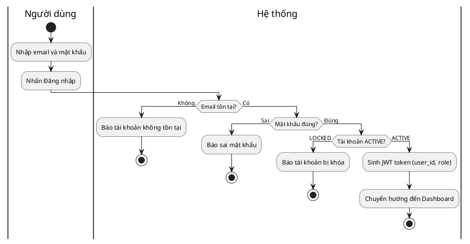

---

## UC2. Đăng xuất

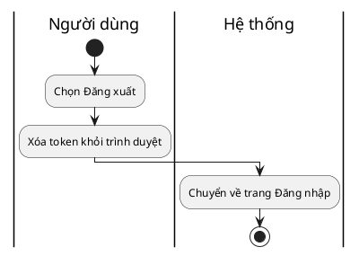

---

## UC3. Quản lý tài khoản cá nhân

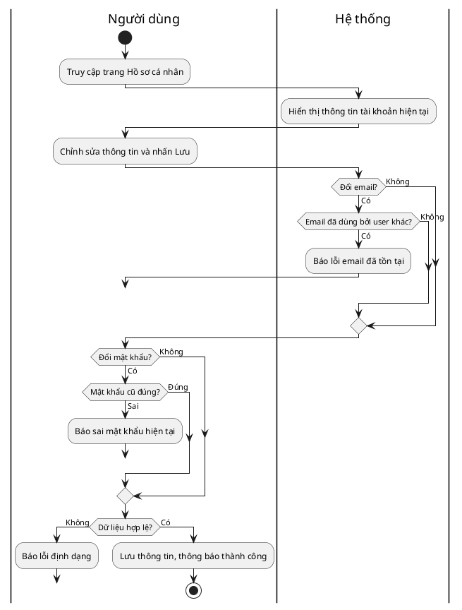

---

## UC4. Quản lý tài khoản người dùng

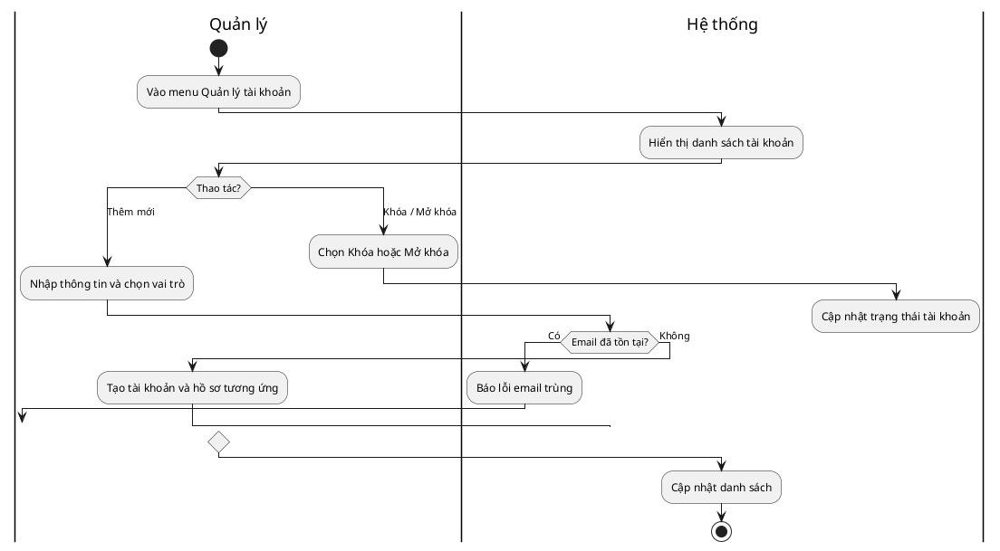

---

## UC5. Phân quyền người dùng

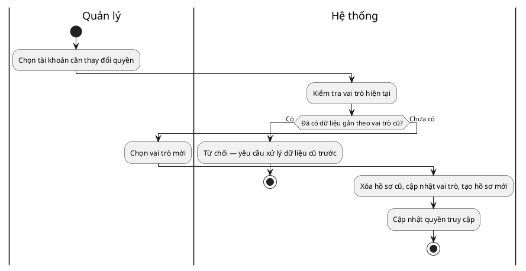

---

## UC6. Quản lý giáo viên

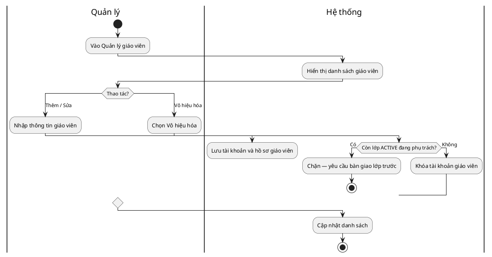

---

## UC7. Quản lý học viên

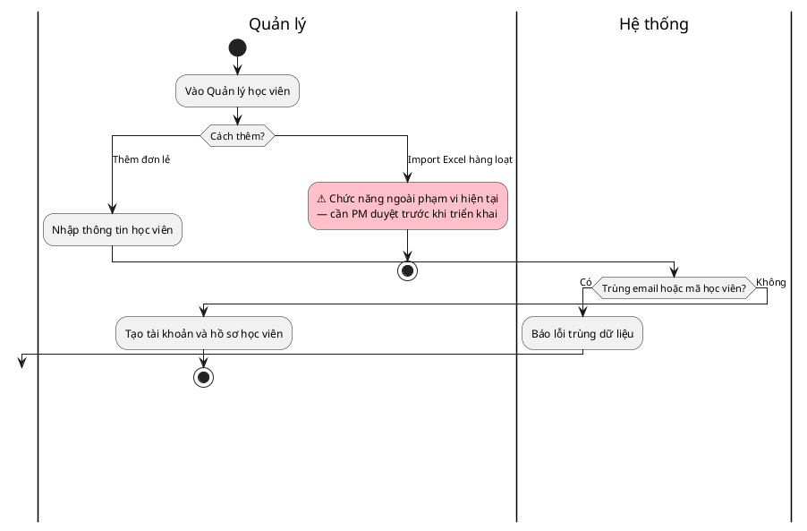

---

## UC8. Quản lý lớp học

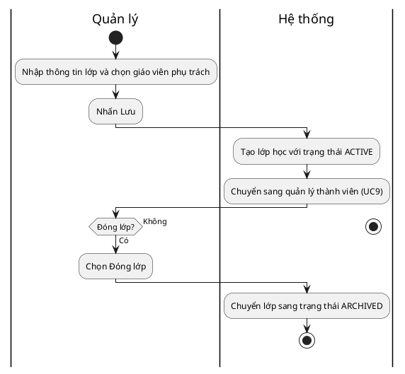

---

## UC9. Quản lý thành viên lớp học

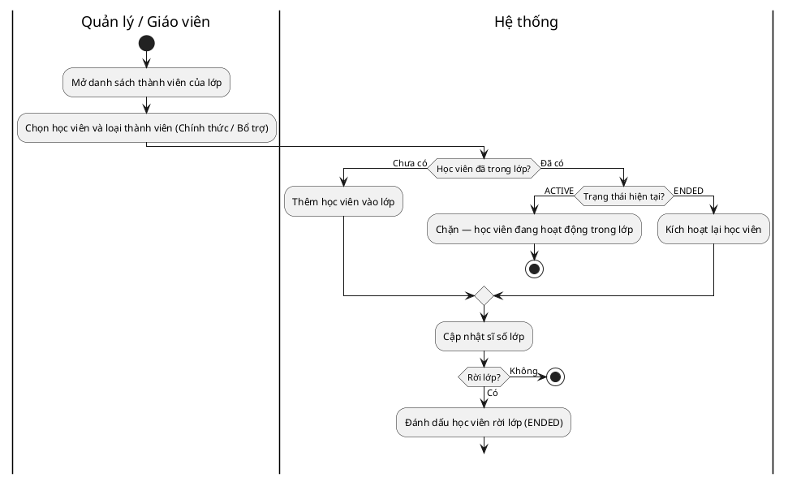

---

## UC10. Xem danh sách lớp học

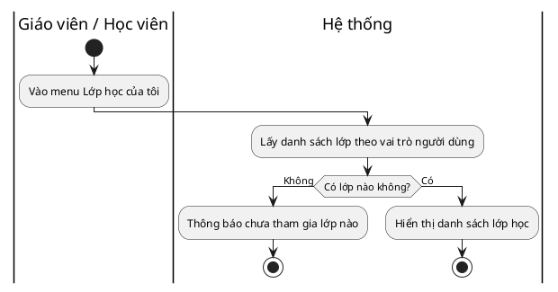

---

## UC11. Quản lý bài tập

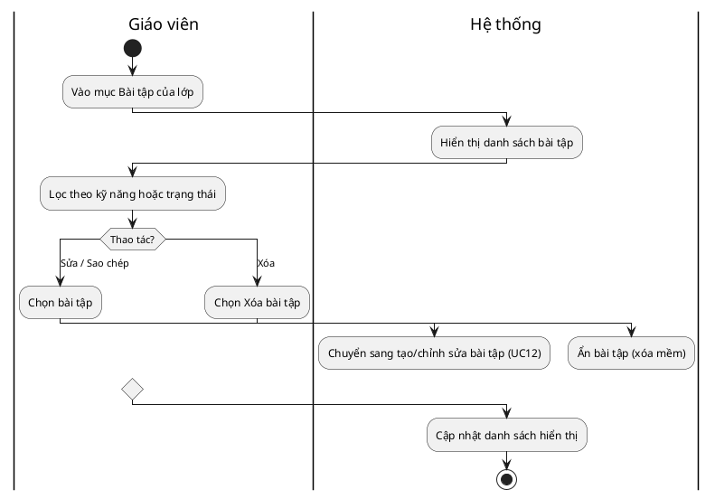

---

## UC12. Tạo bài tập

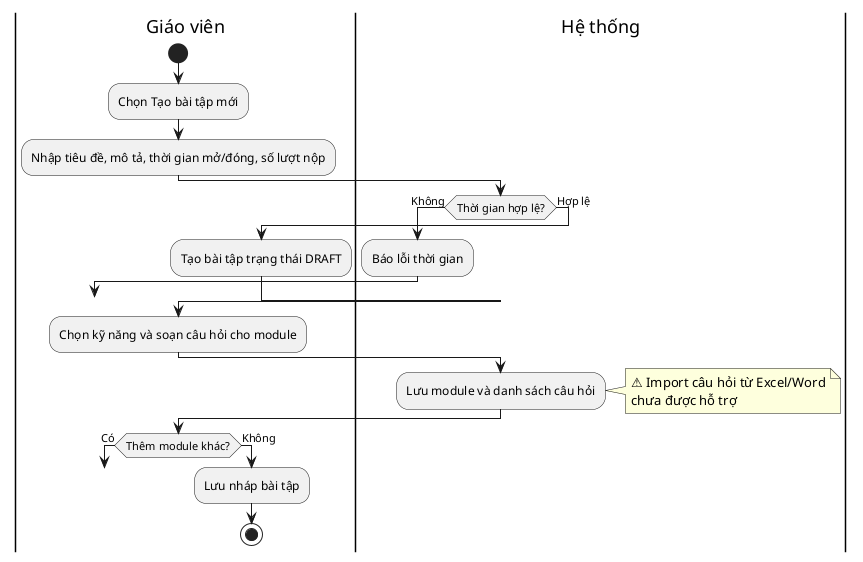

---

## UC13. Mở bài tập

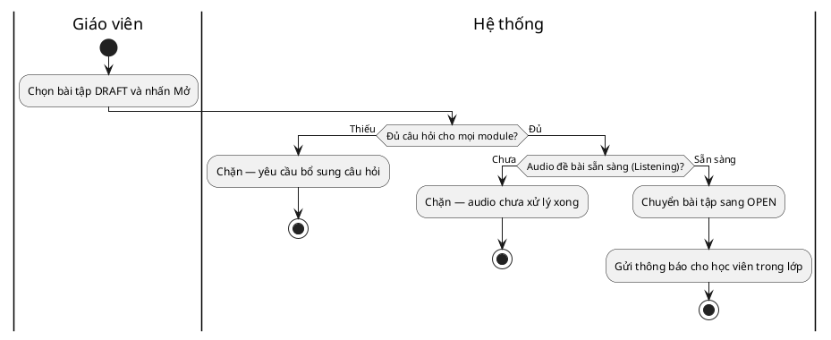

---

## UC14. Khóa bài tập

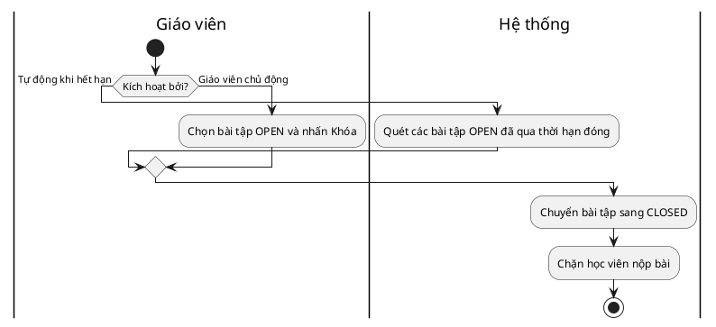

---

## UC15. Xem bài tập

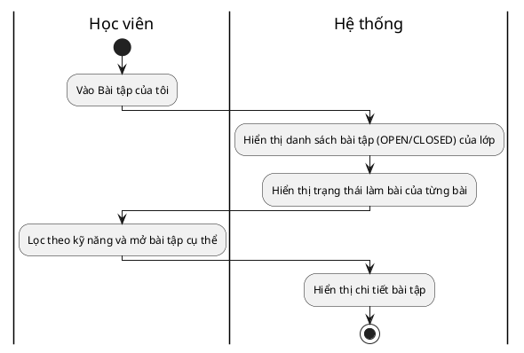

---

## UC16. Làm bài tập viết (Writing)

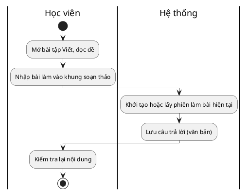

---

## UC17. Làm bài tập nói (Speaking)

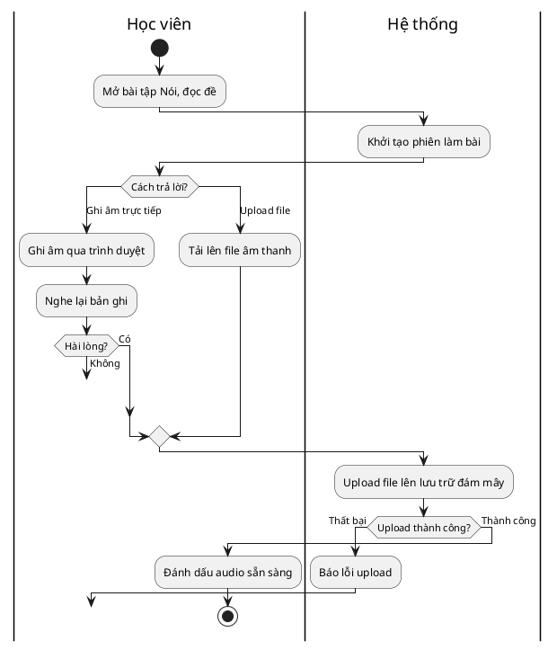

---

## UC18. Làm bài tập đọc (Reading)

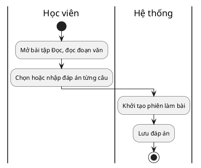

---

## UC19. Làm bài tập nghe (Listening)

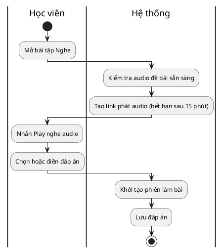

---

## UC20. Kiểm tra và xem lại bài làm

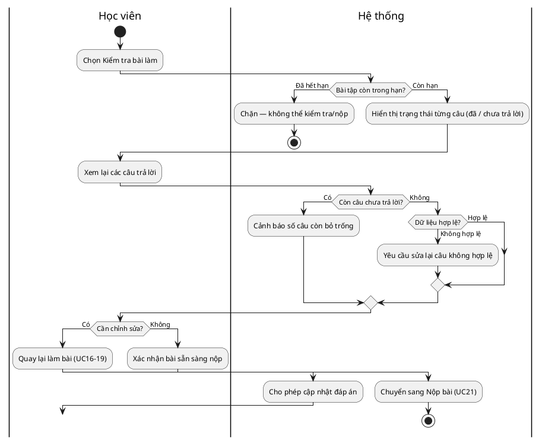

---

## UC21. Nộp bài tập

```plantuml
@startuml
|Học viên|
start
:Nhấn nút Nộp bài;
|Hệ thống|
if (Bài tập còn OPEN?) then (Đã CLOSED)
  :Chặn — bài đã đóng;
  stop
else (OPEN)
  if (Còn lượt nộp?) then (Hết lượt)
    :Chặn — hết số lần nộp;
    stop
  else (Còn lượt)
    if (Còn câu chưa làm?) then (Có)
      :Cảnh báo — vẫn có thể tiếp tục nộp;
    else (Không)
    endif
  endif
endif
|Học viên|
:Nhấn Xác nhận nộp;
|Hệ thống|
:Đánh dấu bài đã nộp;
:Tạo bản ghi chờ chấm điểm;
stop
@enduml
```

---

## UC22. Quản lý lần làm và nộp lại bài

```plantuml
@startuml
|Học viên|
start
:Xem bài đã nộp;
|Hệ thống|
if (Còn lượt nộp lại?) then (Hết lượt)
  :Ẩn nút Làm lại;
  stop
else (Còn lượt)
  :Hiển thị số lượt còn lại và nút Làm lại;
endif
|Học viên|
:Chọn Làm lại bài;
|Hệ thống|
:Tạo lần nộp mới;
|Học viên|
:Làm bài (UC16-19) và nộp lại (UC21);
stop
@enduml
```

---

## UC23. Xem trạng thái bài làm

```plantuml
@startuml
|Học viên|
start
:Vào Dashboard / danh sách bài tập;
|Hệ thống|
:Xác định trạng thái từng bài:\n· Chưa làm\n· Đang làm\n· Đã nộp / Đang chấm\n· Đã có điểm;
:Hiển thị nhãn trạng thái tương ứng;
stop
@enduml
```

---

## UC24. Chấm bài

```plantuml
@startuml
|Giáo viên|
start
:Chọn bài làm cần chấm;
switch (Kỹ năng của module?)
case (Đọc - Reading)
  |Hệ thống|
  :Chấm tự động (UC28);
case (Nghe - Listening)
  |Hệ thống|
  :Chấm tự động (UC29);
case (Viết / Nói - dùng AI)
  |Hệ thống|
  :Gợi ý chấm bằng AI (UC25);
case (Viết / Nói - chấm tay)
  |Giáo viên|
  :Nhập điểm và nhận xét thủ công;
endswitch
|Hệ thống|
:Lưu điểm, chốt điểm tối đa tại thời điểm chấm;
:Cập nhật trạng thái hoàn thành chấm;
|Giáo viên|
:Xác nhận và trả bài;
|Hệ thống|
:Cập nhật trạng thái bài nộp sang GRADED;
:Gửi thông báo cho học viên;
stop
@enduml
```

---

## UC25. Hỗ trợ chấm chữa bài bằng AI

```plantuml
@startuml
|Giáo viên|
start
:Mở bài làm và nhấn Gợi ý chấm bằng AI;
|Hệ thống|
:Tạo bản ghi chấm trạng thái PENDING;
|AI|
:Nhận dữ liệu bài làm;
switch (Kỹ năng?)
case (Viết)
  :Chấm bài Viết (UC26);
case (Nói)
  :Chấm bài Nói (UC27);
endswitch
if (AI xử lý thành công?) then (Thất bại)
  |Hệ thống|
  :Đánh dấu chấm AI thất bại;
  :Yêu cầu giáo viên chấm tay;
  |Giáo viên|
  :Chuyển sang chấm thủ công;
  |Hệ thống|
  :Cập nhật phương thức chấm thành TEACHER_MANUAL;
else (Thành công)
  |Hệ thống|
  :Hiển thị điểm đề xuất và highlight lỗi của AI;
  |Giáo viên|
  :Xem kết quả AI, điều chỉnh nếu cần;
endif
|Giáo viên|
:Xác nhận kết quả cuối;
|Hệ thống|
:Lưu điểm và nhận xét chính thức;
stop
@enduml
```

---

## UC26. Hỗ trợ chấm chữa bài viết bằng AI

```plantuml
@startuml
|AI|
start
:Nhận bài viết của học viên;
:Phân tích lỗi chính tả, ngữ pháp, từ vựng, cấu trúc;
|Hệ thống|
:Lưu từng lỗi kèm vị trí và gợi ý sửa;
|AI|
:Chấm điểm theo từng tiêu chí (Ngữ pháp, Từ vựng, Chính tả, Cấu trúc, Mạch lạc, ...);
|Hệ thống|
:Lưu điểm và nhận xét từng tiêu chí;
|AI|
if (Phát hiện đạo văn?) then (Có)
  #pink:⚠️ Cảnh báo đạo văn — ngoài phạm vi ERD hiện tại;
else (Không)
endif
|Hệ thống|
:Tổng hợp điểm AI đề xuất từ các tiêu chí;
|Giáo viên|
:Duyệt hoặc bỏ từng gợi ý của AI;
stop
@enduml
```

---

## UC27. Hỗ trợ chấm chữa bài nói bằng AI

```plantuml
@startuml
|Hệ thống|
start
:Kiểm tra audio bài nói sẵn sàng;
if (Audio sẵn sàng?) then (Chưa)
  :Chặn — audio chưa xử lý xong;
  stop
else (Sẵn sàng)
  :Tạo link truy cập audio và gửi cho AI;
endif
|AI|
:Chuyển giọng nói sang văn bản (Speech-to-Text);
if (Chất lượng âm thanh đạt?) then (Không đạt)
  :Báo chất lượng âm thanh quá thấp;
  |Hệ thống|
  :Đánh dấu chấm thất bại do chất lượng âm thanh;
  stop
else (Đạt)
  :Xác định từ phát âm sai và vị trí trong transcript;
  |Hệ thống|
  :Lưu transcript vào câu trả lời; 
  :Lưu các lỗi phát âm kèm vị trí;
  |AI|
  :Đánh giá độ trôi chảy (tốc độ, ngắt, filler word);
  |Hệ thống|
  :Ghi chỉ số fluency vào nhận xét;
  |AI|
  :Đề xuất điểm tổng;
  |Hệ thống|
  :Lưu điểm AI đề xuất;
  |Giáo viên|
  :Nghe lại và xác nhận điểm cuối;
  stop
endif
@enduml
```

---

## UC28. Chấm bài đọc (Reading)

```plantuml
@startuml
|Học viên|
start
:Nộp bài Đọc (từ UC21);
|Hệ thống|
:Khởi tạo bản ghi chấm tự động;
:So sánh từng đáp án với đáp án chuẩn;
if (Có câu trả lời ngắn cần duyệt thêm?) then (Có)
  :Đánh dấu cần giáo viên duyệt lại;
  stop
else (Không — so khớp rõ ràng)
  :Tính tổng điểm các câu đúng;
  :Lưu điểm và đánh dấu hoàn thành;
  stop
endif
@enduml
```

---

## UC29. Chấm bài nghe (Listening)

```plantuml
@startuml
|Học viên|
start
:Nộp bài Nghe (từ UC21);
|Hệ thống|
:Khởi tạo bản ghi chấm tự động;
:So sánh từng đáp án với đáp án chuẩn;
if (Cho phép bỏ qua hoa/thường?) then (Có)
  :Chuẩn hóa chữ thường trước khi so sánh;
else (Không)
endif
:Tính tổng điểm;
:Lưu điểm và đánh dấu hoàn thành;
stop
@enduml
```

---

## UC30. Xem điểm số

```plantuml
@startuml
|Học viên / Giáo viên|
start
:Vào Bảng điểm;
|Hệ thống|
:Lấy danh sách kết quả chấm đã hoàn thành;
if (Bài tập có nhiều module?) then (Có)
  :Hiển thị điểm theo từng module / kỹ năng;
else (Không)
  :Hiển thị 1 dòng điểm duy nhất;
endif
stop
@enduml
```

---

## UC31. Quản lý điểm số

```plantuml
@startuml
|Giáo viên|
start
:Vào Quản lý điểm số của lớp;
|Hệ thống|
:Hiển thị bảng điểm học viên theo từng module;
|Giáo viên|
:Click vào ô điểm cần sửa, nhập lý do;
|Hệ thống|
:Lưu điểm mới và ghi log thay đổi (điểm cũ, điểm mới, lý do);
|Giáo viên|
if (Xuất Excel?) then (Có)
  :Nhấn Xuất Excel;
  |Hệ thống|
  :Tạo và trả về file bảng điểm;
  stop
else (Không)
  stop
endif
@enduml
```

---

## UC32. Xem kết quả học tập

```plantuml
@startuml
|Học viên|
start
:Vào Tiến độ học tập;
|Hệ thống|
:Lấy kết quả tất cả module đã hoàn thành;
:Tính tỷ lệ điểm (điểm đạt / điểm tối đa) từng module;
:Nhóm và tính trung bình theo 4 kỹ năng;
:Hiển thị biểu đồ radar 4 kỹ năng;
:Tính điểm trung bình toàn khóa;
stop
@enduml
```

---

## UC33. Xem bài chữa

```plantuml
@startuml
|Học viên|
start
:Mở bài đã chấm xong;
|Hệ thống|
:Hiển thị đáp án của từng câu;
:Hiển thị các lỗi được highlight (nguồn AI hoặc giáo viên);
:Hiển thị nhận xét, điểm theo tiêu chí (nếu Viết/Nói);
:Hiển thị đáp án chuẩn;
stop
@enduml
```

---

## UC34. Xem và đánh giá kết quả học viên

```plantuml
@startuml
|Giáo viên|
start
:Chọn một học viên trong lớp;
|Hệ thống|
:Hiển thị kết quả học tập tổng quan (UC32);
|Giáo viên|
:Xem lịch sử điểm theo từng kỹ năng;
:Viết nhận xét tổng quan về học viên;
|Hệ thống|
#pink:⚠️ Chưa có bảng lưu nhận xét tổng quan\n— tạm ghi vào nhận xét module hoặc chỉ hiển thị tức thời;
|Giáo viên|
:Gửi nhận xét cho học viên;
stop
@enduml
```

---

## UC35. Theo dõi tiến độ học tập

```plantuml
@startuml
|Giáo viên|
start
:Vào Báo cáo lớp học;
|Hệ thống|
:Đếm số học viên đang hoạt động trong lớp;
:Tính tỷ lệ đã nộp / chưa nộp bài;
:Tính điểm trung bình và tỷ lệ học viên dưới ngưỡng;
:Hiển thị Dashboard tiến độ lớp;
|Giáo viên|
:Xem Dashboard, điều chỉnh phương pháp dạy;
stop
@enduml
```

---

## UC36. Xem báo cáo và thống kê học tập

```plantuml
@startuml
|Quản lý / Giáo viên|
start
:Vào Thống kê báo cáo;
label ThietLapBoLoc
:Thiết lập bộ lọc: thời gian, lớp, giáo viên, kỹ năng;
|Hệ thống|
if (Bộ lọc có 'chi nhánh'?) then (Có)
  #pink:⚠️ Không hỗ trợ — cơ sở dữ liệu chưa có thông tin chi nhánh;
  |Quản lý / Giáo viên|
  goto ThietLapBoLoc
else (Không)
  if (Có dữ liệu trong khoảng đã chọn?) then (Không)
    :Thông báo không có dữ liệu;
    |Quản lý / Giáo viên|
    goto ThietLapBoLoc
  else (Có)
    :Tổng hợp số liệu và vẽ biểu đồ KPI;
    |Quản lý / Giáo viên|
    :Nhấn Xuất PDF/Excel;
    |Hệ thống|
    :Tạo và trả về file báo cáo;
    stop
  endif
endif
@enduml
```

---

## Ghi chú kỹ thuật khi dùng PlantUML

- `|Tên lane|` chuyển swimlane — dùng cho Người dùng/Quản lý/Giáo viên/Học viên, `Hệ thống`, và `AI` (UC25–27).
- `label X` + `goto X` thay cho các cạnh quay lui (sửa lỗi rồi nhập lại) — dùng ở UC3, UC4, UC7, UC9, UC12, UC17, UC20, UC36.
- `#pink:...;` tô màu các bước ⚠️ ngoài phạm vi ERD hiện tại.
- `switch/case/endswitch` dùng cho decision có >2 nhánh (UC4, UC6, UC7, UC11, UC17, UC24, UC25).
- Mỗi nhánh trong `switch` cần có hành động trong đúng swimlane trước khi kết thúc hoặc hợp nhất.
