# SƠ ĐỒ HOẠT ĐỘNG (ACTIVITY DIAGRAM) — PlantUML
## Hệ thống quản lý bài tập và chấm chữa bài tiếng Anh thông minh

Quy ước áp dụng cho toàn bộ 36 sơ đồ dưới đây:

- Vẽ bằng **PlantUML**, chỉ dùng ký hiệu UML chuẩn (start/stop, action, decision, swimlane), **không màu, không icon** (`skinparam monochrome true`).
- Mỗi sơ đồ có 2–3 **swimlane** (làn bơi) theo đúng các tác nhân được khai báo trong đặc tả use case, lane cuối luôn là **"Hệ thống"** (hoặc **"AI"** nếu use case có tác nhân Hệ thống AI riêng).
- Các khối hành động được viết bằng **ngôn ngữ tự nhiên**, bám sát **dòng sự kiện chính** và **dòng sự kiện phụ** trong `Detailed_UseCase_Specifications.md`.
- Khi hành động liên quan đến **thêm/sửa/xóa dữ liệu**, khối hành động ghi rõ **tên bảng** theo đúng `ERD_reference.md` (ví dụ: bảng `users`, `assignments`, `submissions`...). Các use case không có bảng tương ứng trong ERD (ví dụ quản lý phiên đăng nhập, xuất báo cáo PDF) sẽ **không** gán tên bảng, chỉ mô tả hành vi.
- Nhánh sự kiện phụ dạng "sai/không hợp lệ → nhập lại" được vẽ bằng vòng lặp `repeat / repeat while` (giống ảnh ví dụ: quay lại bước nhập trước đó). Nhánh sự kiện phụ dạng "kết thúc bằng thông báo" được vẽ bằng `if/else`.

---

## 1. Đăng nhập

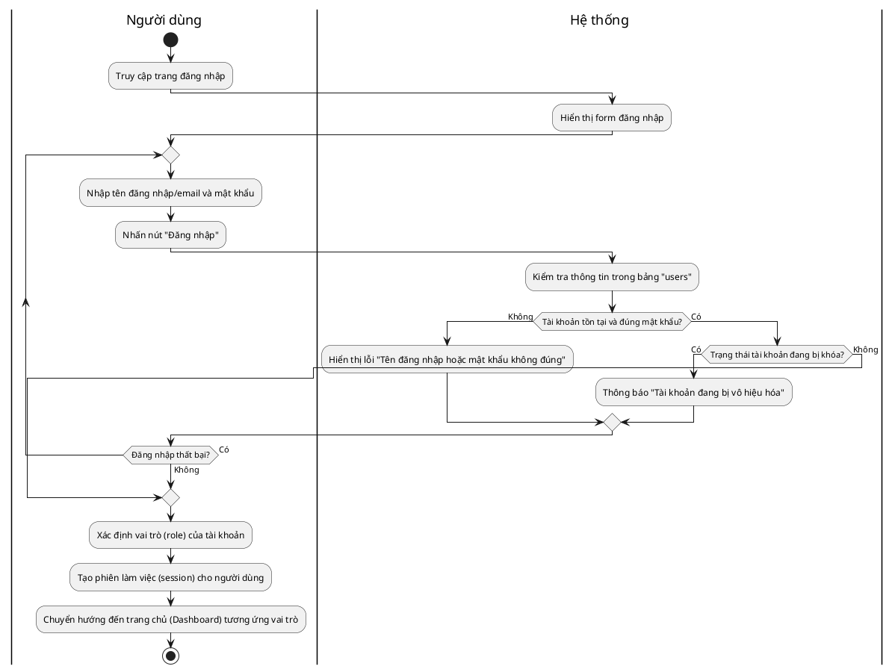

---

## 2. Đăng xuất

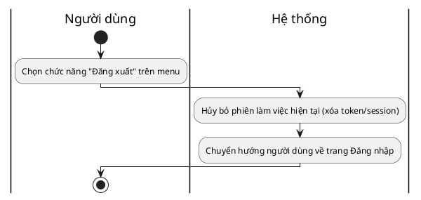

---

## 3. Quản lý tài khoản cá nhân

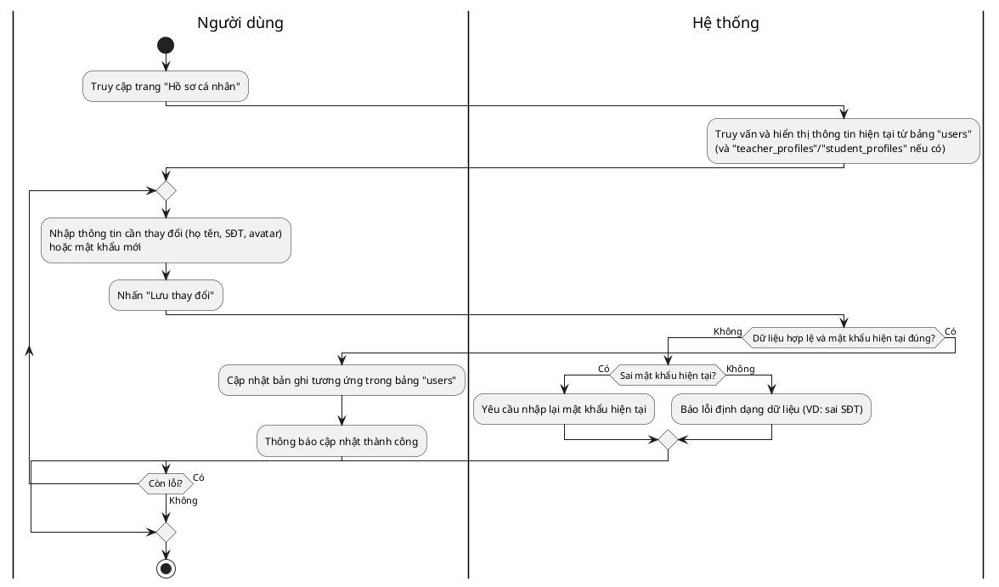

---

## 4. Quản lý tài khoản người dùng

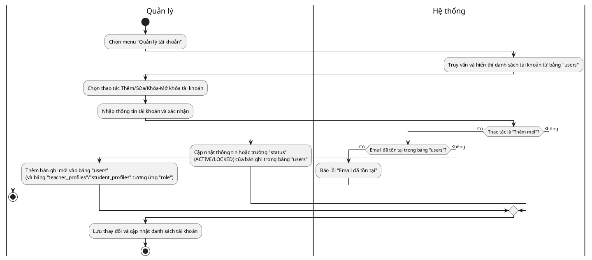

---

## 5. Phân quyền người dùng

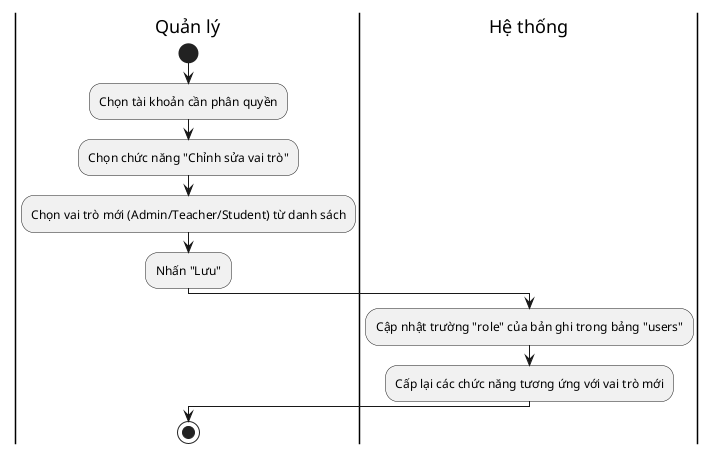

---

## 6. Quản lý giáo viên

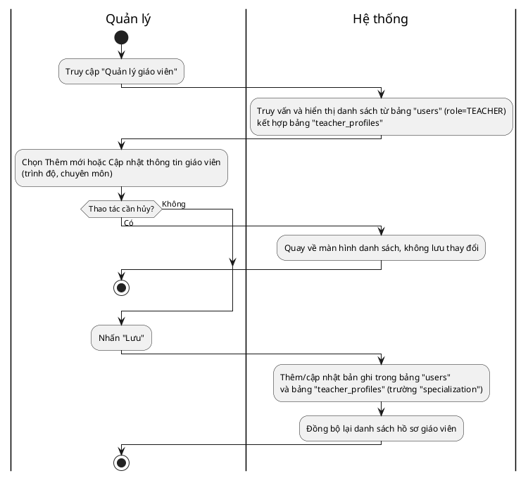

---

## 7. Quản lý học viên

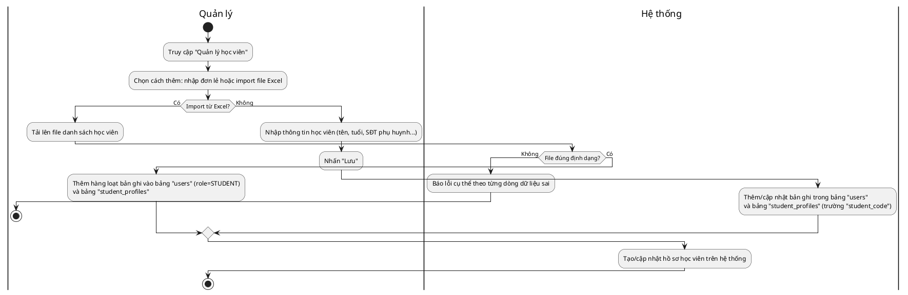

---

## 8. Quản lý lớp học

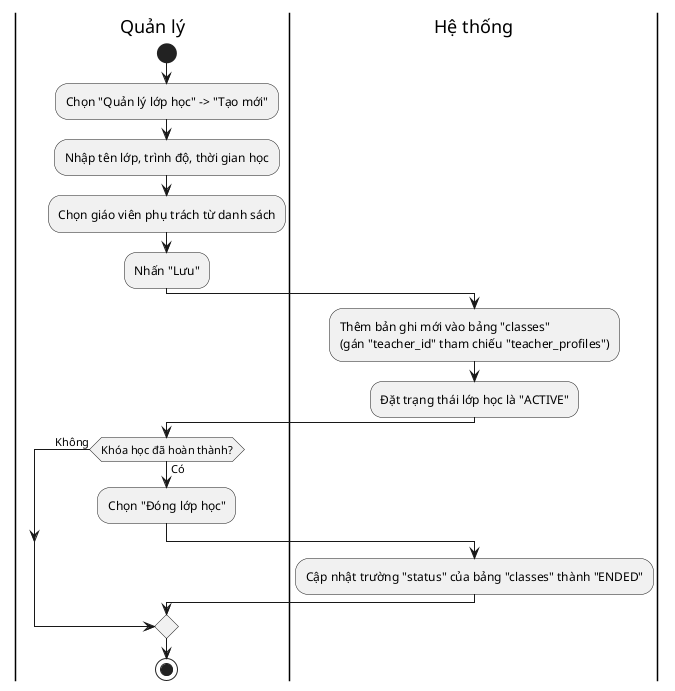

---

## 9. Quản lý thành viên lớp học

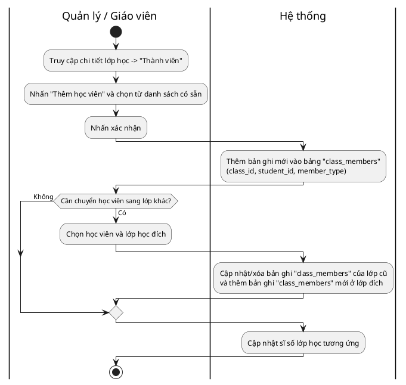

---

## 10. Xem danh sách lớp học

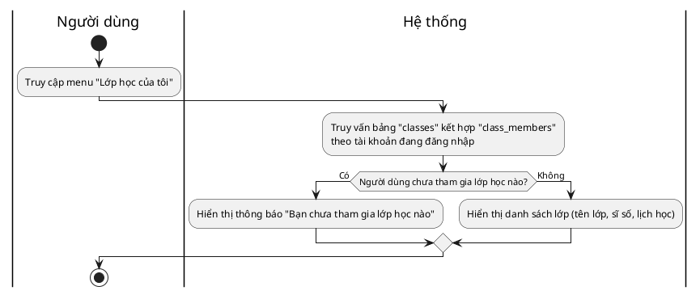

---

## 11. Quản lý bài tập

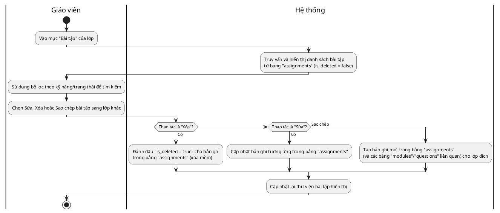

---

## 12. Tạo bài tập

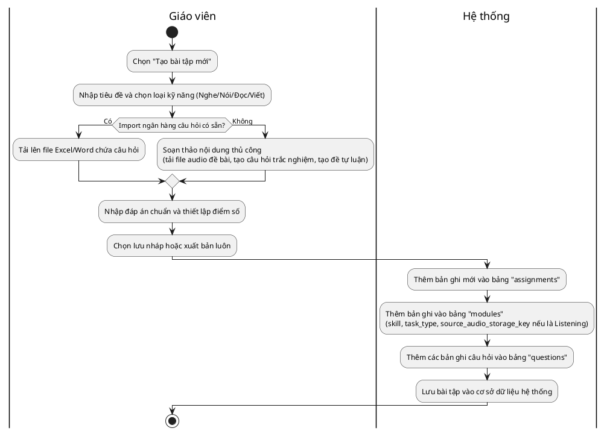

---

## 13. Mở bài tập

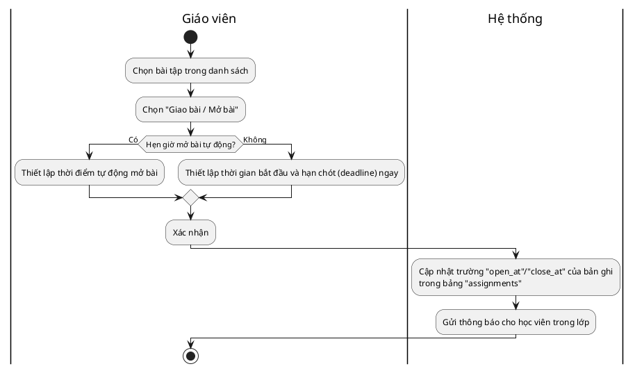

---

## 14. Khóa bài tập

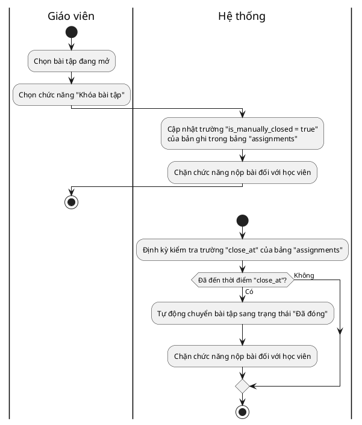

---

## 15. Xem bài tập

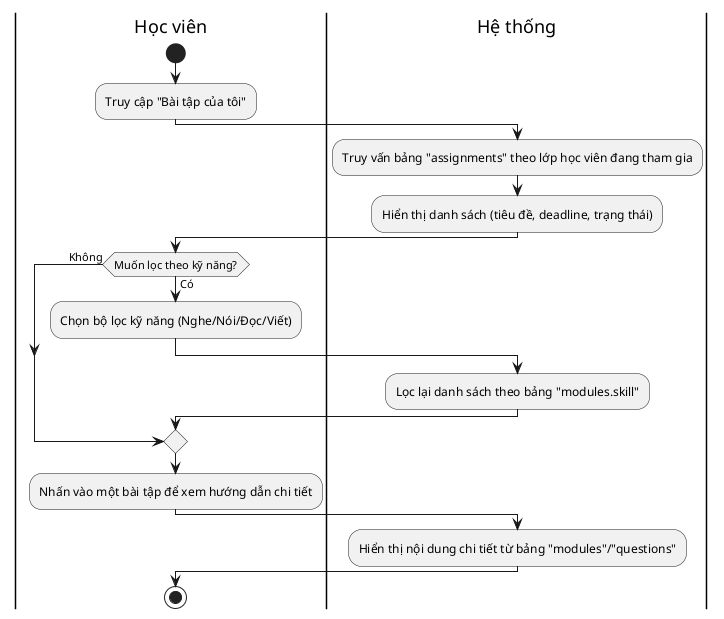

---

## 16. Làm bài tập viết (Writing)

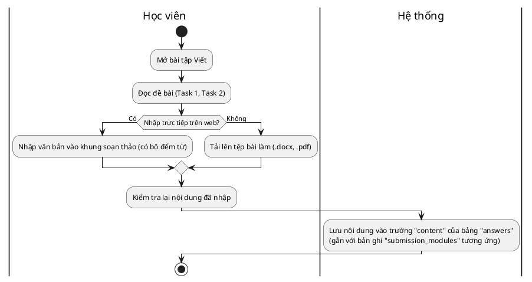

---

## 17. Làm bài tập nói (Speaking)

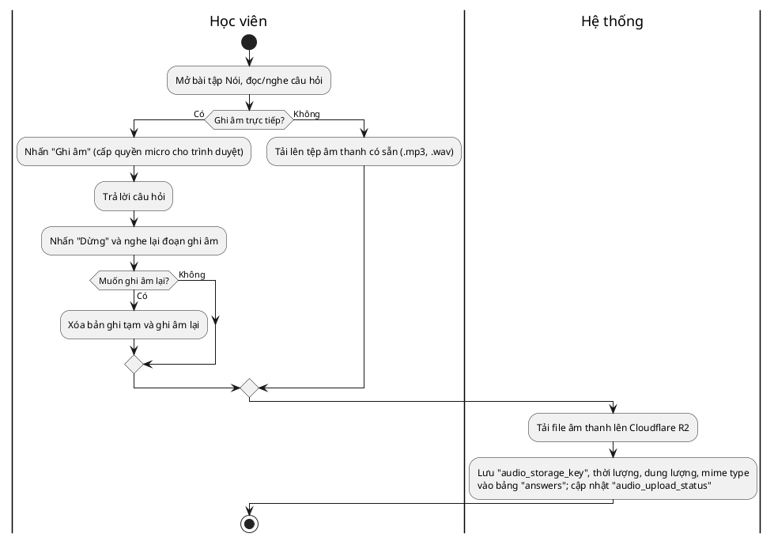

---

## 18. Làm bài tập đọc (Reading)

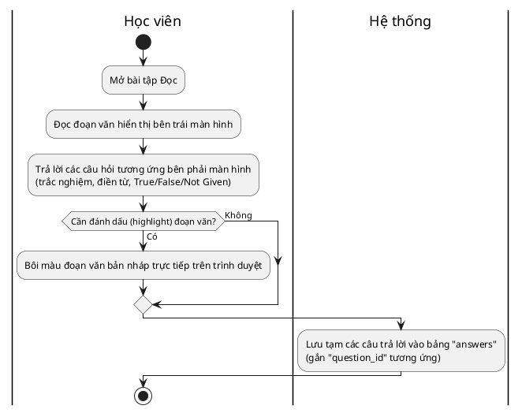

---

## 19. Làm bài tập nghe (Listening)

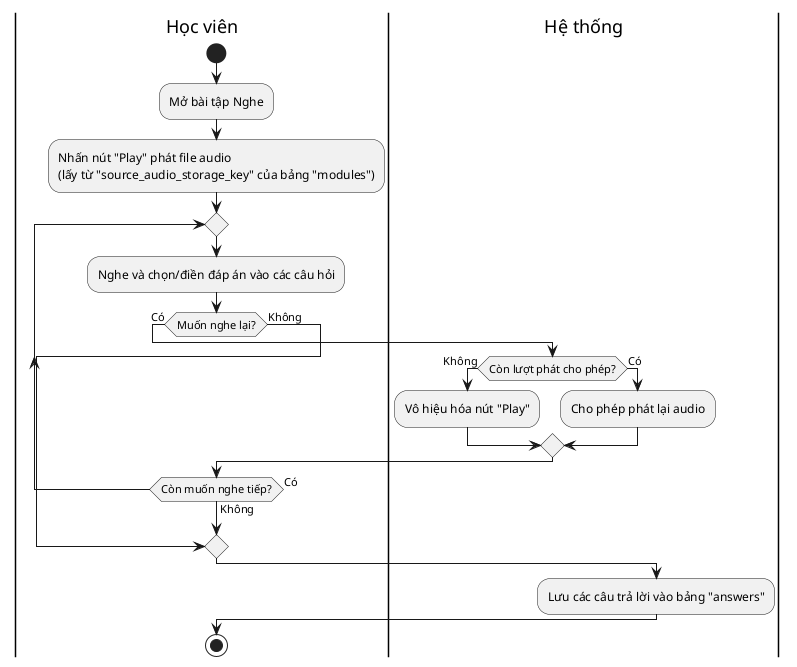

---

## 20. Kiểm tra và xem lại bài làm trước khi nộp

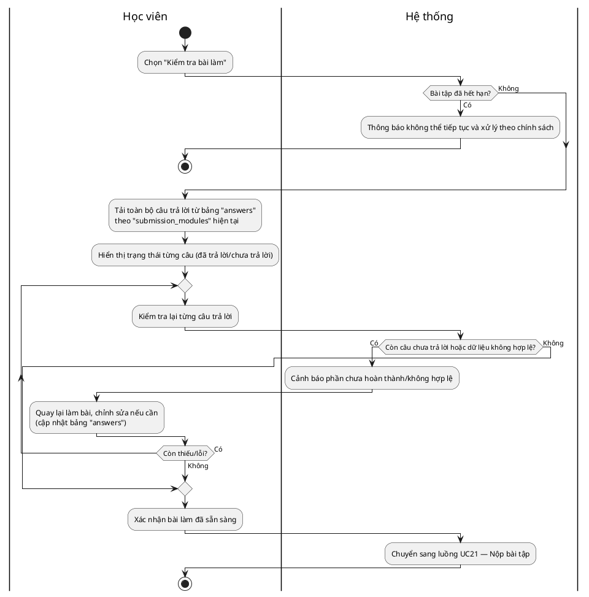

---

## 21. Nộp bài tập

```plantuml
@startuml
skinparam monochrome true
skinparam shadowing false

|Học viên|
start
:Nhấn nút "Nộp bài";
|Hệ thống|
:Hiển thị popup xác nhận "Bạn có chắc chắn muốn nộp bài?";
if (Còn câu hỏi chưa làm?) then (Có)
  :Cảnh báo "Bạn còn X câu chưa làm, vẫn tiếp tục nộp?";
else (Không)
endif
|Học viên|
:Nhấn "Xác nhận";
|Hệ thống|
:Cập nhật trạng thái bản ghi "submissions" thành "SUBMITTED"
và ghi nhận "submitted_at";
:Cập nhật trạng thái các bản ghi liên quan
trong bảng "submission_modules" thành "SUBMITTED";
:Khóa bài làm của học viên (không cho sửa thêm);
|Học viên|
stop
@enduml
```

---

## 22. Quản lý lần làm và nộp lại bài

```plantuml
@startuml
skinparam monochrome true
skinparam shadowing false

|Học viên|
start
:Đã nộp bài lần 1;
:Vào lại bài tập;
|Hệ thống|
:Kiểm tra "max_submissions" của bảng "assignments"
so với số lần đã nộp trong bảng "submissions";
if (Còn lượt làm lại?) then (Không)
  :Ẩn nút "Làm lại bài";
  |Học viên|
  stop
else (Có)
  :Hiển thị nút "Làm lại bài (Còn x lượt)";
endif
|Học viên|
:Chọn "Làm lại";
|Hệ thống|
:Tạo bản ghi mới trong bảng "submissions"
với "attempt_number" tăng thêm 1;
|Học viên|
:Thực hiện bài làm và nộp bài lần tiếp theo (UC21);
|Hệ thống|
:Lưu trữ lịch sử tất cả các lần nộp của học viên;
|Học viên|
stop
@enduml
```

---

## 23. Xem trạng thái bài làm

```plantuml
@startuml
skinparam monochrome true
skinparam shadowing false

|Học viên|
start
:Truy cập trang tổng quan (Dashboard)
hoặc danh sách bài tập;
|Hệ thống|
:Truy vấn trạng thái từ bảng "submissions"
và "submission_modules" (Chưa làm/Đã nộp/Đang chấm/Đã chấm);
:Hiển thị nhãn trạng thái (status tag) bên cạnh mỗi bài tập;
|Học viên|
stop
@enduml
```

---

## 24. Chấm bài

```plantuml
@startuml
skinparam monochrome true
skinparam shadowing false

|Giáo viên|
start
:Chọn danh sách bài "Chờ chấm";
:Mở bài làm của một học viên;
|Hệ thống|
:Truy vấn bài làm từ bảng "answers"
theo "submission_module_id";
|Giáo viên|
:Đọc/nghe bài làm, nhập điểm cho từng câu/phần;
:Ghi chú, nhận xét trực tiếp vào bài làm hoặc nhận xét chung;
if (Muốn lưu nháp để xem lại sau?) then (Có)
  |Hệ thống|
  :Lưu tạm kết quả chấm (chưa hoàn tất) vào bảng "gradings"
  với "status = PENDING";
  |Giáo viên|
  stop
else (Không)
endif
:Nhấn "Xác nhận & Trả bài";
|Hệ thống|
:Thêm/cập nhật bản ghi bảng "gradings"
("method = TEACHER_MANUAL", "final_score", "final_feedback");
:Thêm các ghi chú vào bảng "answer_annotations" (source = TEACHER);
:Cập nhật trạng thái bài làm thành "Đã chấm";
:Gửi thông báo điểm cho học viên;
|Giáo viên|
stop
@enduml
```

---

## 25. Hỗ trợ chấm chữa bài bằng AI (Chung)

```plantuml
@startuml
skinparam monochrome true
skinparam shadowing false

|Giáo viên|
start
:Mở bài làm của học viên;
:Nhấn "Gợi ý chấm bằng AI";
|Hệ thống|
:Gửi dữ liệu bài làm lên AI model;
|AI|
:Phân tích bài làm theo kỹ năng tương ứng
(UC26 — Viết hoặc UC27 — Nói);
|Hệ thống|
if (Kết nối AI bị lỗi/gián đoạn?) then (Có)
  :Báo lỗi "Hệ thống AI đang gián đoạn, vui lòng chấm thủ công";
  |Giáo viên|
  stop
else (Không)
endif
:Nhận kết quả và hiển thị điểm đề xuất,
các lỗi được đánh dấu (highlight) trên giao diện;
:Lưu "ai_suggested_score", "ai_feedback" vào bảng "gradings"
("method = AI");
|Giáo viên|
:Kiểm tra, có thể sửa lại điểm AI đề xuất nếu chưa phù hợp;
:Xác nhận kết quả cuối;
|Hệ thống|
:Cập nhật "final_score", "final_feedback", "reviewed_by",
"reviewed_at" trong bảng "gradings";
|Giáo viên|
stop
@enduml
```

---

## 26. Hỗ trợ chấm chữa bài viết bằng AI

```plantuml
@startuml
skinparam monochrome true
skinparam shadowing false

|Hệ thống|
start
:Gửi nội dung bài viết (bảng "answers") lên AI;
|AI|
:Phân tích văn bản theo các tiêu chí
(Grammar, Lexical Resource, Coherence, Task Achievement);
if (Phát hiện đạo văn (Plagiarism)?) then (Có)
  :Gắn cảnh báo đỏ 100% cho bài làm;
else (Không)
endif
:Đánh dấu lỗi chính tả, lỗi ngữ pháp, từ vựng chưa hay
trên nội dung bài viết;
:Đề xuất cách sửa (rewrite suggestion) cho từng câu lỗi;
:Tổng hợp điểm theo từng tiêu chí;
|Hệ thống|
:Lưu các đánh dấu lỗi vào bảng "answer_annotations"
("source = AI", "error_type", "suggested_fix");
:Lưu điểm từng tiêu chí vào bảng "criteria_scores"
(gắn với bản ghi "gradings" tương ứng);
|Giáo viên|
:Xem từng gợi ý của AI;
if (Chấp nhận gợi ý?) then (Có)
  :Chọn "Accept";
else (Không)
  :Chọn "Reject";
endif
|Hệ thống|
:Cập nhật trạng thái duyệt cho các bản ghi
trong bảng "answer_annotations"/"criteria_scores";
|Giáo viên|
stop
@enduml
```

---

## 27. Hỗ trợ chấm chữa bài nói bằng AI

```plantuml
@startuml
skinparam monochrome true
skinparam shadowing false

|Hệ thống|
start
:Gửi file audio bài làm (bảng "answers") lên AI;
|AI|
:Chuyển giọng nói thành văn bản (transcript);
if (Chất lượng âm thanh quá thấp?) then (Có)
  :Trả về cảnh báo "Chất lượng âm thanh quá thấp,
  không thể phân tích";
  |Hệ thống|
  :Thông báo cho giáo viên chấm thủ công;
  |Giáo viên|
  stop
else (Không)
endif
:Phân tích các từ phát âm sai (mispronounced words)
và đánh dấu trên transcript;
:Đánh giá nhịp điệu (intonation) và độ ngập ngừng;
:Đề xuất điểm theo từng tiêu chí (Pronunciation, Fluency...);
|Hệ thống|
:Lưu các đánh dấu lỗi phát âm vào bảng "answer_annotations"
("source = AI");
:Lưu điểm từng tiêu chí vào bảng "criteria_scores";
|Giáo viên|
:Nghe lại bài làm và đối chiếu đề xuất của AI;
:Chốt điểm cuối;
|Hệ thống|
:Cập nhật "final_score" trong bảng "gradings";
|Giáo viên|
stop
@enduml
```

---

## 28. Chấm bài đọc (Reading)

```plantuml
@startuml
skinparam monochrome true
skinparam shadowing false

|Học viên|
start
:Nộp bài Đọc;
|Hệ thống|
:Tự động so sánh từng câu trả lời trong bảng "answers"
với "correct_answer" của bảng "questions";
if (Có câu trả lời dạng điền từ tương đối đúng?) then (Có)
  :Gán trạng thái "Cần giáo viên duyệt lại"
  cho bản ghi "gradings" liên quan;
  |Giáo viên|
  :Xem lại và xác nhận đáp án;
  |Hệ thống|
else (Không)
endif
:Tính tổng số câu đúng và quy đổi ra điểm
(hệ 10 hoặc hệ IELTS/TOEIC);
:Lưu điểm vào bảng "gradings" ("method = AUTO", "final_score");
|Học viên|
stop
@enduml
```

---

## 29. Chấm bài nghe (Listening)

```plantuml
@startuml
skinparam monochrome true
skinparam shadowing false

|Học viên|
start
:Nộp bài Nghe;
|Hệ thống|
:Tự động chấm câu trắc nghiệm, điền từ trong bảng "answers"
bằng cách đối chiếu với "correct_answer" của bảng "questions";
if (Sai viết hoa/thường nhưng đúng từ và cấu hình cho phép?) then (Có)
  :Tính là câu trả lời đúng;
else (Không)
endif
:Đưa ra điểm tự động;
:Lưu điểm vào bảng "gradings" ("method = AUTO", "final_score");
|Học viên|
stop
@enduml
```

---

## 30. Xem điểm số

```plantuml
@startuml
skinparam monochrome true
skinparam shadowing false

|Người dùng|
start
:Truy cập mục "Bảng điểm / Kết quả";
|Hệ thống|
:Truy vấn "final_score" từ bảng "gradings"
của các bài đã được công bố điểm;
:Hiển thị danh sách bài tập kèm điểm đạt được
và điểm tối đa;
|Người dùng|
stop
@enduml
```

---

## 31. Quản lý điểm số

```plantuml
@startuml
skinparam monochrome true
skinparam shadowing false

|Giáo viên|
start
:Vào mục "Quản lý điểm số" của một lớp;
|Hệ thống|
:Truy vấn và hiển thị bảng ma trận (Học viên x Bài tập)
từ bảng "gradings";
|Giáo viên|
if (Cần sửa điểm thủ công?) then (Có)
  :Click vào ô điểm cần sửa và nhập lý do sửa;
  |Hệ thống|
  :Cập nhật "final_score" trong bảng "gradings"
  và ghi vết thay đổi (audit log);
  |Giáo viên|
else (Không)
endif
if (Cần xuất file?) then (Có)
  :Nhấn "Xuất file Excel";
  |Hệ thống|
  :Tổng hợp dữ liệu từ bảng "gradings" và xuất file Excel;
  |Giáo viên|
else (Không)
endif
:Lưu thay đổi;
stop
@enduml
```

---

## 32. Xem kết quả học tập

```plantuml
@startuml
skinparam monochrome true
skinparam shadowing false

|Học viên|
start
:Chọn "Tiến độ học tập";
|Hệ thống|
:Truy vấn "final_score" và "criteria_scores"
theo từng kỹ năng (Nghe-Nói-Đọc-Viết) từ bảng "gradings";
:Vẽ biểu đồ radar 4 kỹ năng thể hiện điểm yếu/mạnh;
:Tính điểm trung bình toàn khóa;
|Học viên|
:Xem điểm trung bình và biểu đồ;
stop
@enduml
```

---

## 33. Xem bài chữa

```plantuml
@startuml
skinparam monochrome true
skinparam shadowing false

|Học viên|
start
:Click vào "Chi tiết bài chữa" của bài đã có điểm;
|Hệ thống|
:Truy vấn bài làm từ bảng "answers"
kèm các đánh dấu lỗi từ bảng "answer_annotations";
:Hiển thị bài làm kèm đánh dấu màu sắc (highlight lỗi);
|Học viên|
:Đọc/nghe phần nhận xét (feedback) từ giáo viên hoặc AI;
:Xem đáp án chuẩn (answer key/sample answer)
từ bảng "questions"/"gradings";
stop
@enduml
```

---

## 34. Xem và đánh giá kết quả học viên

```plantuml
@startuml
skinparam monochrome true
skinparam shadowing false

|Giáo viên|
start
:Chọn một học viên trong danh sách lớp;
|Hệ thống|
:Truy vấn lịch sử làm bài (bảng "submissions")
và điểm số các kỹ năng (bảng "gradings") của học viên đó;
:Hiển thị biểu đồ điểm số theo từng kỹ năng;
|Giáo viên|
:Xem lịch sử làm bài và biểu đồ điểm số;
:Viết đánh giá (report) tổng quan về thái độ và năng lực;
:Gửi đánh giá cho học viên;
|Hệ thống|
:Lưu bản đánh giá vào hồ sơ học viên;
|Giáo viên|
stop
@enduml
```

---

## 35. Theo dõi tiến độ học tập

```plantuml
@startuml
skinparam monochrome true
skinparam shadowing false

|Giáo viên|
start
:Truy cập "Báo cáo lớp học";
|Hệ thống|
:Tổng hợp tỷ lệ hoàn thành bài tập từ bảng "submissions"
và tỷ lệ học viên dưới trung bình từ bảng "gradings";
:Hiển thị Dashboard tổng quan của lớp;
|Giáo viên|
:Dựa vào số liệu để điều chỉnh phương pháp dạy;
stop
@enduml
```

---

## 36. Xem báo cáo và thống kê học tập

```plantuml
@startuml
skinparam monochrome true
skinparam shadowing false

|Quản lý / Giáo viên|
start
:Truy cập "Thống kê báo cáo";
:Thiết lập bộ lọc (từ tháng X đến tháng Y,
theo chi nhánh/lớp/giáo viên);
|Hệ thống|
:Tổng hợp số liệu từ các bảng "assignments",
"submissions" và "gradings" theo bộ lọc;
if (Không có dữ liệu trong khoảng thời gian đã chọn?) then (Có)
  :Hiển thị "Không có dữ liệu";
  |Quản lý / Giáo viên|
  stop
else (Không)
endif
:Xuất báo cáo dạng số liệu và biểu đồ (KPI);
|Quản lý / Giáo viên|
:Nhấn "Xuất PDF/Excel" để tải báo cáo;
|Hệ thống|
:Sinh file báo cáo (PDF/Excel) để tải về;
|Quản lý / Giáo viên|
stop
@enduml
```

---

*Ghi chú tổng hợp bảng dữ liệu tham chiếu (theo `ERD_reference.md`):* `users`, `teacher_profiles`, `student_profiles`, `classes`, `class_members`, `assignments`, `modules`, `questions`, `submissions`, `submission_modules`, `answers`, `answer_annotations`, `gradings`, `criteria_scores`.
