# SƠ ĐỒ HOẠT ĐỘNG (ACTIVITY DIAGRAM) — BẢN TUÂN THỦ ERD
## Website quản lý bài tập và chấm chữa bài tiếng Anh thông minh — Group 4

Bản vẽ lại 36 Activity Diagram, bắt buộc tuân theo:

1. **`ERD_reference.md`** (14 bảng đã chốt) — mọi hành động lưu/đọc dữ liệu trong sơ đồ đều phải gọi đúng **tên bảng.tên cột** đang tồn tại trong schema, không tự "bịa" dữ liệu chưa có chỗ lưu.
2. **`Giai_trinh_ERD_ActivityDiagram_Group4.md`** (bản 1.0, mục 1–8) — áp dụng toàn bộ quyết định đã chốt (mục 4, 5) và Đợt 10 (mục 10) cho đúng bộ 36 UC hiện hành, bao gồm cả 3 lỗi *carry-over* (10.2) vẫn còn treo ở bản trước.

Mỗi sơ đồ giữ định dạng swimlane 2 làn theo mẫu `2_DangNhap.png` (Tác nhân | Hệ thống — thêm làn **AI** riêng cho UC25–27 theo đúng tinh thần "tránh bị đánh giá là AI wrapper" đã ghi nhận ở mục 8 giải trình). Cuối mỗi UC có bảng **"Cột/bảng ERD dùng trong sơ đồ"** và mục **"Tuân thủ giải trình"** trích dẫn đúng mục đã chốt.

> Ký hiệu dùng trong toàn bộ tài liệu:
> ✅ Khớp ERD hiện hành, không cần thay đổi | 🛠 Đã sửa theo giải trình (mục tương ứng) | ⚠️ Ngoài phạm vi ERD 14 bảng hiện tại — chỉ vẽ dưới dạng nhánh ghi chú, **không đưa vào SRS chính thức** cho tới khi PM duyệt bổ sung schema (đúng tinh thần mục 10.3).

---

## UC1. Đăng nhập
*(🛠 sửa theo mục 5.1 — dùng email, bỏ "Tạo phiên đăng nhập" vì kiến trúc JWT stateless, không có bảng sessions/refresh_tokens)*

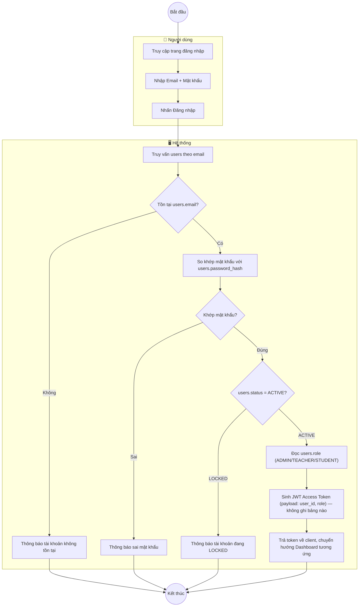
```mermaid
flowchart TD
    Start((Bắt đầu))
    subgraph ACTOR["👤 Người dùng"]
        a1[Truy cập trang đăng nhập]
        a2["Nhập Email + Mật khẩu"]
        a3[Nhấn Đăng nhập]
    end
    subgraph SYS["🖥️ Hệ thống"]
        s1["Truy vấn users theo email"]
        d1{"Tồn tại users.email?"}
        s2["Thông báo tài khoản không tồn tại"]
        s3["So khớp mật khẩu với users.password_hash"]
        d2{"Khớp mật khẩu?"}
        s4["Thông báo sai mật khẩu"]
        d3{"users.status = ACTIVE?"}
        s5["Thông báo tài khoản đang LOCKED"]
        s6["Đọc users.role (ADMIN/TEACHER/STUDENT)"]
        s7["Sinh JWT Access Token (payload: user_id, role) — không ghi bảng nào"]
        s8["Trả token về client, chuyển hướng Dashboard tương ứng"]
    end
    End((Kết thúc))

    Start --> a1 --> a2 --> a3 --> s1 --> d1
    d1 -->|Không| s2 --> End
    d1 -->|Có| s3 --> d2
    d2 -->|Sai| s4 --> End
    d2 -->|Đúng| d3
    d3 -->|LOCKED| s5 --> End
    d3 -->|ACTIVE| s6 --> s7 --> s8 --> End
```

**Cột/bảng ERD dùng:** `users.email` (UNIQUE), `users.password_hash`, `users.status` (ENUM ACTIVE/LOCKED), `users.role` (ENUM).
**Tuân thủ giải trình:** Mục 5.1 — đổi "tên đăng nhập" → "Email" (users không có cột `username`); bỏ hẳn bước "Tạo phiên đăng nhập / Cấp Refresh Token" vì không có bảng lưu session — JWT sinh trực tiếp, không ghi DB (kiến trúc stateless, đã chốt là hướng ít việc sửa nhất).

---

## UC2. Đăng xuất
*(🛠 sửa theo mục 5.1 — xóa token thực hiện ở phía Client, không phải Hệ thống)*

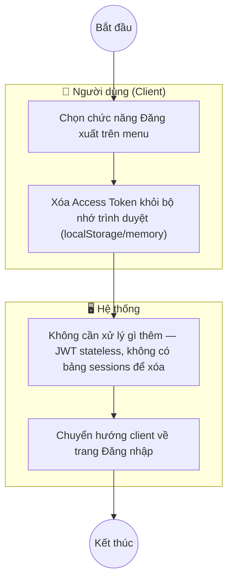
```mermaid
flowchart TD
    Start((Bắt đầu))
    subgraph ACTOR["👤 Người dùng (Client)"]
        a1[Chọn chức năng Đăng xuất trên menu]
        a2["Xóa Access Token khỏi bộ nhớ trình duyệt (localStorage/memory)"]
    end
    subgraph SYS["🖥️ Hệ thống"]
        s1["Không cần xử lý gì thêm — JWT stateless, không có bảng sessions để xóa"]
        s2[Chuyển hướng client về trang Đăng nhập]
    end
    End((Kết thúc))

    Start --> a1 --> a2 --> s1 --> s2 --> End
```

**Cột/bảng ERD dùng:** không bảng nào (đúng bản chất JWT stateless).
**Tuân thủ giải trình:** Mục 5.1 — chuyển bước "Xóa key JWT" sang lane Người dùng/Client thay vì lane Hệ thống, vì schema không có bảng `sessions`/`refresh_tokens`.

---

## UC3. Quản lý tài khoản cá nhân
*(🛠 bổ sung nhánh kiểm tra trùng email theo mục 7 #1)*

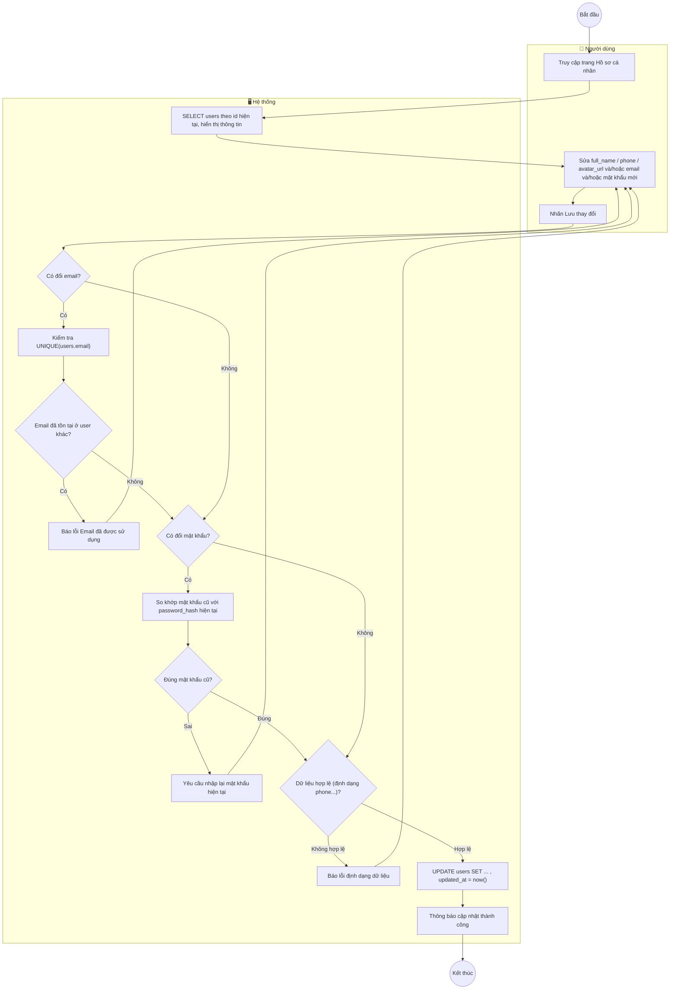
```mermaid
flowchart TD
    Start((Bắt đầu))
    subgraph ACTOR["👤 Người dùng"]
        a1[Truy cập trang Hồ sơ cá nhân]
        a2["Sửa full_name / phone / avatar_url và/hoặc email và/hoặc mật khẩu mới"]
        a3[Nhấn Lưu thay đổi]
    end
    subgraph SYS["🖥️ Hệ thống"]
        s1["SELECT users theo id hiện tại, hiển thị thông tin"]
        d1{Có đổi email?}
        s2["Kiểm tra UNIQUE(users.email)"]
        d2{Email đã tồn tại ở user khác?}
        s3["Báo lỗi Email đã được sử dụng"]
        d3{"Có đổi mật khẩu?"}
        s4["So khớp mật khẩu cũ với password_hash hiện tại"]
        d4{Đúng mật khẩu cũ?}
        s5["Yêu cầu nhập lại mật khẩu hiện tại"]
        d5{"Dữ liệu hợp lệ (định dạng phone...)?"}
        s6["Báo lỗi định dạng dữ liệu"]
        s7["UPDATE users SET ... , updated_at = now()"]
        s8["Thông báo cập nhật thành công"]
    end
    End((Kết thúc))

    Start --> a1 --> s1 --> a2 --> a3 --> d1
    d1 -->|Có| s2 --> d2
    d2 -->|Có| s3 --> a2
    d2 -->|Không| d3
    d1 -->|Không| d3
    d3 -->|Có| s4 --> d4
    d4 -->|Sai| s5 --> a2
    d4 -->|Đúng| d5
    d3 -->|Không| d5
    d5 -->|Không hợp lệ| s6 --> a2
    d5 -->|Hợp lệ| s7 --> s8 --> End
```

**Cột/bảng ERD dùng:** `users.full_name`, `users.email` (UNIQUE), `users.phone`, `users.avatar_url`, `users.password_hash`, `users.updated_at`.
**Tuân thủ giải trình:** Mục 7 #1 — tách riêng nhánh kiểm tra trùng UNIQUE(email) khỏi nhánh báo lỗi "dữ liệu không hợp lệ" chung, đúng như câu hỏi làm rõ đã nêu.

---

## UC4. Quản lý tài khoản người dùng
*(🛠 sửa theo mục 5.2 — gộp "Tạo tài khoản + Tạo hồ sơ theo vai trò" thành 1 bước, không còn include UC5 để đổi role)*

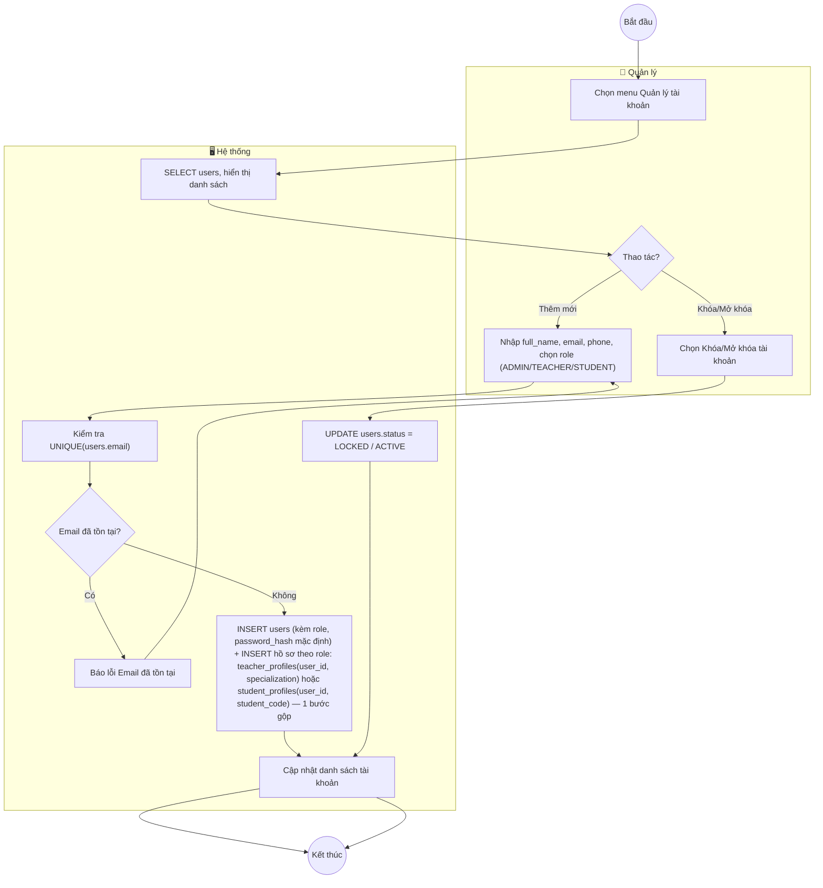
```mermaid
flowchart TD
    Start((Bắt đầu))
    subgraph ACTOR["👤 Quản lý"]
        a1[Chọn menu Quản lý tài khoản]
        d0{"Thao tác?"}
        a2["Nhập full_name, email, phone, chọn role (ADMIN/TEACHER/STUDENT)"]
        a3["Chọn Khóa/Mở khóa tài khoản"]
    end
    subgraph SYS["🖥️ Hệ thống"]
        s1["SELECT users, hiển thị danh sách"]
        s2["Kiểm tra UNIQUE(users.email)"]
        d1{Email đã tồn tại?}
        s3["Báo lỗi Email đã tồn tại"]
        s4["INSERT users (kèm role, password_hash mặc định) + INSERT hồ sơ theo role: teacher_profiles(user_id, specialization) hoặc student_profiles(user_id, student_code) — 1 bước gộp"]
        s5["UPDATE users.status = LOCKED / ACTIVE"]
        s6["Cập nhật danh sách tài khoản"]
    end
    End((Kết thúc))

    Start --> a1 --> s1 --> d0
    d0 -->|Thêm mới| a2 --> s2 --> d1
    d1 -->|Có| s3 --> a2
    d1 -->|Không| s4 --> s6 --> End
    d0 -->|Khóa/Mở khóa| a3 --> s5 --> s6 --> End
```

**Cột/bảng ERD dùng:** `users.full_name/email/phone/password_hash/role/status`, `teacher_profiles(user_id, specialization)`, `student_profiles(user_id, student_code)`.
**Tuân thủ giải trình:** Mục 5.2 — gộp đúng cơ chế shared-PK subtype: 1 role chỉ gắn với 1 bảng profile tương ứng, gán **một lần duy nhất lúc tạo**, không còn bước "Gán vai trò" tách rời/UC5 riêng như bản cũ (khớp Đợt 10 mục 10.2.3: bỏ khả năng đổi role tự do khỏi UC4).

---

## UC5. Phân quyền người dùng
*(🛠 thiết kế lại hoàn toàn theo khuyến nghị 10.2.3 — không còn cho đổi role tự do trên tài khoản đã có dữ liệu)*

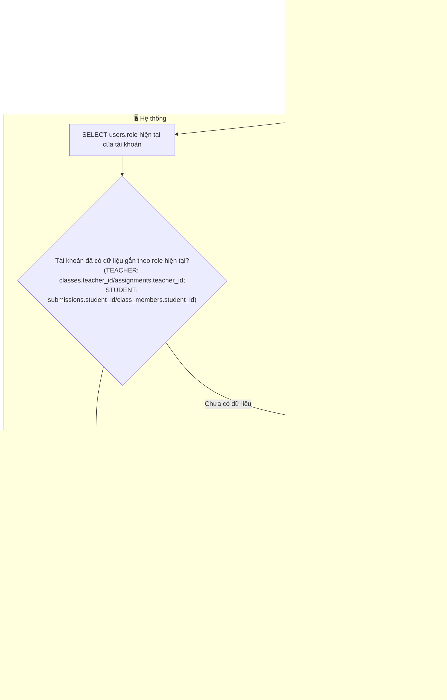
```mermaid
flowchart TD
    Start((Bắt đầu))
    subgraph ACTOR["👤 Quản lý"]
        a1[Chọn tài khoản cần xem/đổi quyền]
        a2["Chọn vai trò mới (nếu hệ thống cho phép đổi)"]
    end
    subgraph SYS["🖥️ Hệ thống"]
        s1["SELECT users.role hiện tại của tài khoản"]
        d1{"Tài khoản đã có dữ liệu gắn theo role hiện tại?<br/>(TEACHER: classes.teacher_id/assignments.teacher_id;<br/>STUDENT: submissions.student_id/class_members.student_id)"}
        s2["Từ chối đổi role — thông báo: cần xử lý dữ liệu cũ trước<br/>(chưa có rule migrate dữ liệu giữa 2 subtype)"]
        s3["Cho phép đổi: DELETE dòng profile cũ (teacher_profiles/student_profiles)<br/>+ UPDATE users.role + INSERT dòng profile mới"]
        s4["Cập nhật quyền truy cập chức năng theo role mới"]
    end
    End((Kết thúc))

    Start --> a1 --> s1 --> d1
    d1 -->|Có dữ liệu| s2 --> End
    d1 -->|Chưa có dữ liệu| a2 --> s3 --> s4 --> End
```

**Cột/bảng ERD dùng:** `users.role`, `teacher_profiles`, `student_profiles`, kiểm tra chéo qua `classes.teacher_id`, `assignments.teacher_id`, `class_members.student_id`, `submissions.student_id`.
**Tuân thủ giải trình:** Mục 10.2.3 — đây chính là lỗi *carry-over* còn treo từ bản 1.0 (mâu thuẫn với kiến trúc shared-PK subtype). Sơ đồ này áp dụng đúng khuyến nghị: chặn đổi role nếu tài khoản đã có dữ liệu nghiệp vụ gắn với role cũ; chỉ cho đổi khi tài khoản "sạch" (mới tạo, chưa phát sinh dữ liệu) — cần PM xác nhận trước khi chốt chính thức.

---

## UC6. Quản lý giáo viên
*(🛠 sửa theo mục 5.2 — gộp bước tạo tài khoản+hồ sơ; bổ sung decision khi vô hiệu hóa)*

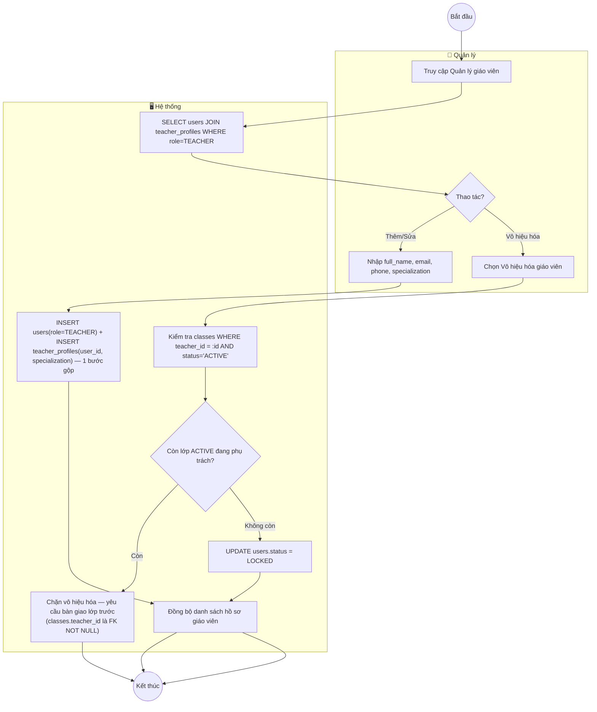
```mermaid
flowchart TD
    Start((Bắt đầu))
    subgraph ACTOR["👤 Quản lý"]
        a1[Truy cập Quản lý giáo viên]
        d0{Thao tác?}
        a2["Nhập full_name, email, phone, specialization"]
        a3[Chọn Vô hiệu hóa giáo viên]
    end
    subgraph SYS["🖥️ Hệ thống"]
        s1["SELECT users JOIN teacher_profiles WHERE role=TEACHER"]
        s2["INSERT users(role=TEACHER) + INSERT teacher_profiles(user_id, specialization) — 1 bước gộp"]
        s3["Kiểm tra classes WHERE teacher_id = :id AND status='ACTIVE'"]
        d1{"Còn lớp ACTIVE đang phụ trách?"}
        s4["Chặn vô hiệu hóa — yêu cầu bàn giao lớp trước<br/>(classes.teacher_id là FK NOT NULL)"]
        s5["UPDATE users.status = LOCKED"]
        s6["Đồng bộ danh sách hồ sơ giáo viên"]
    end
    End((Kết thúc))

    Start --> a1 --> s1 --> d0
    d0 -->|Thêm/Sửa| a2 --> s2 --> s6 --> End
    d0 -->|Vô hiệu hóa| a3 --> s3 --> d1
    d1 -->|Còn| s4 --> End
    d1 -->|Không còn| s5 --> s6 --> End
```

**Cột/bảng ERD dùng:** `users`, `teacher_profiles(user_id, specialization)`, `classes(teacher_id, status)`.
**Tuân thủ giải trình:** Mục 5.2 — gộp "Tạo tài khoản → Gán vai trò" thành 1 bước (cùng gốc lỗi với UC4); bổ sung decision "Còn lớp ACTIVE đang phụ trách?" mà bản cũ có bước kiểm tra nhưng không dẫn nhánh nào, trong khi `classes.teacher_id` là FK NOT NULL.

---

## UC7. Quản lý học viên
*(⚠️ nhánh Import Excel hàng loạt ngoài phạm vi ERD hiện tại — mục 10.3)*

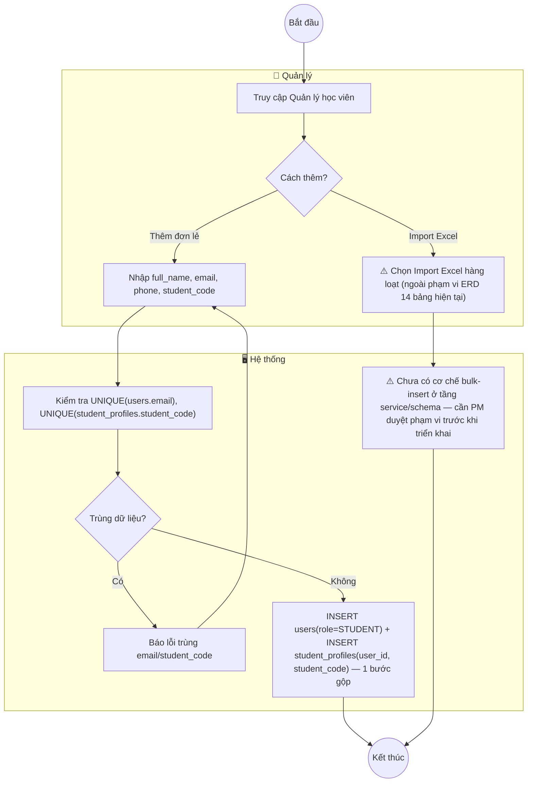
```mermaid
flowchart TD
    Start((Bắt đầu))
    subgraph ACTOR["👤 Quản lý"]
        a1[Truy cập Quản lý học viên]
        d0{"Cách thêm?"}
        a2["Nhập full_name, email, phone, student_code"]
        a3["⚠️ Chọn Import Excel hàng loạt (ngoài phạm vi ERD 14 bảng hiện tại)"]
    end
    subgraph SYS["🖥️ Hệ thống"]
        s1["Kiểm tra UNIQUE(users.email), UNIQUE(student_profiles.student_code)"]
        d1{Trùng dữ liệu?}
        s2["Báo lỗi trùng email/student_code"]
        s3["INSERT users(role=STUDENT) + INSERT student_profiles(user_id, student_code) — 1 bước gộp"]
        s4["⚠️ Chưa có cơ chế bulk-insert ở tầng service/schema — cần PM duyệt phạm vi trước khi triển khai"]
    end
    End((Kết thúc))

    Start --> a1 --> d0
    d0 -->|Thêm đơn lẻ| a2 --> s1 --> d1
    d1 -->|Có| s2 --> a2
    d1 -->|Không| s3 --> End
    d0 -->|Import Excel| a3 --> s4 --> End
```

**Cột/bảng ERD dùng:** `users(role=STUDENT)`, `student_profiles(user_id, student_code UNIQUE)`.
**Tuân thủ giải trình:** Mục 10.3 dòng UC6/UC7 — Import Excel hàng loạt là ý tưởng mới, **chưa có cơ chế bulk-insert** ở tầng service lẫn schema; giữ nhánh này trong sơ đồ chỉ để ghi chú phạm vi, không đưa vào luồng chính thức cho tới khi được duyệt.

---

## UC8. Quản lý lớp học
*(🛠 làm rõ theo mục 7 #2 — Đóng lớp dùng `status = ARCHIVED`, soft-delete)*

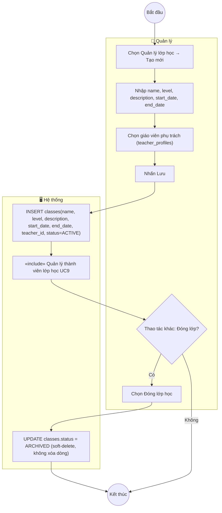
```mermaid
flowchart TD
    Start((Bắt đầu))
    subgraph ACTOR["👤 Quản lý"]
        a1["Chọn Quản lý lớp học → Tạo mới"]
        a2["Nhập name, level, description, start_date, end_date"]
        a3["Chọn giáo viên phụ trách (teacher_profiles)"]
        a4[Nhấn Lưu]
        d0{"Thao tác khác: Đóng lớp?"}
        a5[Chọn Đóng lớp học]
    end
    subgraph SYS["🖥️ Hệ thống"]
        s1["INSERT classes(name, level, description, start_date, end_date, teacher_id, status=ACTIVE)"]
        s2["«include» Quản lý thành viên lớp học UC9"]
        s3["UPDATE classes.status = ARCHIVED (soft-delete, không xóa dòng)"]
    end
    End((Kết thúc))

    Start --> a1 --> a2 --> a3 --> a4 --> s1 --> s2 --> d0
    d0 -->|Có| a5 --> s3 --> End
    d0 -->|Không| End
```

**Cột/bảng ERD dùng:** `classes(name, level, description, start_date, end_date, status, teacher_id)`.
**Tuân thủ giải trình:** Mục 7 #2 — chốt hướng "Đóng lớp" dùng `classes.status = ARCHIVED` (giá trị đã có sẵn trong ENUM) thay vì DELETE vật lý, nhất quán tinh thần soft-delete toàn hệ thống.

---

## UC9. Quản lý thành viên lớp học
*(🛠 sửa toàn diện theo mục 5.3 — 3 nhánh trạng thái + bước chọn member_type)*

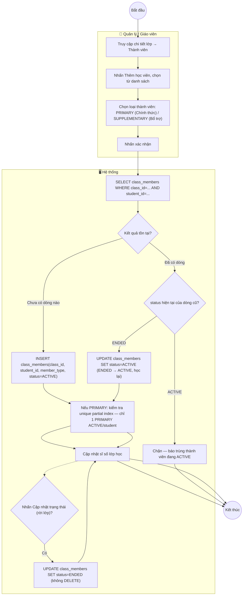
```mermaid
flowchart TD
    Start((Bắt đầu))
    subgraph ACTOR["👤 Quản lý / Giáo viên"]
        a1["Truy cập chi tiết lớp → Thành viên"]
        a2[Nhấn Thêm học viên, chọn từ danh sách]
        a3["Chọn loại thành viên: PRIMARY (Chính thức) / SUPPLEMENTARY (Bổ trợ)"]
        a4[Nhấn xác nhận]
    end
    subgraph SYS["🖥️ Hệ thống"]
        s1["SELECT class_members WHERE class_id=... AND student_id=..."]
        d1{"Kết quả tồn tại?"}
        s2a["INSERT class_members(class_id, student_id, member_type, status=ACTIVE)"]
        d2{"status hiện tại của dòng cũ?"}
        s2b["Chặn — báo trùng thành viên đang ACTIVE"]
        s2c["UPDATE class_members SET status=ACTIVE (ENDED → ACTIVE, học lại)"]
        s3["Nếu PRIMARY: kiểm tra unique partial index — chỉ 1 PRIMARY ACTIVE/student"]
        s4["Cập nhật sĩ số lớp học"]
        d3{"Nhấn Cập nhật trạng thái (rời lớp)?"}
        s5["UPDATE class_members SET status=ENDED (không DELETE)"]
    end
    End((Kết thúc))

    Start --> a1 --> a2 --> a3 --> a4 --> s1 --> d1
    d1 -->|Chưa có dòng nào| s2a --> s3 --> s4 --> End
    d1 -->|Đã có dòng| d2
    d2 -->|ACTIVE| s2b --> End
    d2 -->|ENDED| s2c --> s3 --> s4 --> End
    s4 -.-> d3
    d3 -->|Có| s5 --> s4
```

**Cột/bảng ERD dùng:** `class_members(class_id, student_id, member_type ENUM(PRIMARY,SUPPLEMENTARY), status ENUM(ACTIVE,ENDED))` — UNIQUE(class_id, student_id); unique partial index cho PRIMARY ACTIVE.
**Tuân thủ giải trình:** Mục 5.3 — (1) thêm bước chọn `member_type` trước khi thêm (cột NOT NULL, bản cũ thiếu); (2) tách "Đã thuộc lớp?" thành 3 trường hợp thay vì 2 (chưa có/ACTIVE/ENDED) vì UNIQUE(class_id, student_id) là tuyệt đối, không phân biệt theo status; (3) đổi "Xóa học viên khỏi lớp" → "Cập nhật trạng thái (ENDED)" đúng tinh thần soft-status.

> ⚠️ Nhánh "Chuyển học viên từ lớp A sang lớp B" (mục 10.3, dòng UC9): về bản chất là 2 thao tác trên `class_members` chạy cùng lúc — `UPDATE ... SET status=ENDED` ở lớp cũ + `INSERT/UPDATE ... status=ACTIVE` ở lớp mới — **chưa có business rule chính thức đảm bảo tính atomic (transaction) cho cặp thao tác này**, cần PM duyệt trước khi đưa vào luồng chính thức.

---

## UC10. Xem danh sách lớp học

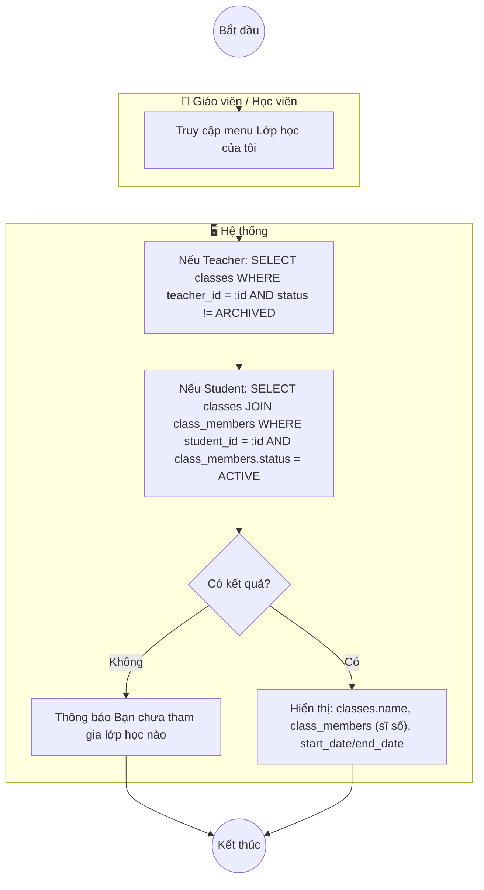
```mermaid
flowchart TD
    Start((Bắt đầu))
    subgraph ACTOR["👤 Giáo viên / Học viên"]
        a1[Truy cập menu Lớp học của tôi]
    end
    subgraph SYS["🖥️ Hệ thống"]
        s1["Nếu Teacher: SELECT classes WHERE teacher_id = :id AND status != ARCHIVED"]
        s2["Nếu Student: SELECT classes JOIN class_members WHERE student_id = :id AND class_members.status = ACTIVE"]
        d1{Có kết quả?}
        s3["Thông báo Bạn chưa tham gia lớp học nào"]
        s4["Hiển thị: classes.name, class_members (sĩ số), start_date/end_date"]
    end
    End((Kết thúc))

    Start --> a1 --> s1 --> s2 --> d1
    d1 -->|Không| s3 --> End
    d1 -->|Có| s4 --> End
```

**Cột/bảng ERD dùng:** `classes(teacher_id, status, name, start_date, end_date)`, `class_members(student_id, status)`.
**Tuân thủ giải trình:** ✅ Không có lỗi được nêu — chỉ làm rõ điều kiện lọc `status` tương ứng theo từng vai trò.

---

## UC11. Quản lý bài tập
*(🛠 sửa theo mục 5.5 — bỏ nhánh chặn xóa khi đã có bài nộp)*

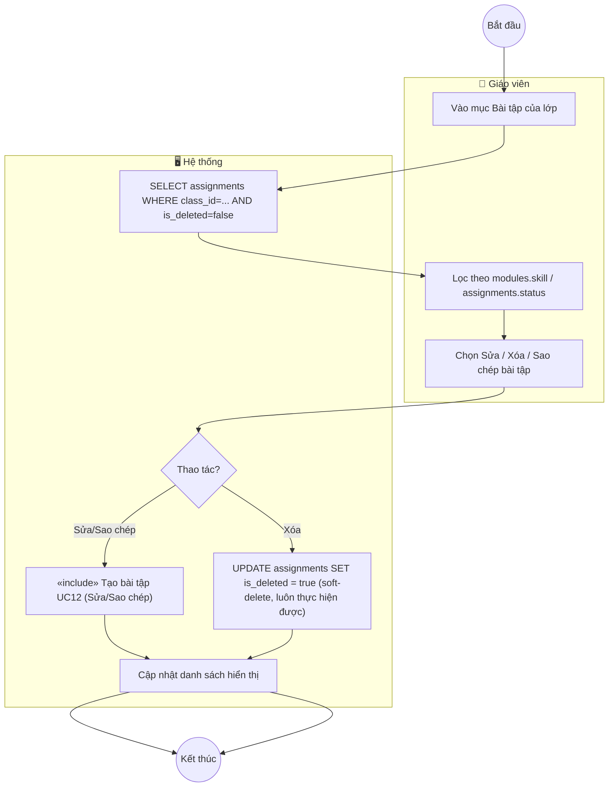
```mermaid
flowchart TD
    Start((Bắt đầu))
    subgraph ACTOR["👤 Giáo viên"]
        a1[Vào mục Bài tập của lớp]
        a2["Lọc theo modules.skill / assignments.status"]
        a3[Chọn Sửa / Xóa / Sao chép bài tập]
    end
    subgraph SYS["🖥️ Hệ thống"]
        s1["SELECT assignments WHERE class_id=... AND is_deleted=false"]
        d1{Thao tác?}
        s2["«include» Tạo bài tập UC12 (Sửa/Sao chép)"]
        s3["UPDATE assignments SET is_deleted = true (soft-delete, luôn thực hiện được)"]
        s4["Cập nhật danh sách hiển thị"]
    end
    End((Kết thúc))

    Start --> a1 --> s1 --> a2 --> a3 --> d1
    d1 -->|Sửa/Sao chép| s2 --> s4 --> End
    d1 -->|Xóa| s3 --> s4 --> End
```

**Cột/bảng ERD dùng:** `assignments(class_id, is_deleted)`, `modules.skill`.
**Tuân thủ giải trình:** Mục 5.5 — bỏ hẳn nhánh "Kiểm tra bài nộp / Đã có bài nộp?" vì `assignments.is_deleted` là cột soft-delete có sẵn đúng mục đích; thao tác Xóa luôn thực hiện được bằng UPDATE, không cần điều kiện chặn theo FK constraint.

---

## UC12. Tạo bài tập
*(🛠 sửa theo mục 4.1 &amp; 5.4 — trạng thái DRAFT, vòng lặp thêm module, thiết lập max_submissions)*

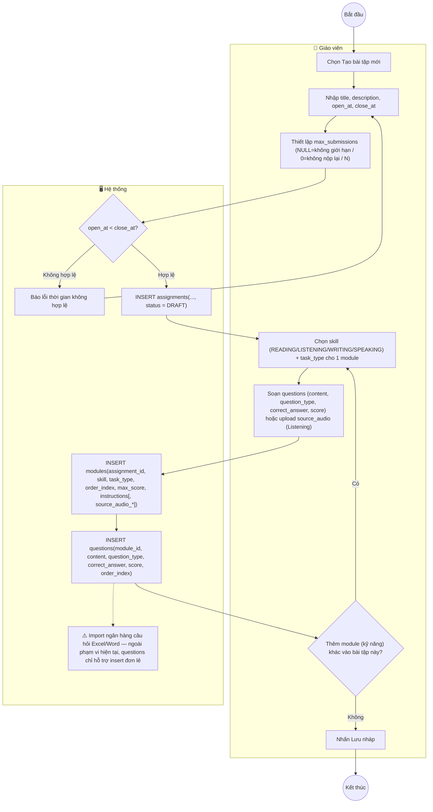
```mermaid
flowchart TD
    Start((Bắt đầu))
    subgraph ACTOR["👤 Giáo viên"]
        a1[Chọn Tạo bài tập mới]
        a2["Nhập title, description, open_at, close_at"]
        a3["Thiết lập max_submissions (NULL=không giới hạn / 0=không nộp lại / N)"]
        a4["Chọn skill (READING/LISTENING/WRITING/SPEAKING) + task_type cho 1 module"]
        a5["Soạn questions (content, question_type, correct_answer, score) hoặc upload source_audio (Listening)"]
        d0{"Thêm module (kỹ năng) khác vào bài tập này?"}
        a6["Nhấn Lưu nháp"]
    end
    subgraph SYS["🖥️ Hệ thống"]
        d1{"open_at &lt; close_at?"}
        s1["Báo lỗi thời gian không hợp lệ"]
        s2["INSERT assignments(..., status = DRAFT)"]
        s3["INSERT modules(assignment_id, skill, task_type, order_index, max_score, instructions[, source_audio_*])"]
        s4["INSERT questions(module_id, content, question_type, correct_answer, score, order_index)"]
        s5["⚠️ Import ngân hàng câu hỏi Excel/Word — ngoài phạm vi hiện tại, questions chỉ hỗ trợ insert đơn lẻ"]
    end
    End((Kết thúc))

    Start --> a1 --> a2 --> a3 --> d1
    d1 -->|Không hợp lệ| s1 --> a2
    d1 -->|Hợp lệ| s2 --> a4 --> a5 --> s3 --> s4 --> d0
    d0 -->|Có| a4
    d0 -->|Không| a6 --> End
    s4 -.-> s5
```

**Cột/bảng ERD dùng:** `assignments(class_id, teacher_id, title, description, open_at, close_at, max_submissions, status)`, `modules(assignment_id, skill, task_type, order_index, instructions, max_score, source_audio_*)`, `questions(module_id, content, question_type, correct_answer, score, order_index)`.
**Tuân thủ giải trình:** Mục 4.1 — trạng thái mặc định khi tạo mới là `status = DRAFT` (không còn `is_manually_closed`). Mục 5.4 — bổ sung decision "Thêm module kỹ năng khác?" (1 assignment chứa nhiều module) và bước thiết lập `max_submissions` (trước đây hoàn toàn thiếu). Mục 10.3 — Import Excel/Word chỉ ghi chú ⚠️, chưa đưa vào luồng chính thức.

---

## UC13. Mở bài tập
*(🛠 sửa theo mục 4.1 — chỉ đổi `status`, bỏ nhập lại thời gian, thêm điều kiện "Có thể mở?")*

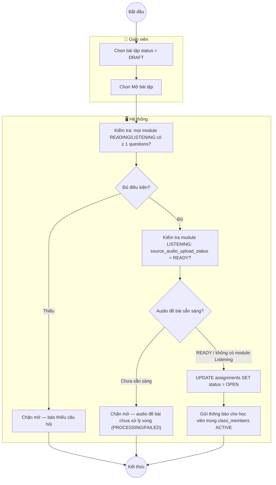
```mermaid
flowchart TD
    Start((Bắt đầu))
    subgraph ACTOR["👤 Giáo viên"]
        a1["Chọn bài tập status = DRAFT"]
        a2[Chọn Mở bài tập]
    end
    subgraph SYS["🖥️ Hệ thống"]
        s1["Kiểm tra: mọi module READING/LISTENING có ≥ 1 questions?"]
        d1{Đủ điều kiện?}
        s2["Chặn mở — báo thiếu câu hỏi"]
        s3["Kiểm tra module LISTENING: source_audio_upload_status = READY?"]
        d2{Audio đề bài sẵn sàng?}
        s4["Chặn mở — audio đề bài chưa xử lý xong (PROCESSING/FAILED)"]
        s5["UPDATE assignments SET status = OPEN"]
        s6["Gửi thông báo cho học viên trong class_members ACTIVE"]
    end
    End((Kết thúc))

    Start --> a1 --> a2 --> s1 --> d1
    d1 -->|Thiếu| s2 --> End
    d1 -->|Đủ| s3 --> d2
    d2 -->|Chưa sẵn sàng| s4 --> End
    d2 -->|READY / không có module Listening| s5 --> s6 --> End
```

**Cột/bảng ERD dùng:** `assignments.status`, `modules(skill, source_audio_upload_status)`, `questions`.
**Tuân thủ giải trình:** Mục 4.1 — bỏ 2 bước "Thiết lập lại thời gian mở/hạn nộp" (thời gian chỉ nhập 1 lần lúc UC12); "Mở bài tập" chỉ đổi `assignments.status` từ `DRAFT → OPEN`; bổ sung điều kiện "Có thể mở?" đúng như đặc tả UC013 đã chốt: mọi module Reading/Listening phải có ≥1 câu hỏi, module Listening phải `source_audio_upload_status = READY`.

---

## UC14. Khóa bài tập
*(🛠 sửa theo mục 4.1 — chỉ đổi `status`, thêm job tự động)*

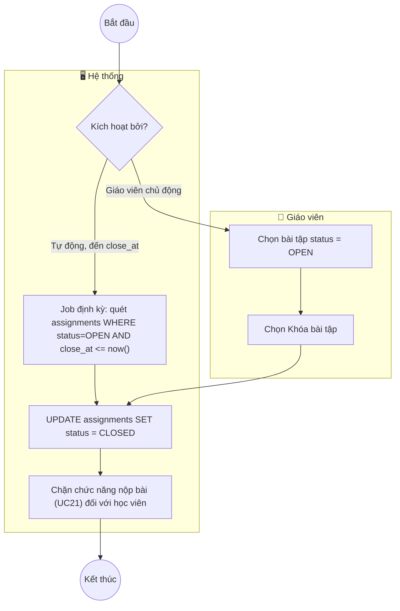
```mermaid
flowchart TD
    Start((Bắt đầu))
    subgraph ACTOR["👤 Giáo viên"]
        a1["Chọn bài tập status = OPEN"]
        a2[Chọn Khóa bài tập]
    end
    subgraph SYS["🖥️ Hệ thống"]
        d1{"Kích hoạt bởi?"}
        s1["Job định kỳ: quét assignments WHERE status=OPEN AND close_at &lt;= now()"]
        s2["UPDATE assignments SET status = CLOSED"]
        s3["Chặn chức năng nộp bài (UC21) đối với học viên"]
    end
    End((Kết thúc))

    Start --> d1
    d1 -->|Tự động, đến close_at| s1 --> s2
    d1 -->|Giáo viên chủ động| a1 --> a2 --> s2
    s2 --> s3 --> End
```

**Cột/bảng ERD dùng:** `assignments(status, close_at)`.
**Tuân thủ giải trình:** Mục 4.1 — không còn cột `is_manually_closed`; cả 2 trường hợp (job tự động theo `close_at` và giáo viên chủ động) đều quy về cùng 1 hành động duy nhất: `UPDATE assignments SET status = CLOSED`.

---

## UC15. Xem bài tập

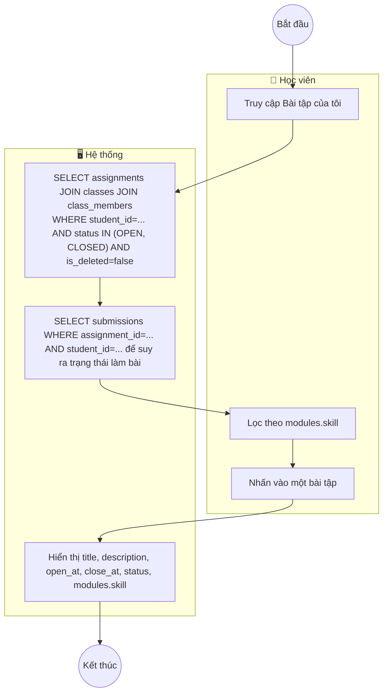
```mermaid
flowchart TD
    Start((Bắt đầu))
    subgraph ACTOR["👤 Học viên"]
        a1[Truy cập Bài tập của tôi]
        a2["Lọc theo modules.skill"]
        a3[Nhấn vào một bài tập]
    end
    subgraph SYS["🖥️ Hệ thống"]
        s1["SELECT assignments JOIN classes JOIN class_members<br/>WHERE student_id=... AND status IN (OPEN, CLOSED) AND is_deleted=false"]
        s2["SELECT submissions WHERE assignment_id=... AND student_id=... để suy ra trạng thái làm bài"]
        s3["Hiển thị title, description, open_at, close_at, status, modules.skill"]
    end
    End((Kết thúc))

    Start --> a1 --> s1 --> s2 --> a2 --> a3 --> s3 --> End
```

**Cột/bảng ERD dùng:** `assignments(status, is_deleted, title, description, open_at, close_at)`, `modules.skill`, `submissions`.
**Tuân thủ giải trình:** ✅ Làm rõ thêm: chỉ hiển thị `status IN (OPEN, CLOSED)` — bài `DRAFT` chưa mở thì học viên không nhìn thấy (hệ quả trực tiếp của state machine mục 4.1).

---

## UC16. Làm bài tập viết (Writing)
*(🛠 làm rõ theo mục 5.6 — submission đã tồn tại từ lúc bắt đầu làm bài)*

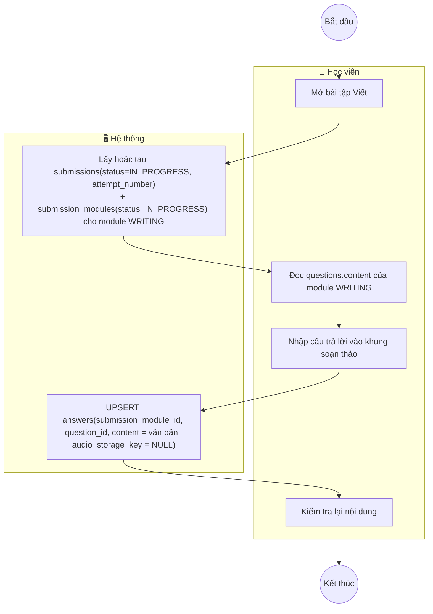
```mermaid
flowchart TD
    Start((Bắt đầu))
    subgraph ACTOR["👤 Học viên"]
        a1[Mở bài tập Viết]
        a2[Đọc questions.content của module WRITING]
        a3["Nhập câu trả lời vào khung soạn thảo"]
        a4[Kiểm tra lại nội dung]
    end
    subgraph SYS["🖥️ Hệ thống"]
        s1["Lấy hoặc tạo submissions(status=IN_PROGRESS, attempt_number)<br/>+ submission_modules(status=IN_PROGRESS) cho module WRITING"]
        s2["UPSERT answers(submission_module_id, question_id, content = văn bản, audio_storage_key = NULL)"]
    end
    End((Kết thúc))

    Start --> a1 --> s1 --> a2 --> a3 --> s2 --> a4 --> End
```

**Cột/bảng ERD dùng:** `submissions(status, attempt_number)`, `submission_modules(status)`, `answers(content)` — audio_* để NULL.
**Tuân thủ giải trình:** Mục 5.6 — làm rõ thứ tự đúng: `submission_modules` phải tồn tại **trước** khi ghi `answers` (FK bắt buộc); mỗi lần nhập là một UPSERT vào `answers.content`, không phải hành động "lưu file" riêng.

---

## UC17. Làm bài tập nói (Speaking)
*(🛠 làm rõ theo mục 4.2 &amp; mục 7 #6 — chờ `audio_upload_status = READY`)*

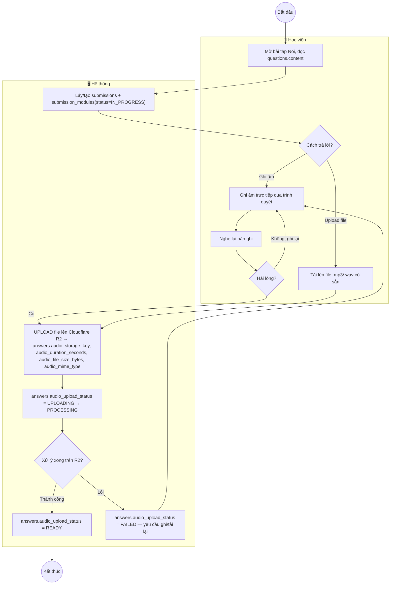
```mermaid
flowchart TD
    Start((Bắt đầu))
    subgraph ACTOR["👤 Học viên"]
        a1[Mở bài tập Nói, đọc questions.content]
        d0{Cách trả lời?}
        a2["Ghi âm trực tiếp qua trình duyệt"]
        a3["Tải lên file .mp3/.wav có sẵn"]
        a4[Nghe lại bản ghi]
        d1{Hài lòng?}
    end
    subgraph SYS["🖥️ Hệ thống"]
        s1["Lấy/tạo submissions + submission_modules(status=IN_PROGRESS)"]
        s2["UPLOAD file lên Cloudflare R2 → answers.audio_storage_key, audio_duration_seconds, audio_file_size_bytes, audio_mime_type"]
        s3["answers.audio_upload_status = UPLOADING → PROCESSING"]
        d2{"Xử lý xong trên R2?"}
        s4["answers.audio_upload_status = READY"]
        s5["answers.audio_upload_status = FAILED — yêu cầu ghi/tải lại"]
    end
    End((Kết thúc))

    Start --> a1 --> s1 --> d0
    d0 -->|Ghi âm| a2 --> a4 --> d1
    d1 -->|Không, ghi lại| a2
    d1 -->|Có| s2
    d0 -->|Upload file| a3 --> s2
    s2 --> s3 --> d2
    d2 -->|Lỗi| s5 --> a2
    d2 -->|Thành công| s4 --> End
```

**Cột/bảng ERD dùng:** `answers(audio_storage_key, audio_duration_seconds, audio_file_size_bytes, audio_mime_type, audio_upload_status)`.
**Tuân thủ giải trình:** Mục 7 #6 — bắt buộc chờ `audio_upload_status = READY` (upload R2 bất đồng bộ) trước khi coi bài Nói đã sẵn sàng nộp/chấm.

---

## UC18. Làm bài tập đọc (Reading)

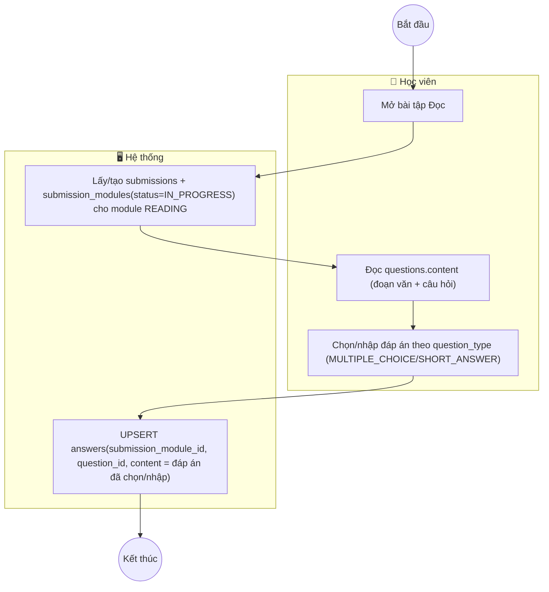
```mermaid
flowchart TD
    Start((Bắt đầu))
    subgraph ACTOR["👤 Học viên"]
        a1[Mở bài tập Đọc]
        a2["Đọc questions.content (đoạn văn + câu hỏi)"]
        a3["Chọn/nhập đáp án theo question_type (MULTIPLE_CHOICE/SHORT_ANSWER)"]
    end
    subgraph SYS["🖥️ Hệ thống"]
        s1["Lấy/tạo submissions + submission_modules(status=IN_PROGRESS) cho module READING"]
        s2["UPSERT answers(submission_module_id, question_id, content = đáp án đã chọn/nhập)"]
    end
    End((Kết thúc))

    Start --> a1 --> s1 --> a2 --> a3 --> s2 --> End
```

**Cột/bảng ERD dùng:** `questions(content, question_type)`, `answers(question_id, content)`.
**Tuân thủ giải trình:** ✅ Khớp tốt — không phát sinh lỗi trong file giải trình.

---

## UC19. Làm bài tập nghe (Listening)

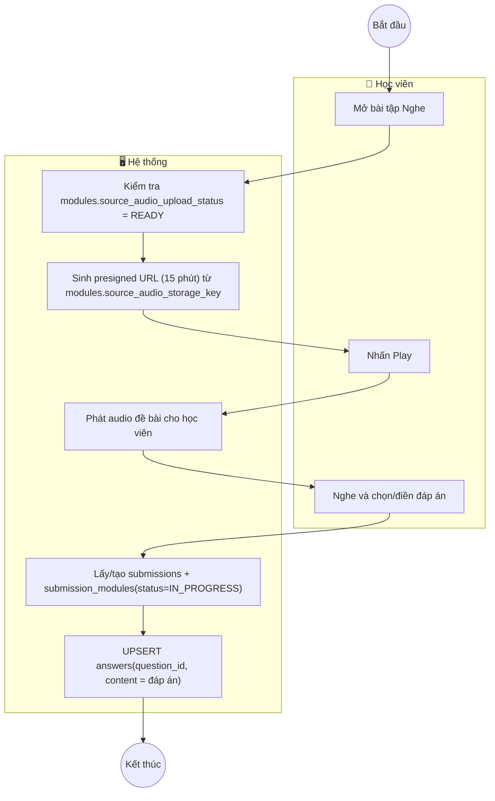
```mermaid
flowchart TD
    Start((Bắt đầu))
    subgraph ACTOR["👤 Học viên"]
        a1[Mở bài tập Nghe]
        a2[Nhấn Play]
        a3[Nghe và chọn/điền đáp án]
    end
    subgraph SYS["🖥️ Hệ thống"]
        s1["Kiểm tra modules.source_audio_upload_status = READY"]
        s2["Sinh presigned URL (15 phút) từ modules.source_audio_storage_key"]
        s3["Phát audio đề bài cho học viên"]
        s4["Lấy/tạo submissions + submission_modules(status=IN_PROGRESS)"]
        s5["UPSERT answers(question_id, content = đáp án)"]
    end
    End((Kết thúc))

    Start --> a1 --> s1 --> s2 --> a2 --> s3 --> a3 --> s4 --> s5 --> End
```

**Cột/bảng ERD dùng:** `modules(source_audio_storage_key, source_audio_upload_status)`, `answers(question_id, content)`.
**Tuân thủ giải trình:** ✅ Mục 8 — "Việc gắn `source_audio_*` vào `modules` (không phải `questions`) cho Listening được vẽ đúng tinh thần thiết kế" — giữ nguyên cơ chế presigned URL, không lưu URL cố định trong DB.

---

## UC20. Lưu và khôi phục bài làm
*(⚠️ auto-save 30s ngoài phạm vi ERD hiện tại — mục 10.3)*

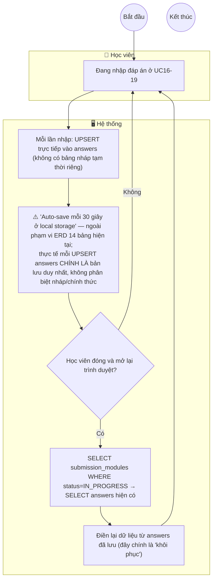
```mermaid
flowchart TD
    Start((Bắt đầu))
    subgraph ACTOR["👤 Học viên"]
        a1[Đang nhập đáp án ở UC16-19]
    end
    subgraph SYS["🖥️ Hệ thống"]
        s1["Mỗi lần nhập: UPSERT trực tiếp vào answers (không có bảng nháp tạm thời riêng)"]
        s2["⚠️ 'Auto-save mỗi 30 giây ở local storage' — ngoài phạm vi ERD 14 bảng hiện tại;<br/>thực tế mỗi UPSERT answers CHÍNH LÀ bản lưu duy nhất, không phân biệt nháp/chính thức"]
        d1{"Học viên đóng và mở lại trình duyệt?"}
        s3["SELECT submission_modules WHERE status=IN_PROGRESS → SELECT answers hiện có"]
        s4["Điền lại dữ liệu từ answers đã lưu (đây chính là 'khôi phục')"]
    end
    End((Kết thúc))

    Start --> a1 --> s1 --> s2 --> d1
    d1 -->|Có| s3 --> s4 --> a1
    d1 -->|Không| a1
```

**Cột/bảng ERD dùng:** `answers` (đóng vai trò cả "nháp" và "chính thức", vì `submission_modules.status = IN_PROGRESS` cho tới khi nộp).
**Tuân thủ giải trình:** Mục 10.3 dòng UC20 — schema 14 bảng **không có bảng/cột riêng cho trạng thái nháp tạm thời** tách biệt với `answers` chính thức. Sơ đồ vẽ lại đúng thực tế: "lưu" và "khôi phục" chỉ là UPSERT/SELECT trực tiếp trên `answers`, không có cơ chế auto-save 30 giây độc lập như mô tả ban đầu — cần PM xác nhận có bổ sung bảng `draft_answers` hay chấp nhận giới hạn này.

---

## UC21. Nộp bài tập
*(🛠 sửa bắt buộc theo mục 5.6 — thêm decision "Còn lượt nộp", đổi tên "Xác nhận bài nộp")*

```mermaid
flowchart TD
    Start((Bắt đầu))
    subgraph ACTOR["👤 Học viên"]
        a1[Nhấn nút Nộp bài]
        a2[Nhấn Xác nhận]
    end
    subgraph SYS["🖥️ Hệ thống"]
        d1{"assignments.status = OPEN?"}
        s0["Chặn nộp — bài đã CLOSED"]
        d2{"submissions.attempt_number &lt; assignments.max_submissions?<br/>(NULL = không giới hạn, 0 = không cho nộp)"}
        s1["Chặn — hết lượt nộp"]
        d3{"Còn questions chưa có answers tương ứng?"}
        s2["Cảnh báo Còn X câu chưa làm, vẫn tiếp tục?"]
        s3["UPDATE submissions SET status=SUBMITTED, submitted_at=now()<br/>(bản ghi submissions đã tồn tại từ lúc bắt đầu làm — đây là XÁC NHẬN, không phải tạo mới)"]
        s4["UPDATE submission_modules SET status=SUBMITTED"]
        s5["INSERT gradings(submission_module_id, status=PENDING) cho mỗi submission_module"]
    end
    End((Kết thúc))

    Start --> a1 --> d1
    d1 -->|CLOSED| s0 --> End
    d1 -->|OPEN| d2
    d2 -->|Hết lượt| s1 --> End
    d2 -->|Còn lượt| d3
    d3 -->|Có| s2 --> a2
    d3 -->|Không| a2
    a2 --> s3 --> s4 --> s5 --> End
```

**Cột/bảng ERD dùng:** `assignments(status, max_submissions)`, `submissions(status, attempt_number, submitted_at)`, `submission_modules(status)`, `gradings(submission_module_id, status)`.
**Tuân thủ giải trình:** Mục 5.6 (bắt buộc) — bổ sung decision "Còn lượt nộp không?" so `submissions.attempt_number` với `assignments.max_submissions`, đặt tại UC021 dùng chung cho 4 kỹ năng, tránh sửa lặp; đổi tên bước "Tạo bài nộp" → **"Xác nhận bài nộp"** đúng bản chất UPDATE (không phải INSERT mới, vì `submissions` đã có từ lúc `IN_PROGRESS`).

---

## UC22. Quản lý lần làm và nộp lại bài

```mermaid
flowchart TD
    Start((Bắt đầu))
    subgraph ACTOR["👤 Học viên"]
        a1["Đã nộp bài — submissions.status=SUBMITTED, attempt_number=N"]
        a2[Vào lại bài tập]
        a3[Chọn Làm lại bài]
        a4["«include» Làm bài (UC16-19) → «include» Nộp bài tập UC21"]
    end
    subgraph SYS["🖥️ Hệ thống"]
        d1{"attempt_number &lt; assignments.max_submissions?"}
        s1["Ẩn nút Làm lại"]
        s2["Hiển thị nút Làm lại (còn X lượt), tính từ max_submissions - attempt_number"]
        s3["INSERT submissions(assignment_id, student_id, attempt_number = N+1, status=IN_PROGRESS)<br/>— UNIQUE(assignment_id, student_id, attempt_number) đảm bảo không trùng"]
    end
    End((Kết thúc))

    Start --> a1 --> d1
    d1 -->|Hết lượt| s1 --> End
    d1 -->|Còn lượt| s2 --> a2 --> a3 --> s3 --> a4 --> End
```

**Cột/bảng ERD dùng:** `submissions(attempt_number)` — UNIQUE(assignment_id, student_id, attempt_number), `assignments.max_submissions`.
**Tuân thủ giải trình:** Mục 10.1 — xác nhận lỗi ở mục 5.6 (check `max_submissions`) đã được **đóng** trong bản 36 UC nhờ tách hẳn thành UC22 với decision "Còn lượt làm lại?" đúng như khuyến nghị.

---

## UC23. Xem trạng thái bài làm

```mermaid
flowchart TD
    Start((Bắt đầu))
    subgraph ACTOR["👤 Học viên"]
        a1[Truy cập Dashboard/danh sách bài tập]
    end
    subgraph SYS["🖥️ Hệ thống"]
        s1["Nếu chưa có submissions → Chưa làm"]
        s2["submissions.status = IN_PROGRESS → Đang làm"]
        s3["submissions.status = SUBMITTED → Đã nộp / Đang chấm (tùy gradings.status)"]
        s4["Tất cả gradings liên quan status = COMPLETED → Đã chấm / Đã có bài chữa"]
        s5["Hiển thị Status tag theo màu tương ứng"]
    end
    End((Kết thúc))

    Start --> a1 --> s1 --> s2 --> s3 --> s4 --> s5 --> End
```

**Cột/bảng ERD dùng:** `submissions.status`, `gradings.status` (theo từng `submission_module`).
**Tuân thủ giải trình:** ✅ Khớp tốt, chỉ làm rõ: trạng thái hiển thị cho học viên là *suy ra* từ tổ hợp `submissions.status` + `gradings.status` của tất cả module trong bài, không phải 1 cột trạng thái đơn lẻ.

---

## UC24. Chấm bài
*(🛠 làm rõ theo mục 4.3 &amp; 5.7 — snapshot điểm, tách nhánh lỗi AI)*

```mermaid
flowchart TD
    Start((Bắt đầu))
    subgraph ACTOR["👤 Giáo viên"]
        a1["Chọn ds submission_modules WHERE status=SUBMITTED"]
        a2[Mở bài làm của 1 học viên]
        d0{"Kỹ năng của module?"}
        a3["Nhập final_score, final_feedback thủ công (Writing/Speaking nếu không dùng AI)"]
        a4[Nhấn Xác nhận và Trả bài]
    end
    subgraph SYS["🖥️ Hệ thống"]
        s1["«include» Chấm bài đọc UC28 (AUTO)"]
        s2["«include» Chấm bài nghe UC29 (AUTO)"]
        s3["«include» Hỗ trợ chấm chữa bài bằng AI UC25 (AI, nếu giáo viên chọn dùng AI)"]
        s4["UPDATE gradings SET max_score_snapshot = modules.max_score (chốt tại thời điểm chấm, tránh sai hồi tố nếu sau này max_score đổi)"]
        s5["UPDATE gradings SET final_score, final_feedback, reviewed_by, reviewed_at, status=COMPLETED"]
        s6["UPDATE submission_modules.status = GRADED; nếu đủ mọi module → submissions.status = GRADED"]
        s7["Gửi thông báo học viên có điểm"]
    end
    End((Kết thúc))

    Start --> a1 --> a2 --> d0
    d0 -->|READING| s1 --> s4
    d0 -->|LISTENING| s2 --> s4
    d0 -->|WRITING/SPEAKING - dùng AI| s3 --> s4
    d0 -->|WRITING/SPEAKING - chấm tay| a3 --> s4
    s4 --> s5 --> a4 --> s6 --> s7 --> End
```

**Cột/bảng ERD dùng:** `submission_modules(status)`, `modules.skill`, `gradings(method, status, final_score, final_feedback, max_score_snapshot, reviewed_by, reviewed_at)`.
**Tuân thủ giải trình:** Mục 4.3 — luôn ghi `max_score_snapshot` từ `modules.max_score` **tại thời điểm chấm**, đúng yêu cầu toàn vẹn dữ liệu theo thời gian. Mục 5.7 — nhánh AI lỗi (UC25) không merge trực tiếp vào bước Trả bài; chỉ đi tiếp khi `gradings.status = COMPLETED` thật sự (qua chấm tay nếu AI fail).

---

## UC25. Hỗ trợ chấm chữa bài bằng AI
*(🛠 sửa theo mục 5.7 — tách hẳn nhánh lỗi AI cho tới khi có kết quả TEACHER_MANUAL thật)*

```mermaid
flowchart TD
    Start((Bắt đầu))
    subgraph ACTOR["👤 Giáo viên"]
        a1[Mở bài làm, nhấn Gợi ý chấm bằng AI]
        a2["Xem điểm/feedback AI đề xuất, có thể sửa lại"]
        a3[Xác nhận kết quả cuối]
        a4["Vào chấm thủ công (nếu AI lỗi)"]
    end
    subgraph AI["🤖 Hệ thống AI"]
        ai1["Nhận dữ liệu bài làm (answers)"]
        d0{"Kỹ năng?"}
        ai2["«include» UC26 - chấm Viết bằng AI"]
        ai3["«include» UC27 - chấm Nói bằng AI"]
    end
    subgraph SYS["🖥️ Hệ thống"]
        s1["INSERT gradings(method=AI, status=PENDING)"]
        d1{Kết nối/xử lý AI thành công?}
        s2["UPDATE gradings SET status=FAILED, method giữ nguyên = AI<br/>(KHÔNG merge vào nhánh thành công)"]
        s3["Báo Hệ thống AI đang gián đoạn, cần chấm thủ công"]
        s4["UPDATE gradings SET ai_suggested_score, ai_feedback"]
        s5["Hiển thị điểm đề xuất + answer_annotations (source=AI) highlight lỗi"]
        s6["UPDATE gradings SET final_score, final_feedback, status=COMPLETED"]
        s7["UPDATE gradings SET method=TEACHER_MANUAL, status=PENDING (chờ giáo viên chấm tay)"]
    end
    End((Kết thúc))

    Start --> a1 --> s1 --> ai1 --> d0
    d0 -->|Viết| ai2 --> d1
    d0 -->|Nói| ai3 --> d1
    d1 -->|Lỗi| s2 --> s3 --> a4 --> s7 --> a3
    d1 -->|Thành công| s4 --> s5 --> a2 --> a3
    a3 --> s6 --> End
```

**Cột/bảng ERD dùng:** `gradings(method ENUM(AUTO,AI,TEACHER_MANUAL), status ENUM(PENDING,COMPLETED,FAILED), ai_suggested_score, ai_feedback, final_score, final_feedback)`, `answer_annotations(source=AI)`.
**Tuân thủ giải trình:** Mục 5.7 (bắt buộc) — nhánh lỗi AI (`status=FAILED`) giữ tách biệt hoàn toàn cho tới khi giáo viên chấm tay thật sự xong (`status → COMPLETED` chỉ sau bước a3/s6); làm rõ luôn 1 trong 2 cách hiểu còn treo: khi chuyển sang chấm thủ công, `gradings.method` đổi từ `AI → TEACHER_MANUAL` (chọn phương án đổi method, không chỉ để `status=FAILED` chờ giáo viên tự vào).

---

## UC26. Hỗ trợ chấm chữa bài viết bằng AI
*(🛠 làm rõ theo mục 7 #4 — criteria_scores lưu N dòng; ⚠️ Plagiarism ngoài phạm vi ERD — mục 10.3)*

```mermaid
flowchart TD
    Start((Bắt đầu))
    subgraph AI["🤖 Hệ thống AI"]
        ai1["Nhận answers.content (văn bản Writing)"]
        ai2["Phân tích lỗi: chính tả/ngữ pháp/từ vựng/cấu trúc câu"]
        ai3["Với mỗi lỗi: chuẩn bị start_offset, end_offset, error_type, suggested_fix"]
        ai4["Tính điểm theo từng tiêu chí: Grammar, Vocabulary, Spelling,<br/>Sentence structure, Coherence, Relevance, Writing quality"]
        d0{"Phát hiện đạo văn?"}
        ai5["⚠️ Cảnh báo Plagiarism — ngoài phạm vi ERD hiện tại<br/>(không có pipeline/cột lưu kết quả plagiarism)"]
    end
    subgraph SYS["🖥️ Hệ thống"]
        s1["INSERT answer_annotations(answer_id, source=AI, start_offset, end_offset, error_type, comment, suggested_fix) — N dòng, mỗi lỗi 1 dòng"]
        s2["INSERT criteria_scores(grading_id, criteria_name, score, feedback) — N dòng, mỗi tiêu chí 1 dòng"]
        s3["UPDATE gradings.ai_suggested_score = SUM/AVG(criteria_scores.score theo trọng số),<br/>ai_feedback = tổng hợp"]
    end
    subgraph ACTOR["👤 Giáo viên"]
        a1["Duyệt: Accept hoặc Reject từng gợi ý AI (answer_annotations)"]
    end
    End((Kết thúc))

    Start --> ai1 --> ai2 --> ai3 --> s1 --> ai4 --> s2 --> d0
    d0 -->|Có| ai5 --> s3
    d0 -->|Không| s3
    s3 --> a1 --> End
```

**Cột/bảng ERD dùng:** `answer_annotations(answer_id, source, start_offset, end_offset, error_type, comment, suggested_fix)`, `criteria_scores(grading_id, criteria_name, score, feedback)`, `gradings(ai_suggested_score, ai_feedback)`.
**Tuân thủ giải trình:** Mục 7 #4 (làm rõ, đã chọn hướng) — `criteria_scores` lưu **nhiều dòng** theo từng tiêu chí, `gradings.ai_suggested_score` là giá trị tổng hợp derived từ các dòng đó (domain rule #6). Mục 10.3 — nhánh phát hiện đạo văn chỉ giữ dưới dạng ⚠️ ghi chú, chưa có pipeline/cột lưu trong 14 bảng.

---

## UC27. Hỗ trợ chấm chữa bài nói bằng AI
*(🛠 sửa theo mục 4.2 — dùng `content` làm transcript song song `audio_storage_key`; fluency gộp vào `ai_feedback`)*

```mermaid
flowchart TD
    Start((Bắt đầu))
    subgraph SYS["🖥️ Hệ thống"]
        s0["Kiểm tra answers.audio_upload_status = READY"]
        d0{Sẵn sàng?}
        s0b["Chặn — audio chưa xử lý xong"]
        s1["Sinh presigned URL từ answers.audio_storage_key, gửi cho AI"]
    end
    subgraph AI["🤖 Hệ thống AI"]
        ai1["ASR: chuyển giọng nói → văn bản (Speech-to-Text)"]
        d1{"Chất lượng âm thanh đạt?"}
        ai2["Trả cảnh báo: chất lượng âm thanh quá thấp"]
        ai3["Phân tích từ phát âm sai, tính offset trong transcript"]
        ai4["Đánh giá Fluency: WPM, số lần ngừng, filler word..."]
        ai5["Đề xuất điểm (ai_suggested_score)"]
    end
    subgraph SYS2["🖥️ Hệ thống (tiếp)"]
        s2["UPDATE gradings.status = FAILED, ai_feedback = 'Chất lượng âm thanh thấp'"]
        s3["UPDATE answers.content = transcript (KHÔNG xóa audio_storage_key — cả 2 cùng tồn tại, riêng cho Speaking)"]
        s4["INSERT answer_annotations(answer_id, source=AI, start_offset, end_offset trỏ vào content=transcript, error_type='pronunciation')"]
        s5["UPDATE gradings.ai_feedback += chỉ số Fluency dạng text (không tách cột riêng)"]
        s6["UPDATE gradings.ai_suggested_score"]
    end
    subgraph ACTOR["👤 Giáo viên"]
        a1[Nghe lại bài nói và chốt điểm cuối]
    end
    End((Kết thúc))

    Start --> s0 --> d0
    d0 -->|Chưa| s0b --> End
    d0 -->|READY| s1 --> ai1 --> d1
    d1 -->|Không đạt| ai2 --> s2 --> End
    d1 -->|Đạt| ai3 --> s3 --> s4 --> ai4 --> s5 --> ai5 --> s6 --> a1 --> End
```

**Cột/bảng ERD dùng:** `answers(audio_storage_key, audio_upload_status, content)`, `answer_annotations(source, start_offset, end_offset, error_type)`, `gradings(status, ai_feedback, ai_suggested_score)`.
**Tuân thủ giải trình:** Mục 4.2 (bắt buộc) — cho phép `answers` của Speaking có **đồng thời** `audio_storage_key` (phát lại) lẫn `content` (mang nghĩa transcript, không phải câu trả lời gõ tay) — bỏ ràng buộc "chỉ 1 trong 2" riêng cho trường hợp này để cơ chế `answer_annotations` offset hoạt động được. Fluency (WPM, filler...) gộp vào `ai_feedback` dạng text, không tách cột riêng. Mục 7 #6 — chặn xử lý nếu `audio_upload_status` chưa `READY`.

---

## UC28. Chấm bài đọc (Reading)

```mermaid
flowchart TD
    Start((Bắt đầu))
    subgraph ACTOR["👤 Học viên"]
        a1["Nộp bài Đọc (trigger từ UC21)"]
    end
    subgraph SYS["🖥️ Hệ thống"]
        s1["INSERT gradings(submission_module_id, method=AUTO, status=PENDING)"]
        s2["Với mỗi answers: so sánh content với questions.correct_answer"]
        d1{"question_type = SHORT_ANSWER và gần đúng (tương đối)?"}
        s3["UPDATE gradings.status = PENDING, ghi chú cần giáo viên duyệt lại (chưa COMPLETED)"]
        s4["SUM(questions.score) cho các answers đúng"]
        s5["UPDATE gradings SET final_score = tổng điểm, max_score_snapshot = modules.max_score,<br/>status = COMPLETED, graded_at = now()"]
    end
    End((Kết thúc))

    Start --> a1 --> s1 --> s2 --> d1
    d1 -->|Có, cần duyệt lại| s3 --> End
    d1 -->|Không, so khớp rõ ràng| s4 --> s5 --> End
```

**Cột/bảng ERD dùng:** `gradings(method=AUTO, status, final_score, max_score_snapshot, graded_at)`, `answers.content`, `questions(correct_answer, score, question_type)`.
**Tuân thủ giải trình:** ✅ Khớp tốt — chỉ làm rõ: câu trả lời dạng điền từ "tương đối đúng" giữ `gradings.status = PENDING` (chưa COMPLETED) cho tới khi giáo viên duyệt lại thủ công, nhất quán với state machine `PENDING → COMPLETED/FAILED` đã có sẵn.

---

## UC29. Chấm bài nghe (Listening)

```mermaid
flowchart TD
    Start((Bắt đầu))
    subgraph ACTOR["👤 Học viên"]
        a1["Nộp bài Nghe (trigger từ UC21)"]
    end
    subgraph SYS["🖥️ Hệ thống"]
        s1["INSERT gradings(submission_module_id, method=AUTO, status=PENDING)"]
        s2["Với mỗi answers: so sánh content với questions.correct_answer"]
        d1{"Cấu hình cho phép sai hoa/thường?"}
        s3["Chuẩn hóa lowercase trước khi so sánh"]
        s4["SUM(questions.score) cho các answers đúng"]
        s5["UPDATE gradings SET final_score, max_score_snapshot = modules.max_score,<br/>status = COMPLETED, graded_at = now()"]
    end
    End((Kết thúc))

    Start --> a1 --> s1 --> s2 --> d1
    d1 -->|Có| s3 --> s4
    d1 -->|Không| s4
    s4 --> s5 --> End
```

**Cột/bảng ERD dùng:** `gradings(method=AUTO, final_score, max_score_snapshot, status, graded_at)`, `answers.content`, `questions.correct_answer`.
**Tuân thủ giải trình:** ✅ Khớp tốt.

---

## UC30. Xem điểm số
*(🛠 làm rõ theo mục 7 #7 — hiển thị theo từng module, không có cột tổng hợp cấp assignment)*

```mermaid
flowchart TD
    Start((Bắt đầu))
    subgraph ACTOR["👤 Học viên / Giáo viên"]
        a1[Truy cập Bảng điểm / Kết quả]
    end
    subgraph SYS["🖥️ Hệ thống"]
        s1["SELECT assignments → submission_modules → modules(skill) → gradings<br/>WHERE gradings.status = COMPLETED"]
        s2["Với mỗi module: hiển thị final_score / max_score_snapshot theo skill riêng<br/>(KHÔNG có cột điểm tổng hợp cấp assignment trong schema)"]
        d1{"Assignment có &gt;1 module?"}
        s3["Hiển thị danh sách N dòng điểm — 1 dòng / module / skill"]
        s4["Hiển thị 1 dòng điểm duy nhất"]
    end
    End((Kết thúc))

    Start --> a1 --> s1 --> s2 --> d1
    d1 -->|Có| s3 --> End
    d1 -->|Không| s4 --> End
```

**Cột/bảng ERD dùng:** `gradings(final_score, max_score_snapshot, status)`, `submission_modules`, `modules.skill`.
**Tuân thủ giải trình:** Mục 7 #7 — làm rõ: mỗi `submission_module` có đúng 1 dòng `gradings` riêng (UNIQUE), nên khi 1 assignment có nhiều module (nhiều kỹ năng), giao diện phải hiển thị **theo từng module**, không có sẵn cột tính tổng hợp cấp assignment trong 14 bảng.

---

## UC31. Quản lý điểm số
*(🛠 bổ sung ERD — Audit log đầy đủ, theo hướng đã chốt ở mục 10.1)*

```mermaid
flowchart TD
    Start((Bắt đầu))
    subgraph ACTOR["👤 Giáo viên"]
        a1["Vào Quản lý điểm số của 1 lớp"]
        a2["Click ô điểm để sửa thủ công, nhập lý do sửa"]
        d0{"Xuất Excel?"}
        a3[Nhấn Xuất Excel]
    end
    subgraph SYS["🖥️ Hệ thống"]
        s1["SELECT gradings JOIN submission_modules JOIN submissions JOIN class_members<br/>→ hiển thị bảng Matrix Học viên × Module"]
        s2["Lưu old_score = gradings.final_score (giá trị trước khi sửa)"]
        s3["UPDATE gradings SET final_score = giá trị mới"]
        s4["🆕 INSERT grading_change_logs(grading_id, changed_by, old_score, new_score, reason, changed_at)<br/>— bảng MỚI, chưa có trong ERD 14 bảng hiện tại, cần bổ sung migration"]
        s5["Xuất file Excel bảng điểm hiện hành"]
    end
    End((Kết thúc))

    Start --> a1 --> s1 --> a2 --> s2 --> s3 --> s4 --> d0
    d0 -->|Có| a3 --> s5 --> End
    d0 -->|Không| End
```

**Cột/bảng ERD dùng:** `gradings.final_score`, và **bảng mới `grading_change_logs(id, grading_id FK, changed_by FK→teacher_profiles.user_id, old_score, new_score, reason, changed_at)`**.
**Tuân thủ giải trình:** Mục 10.1 — xác nhận nhóm đã **chọn hướng (a) Audit log đầy đủ** (không chọn phương án `adjustment_note` đơn giản ở mục 4.3). Đây là hạng mục "đã chốt hướng — chỉ còn thiếu bổ sung ERD": sơ đồ này dùng bảng `grading_change_logs` **mới**, cần thêm vào migration V2 + `ERD_reference.md` trước khi coi là chính thức (mục 10.4 — ưu tiên Cao).

---

## UC32. Xem kết quả học tập
*(🛠 làm rõ theo mục 7 #8 — dùng tỷ lệ final_score/max_score_snapshot)*

```mermaid
flowchart TD
    Start((Bắt đầu))
    subgraph ACTOR["👤 Học viên"]
        a1[Chọn Tiến độ học tập]
    end
    subgraph SYS["🖥️ Hệ thống"]
        s1["SELECT gradings JOIN submission_modules JOIN modules(skill)<br/>WHERE student_id=... AND status=COMPLETED"]
        s2["Tính tỷ lệ = final_score / max_score_snapshot cho từng dòng<br/>(KHÔNG dùng điểm thô, vì max_score khác nhau giữa các module)"]
        s3["Nhóm theo modules.skill (READING/LISTENING/WRITING/SPEAKING) → AVG(tỷ lệ)"]
        s4["Render biểu đồ radar 4 kỹ năng"]
        s5["Tính điểm trung bình toàn khóa = AVG(tỷ lệ tất cả module)"]
    end
    End((Kết thúc))

    Start --> a1 --> s1 --> s2 --> s3 --> s4 --> s5 --> End
```

**Cột/bảng ERD dùng:** `gradings(final_score, max_score_snapshot, status)`, `modules.skill`.
**Tuân thủ giải trình:** Mục 7 #8 — bắt buộc dùng công thức tỷ lệ `final_score / max_score_snapshot` khi so sánh/tính trung bình giữa các module, để tránh lệch do `max_score` khác nhau; công thức này cần đặt chung ở tầng Backend, dùng lại ở UC30/32/35/36.

---

## UC33. Xem bài chữa

```mermaid
flowchart TD
    Start((Bắt đầu))
    subgraph ACTOR["👤 Học viên"]
        a1["Click Chi tiết bài chữa của module đã status=COMPLETED"]
    end
    subgraph SYS["🖥️ Hệ thống"]
        s1["SELECT answers WHERE submission_module_id=..."]
        s2["SELECT answer_annotations WHERE answer_id IN (...) — hiển thị highlight lỗi (source AI hoặc TEACHER)"]
        s3["SELECT gradings.final_feedback, criteria_scores (nếu Writing/Speaking)"]
        s4["Hiển thị questions.correct_answer làm đáp án chuẩn"]
    end
    End((Kết thúc))

    Start --> a1 --> s1 --> s2 --> s3 --> s4 --> End
```

**Cột/bảng ERD dùng:** `answers`, `answer_annotations(source, start_offset, end_offset, error_type, comment, suggested_fix)`, `gradings.final_feedback`, `criteria_scores`, `questions.correct_answer`.
**Tuân thủ giải trình:** ✅ Khớp tốt — không phát sinh lỗi.

---

## UC34. Xem và đánh giá kết quả học viên
*(⚠️ "Viết đánh giá tổng quan" chưa có bảng lưu chính thức trong ERD 14 bảng)*

```mermaid
flowchart TD
    Start((Bắt đầu))
    subgraph ACTOR["👤 Giáo viên"]
        a1[Chọn một học viên trong danh sách lớp]
        a2["Xem lịch sử: SELECT gradings/criteria_scores theo student_id, nhóm theo modules.skill"]
        a3["Viết đánh giá tổng quan (nhận xét thái độ, năng lực)"]
        a4[Gửi đánh giá cho học viên]
    end
    subgraph SYS["🖥️ Hệ thống"]
        s1["«include» Xem kết quả học tập UC32 (tính theo tỷ lệ final_score/max_score_snapshot)"]
        s2["⚠️ Không có bảng lưu 'đánh giá tổng quan' (report) riêng trong 14 bảng hiện tại.<br/>Trong phạm vi ERD hiện hành CHỈ có thể: (a) ghi tạm vào gradings.final_feedback<br/>của 1 module bất kỳ (không đúng bản chất), hoặc (b) chưa lưu — chỉ hiển thị tức thời."]
    end
    End((Kết thúc))

    Start --> a1 --> s1 --> a2 --> a3 --> s2 --> a4 --> End
```

**Cột/bảng ERD dùng:** `gradings`, `criteria_scores`, `modules.skill` (qua include UC32).
**Tuân thủ giải trình:** Đây là điểm phát sinh khi rà soát bộ 36 UC (chưa được nêu tường minh trong bản giải trình 1.0/Đợt 10, cần bổ sung vào đợt soát kế tiếp): "đánh giá tổng quan cuối tháng/khóa" mà giáo viên viết **không có bảng lưu chính thức**. Đề xuất theo đúng tinh thần các mục 4/10.3 khác trong giải trình: cần 1 bảng mới dạng `student_evaluations(id, student_id, teacher_id, class_id, content, created_at)` nếu muốn lưu chính thức — hiện chỉ vẽ dưới dạng ⚠️ ghi chú, chưa đưa vào luồng chính thức cho tới khi PM duyệt bổ sung schema.

---

## UC35. Theo dõi tiến độ học tập
*(Giáo viên — theo ghi chú Đợt 9 xác nhận đã được bổ sung, mục 11)*

```mermaid
flowchart TD
    Start((Bắt đầu))
    subgraph ACTOR["👤 Giáo viên"]
        a1[Truy cập Báo cáo lớp học]
        a2["Xem Dashboard, điều chỉnh phương pháp giảng dạy"]
    end
    subgraph SYS["🖥️ Hệ thống"]
        s1["SELECT class_members WHERE class_id=... AND status=ACTIVE → tổng số học viên"]
        s2["SELECT submissions WHERE assignment_id IN (assignments của lớp) → tỷ lệ đã nộp/chưa nộp"]
        s3["SELECT gradings JOIN submission_modules → tính tỷ lệ final_score/max_score_snapshot theo học viên"]
        s4["Tính % hoàn thành bài tập, % học viên có tỷ lệ điểm dưới ngưỡng trung bình"]
        s5["Hiển thị Dashboard tiến độ lớp học"]
    end
    End((Kết thúc))

    Start --> a1 --> s1 --> s2 --> s3 --> s4 --> s5 --> a2 --> End
```

**Cột/bảng ERD dùng:** `class_members.status`, `submissions.status`, `gradings(final_score, max_score_snapshot)`.
**Tuân thủ giải trình:** Mục 11 — xác nhận UC35 (Giáo viên) trong bộ 36 UC chính là hạng mục "Activity Diagram còn thiếu cho UC033" đã ghi chú ở bản giải trình gốc — nay đã được bổ sung đầy đủ, đóng mục ghi chú phạm vi cũ. Áp dụng công thức tỷ lệ theo mục 7 #8, dùng chung với UC32/36.

---

## UC36. Xem báo cáo và thống kê học tập
*(⚠️ lọc theo "chi nhánh" ngoài phạm vi ERD — mục 10.3)*

```mermaid
flowchart TD
    Start((Bắt đầu))
    subgraph ACTOR["👤 Quản lý / Giáo viên"]
        a1[Truy cập Thống kê báo cáo]
        a2["Thiết lập bộ lọc: khoảng thời gian, theo lớp (classes)/giáo viên (teacher_profiles)/kỹ năng (modules.skill)"]
        a3[Nhấn Xuất PDF/Excel]
    end
    subgraph SYS["🖥️ Hệ thống"]
        d0{"Bộ lọc có bao gồm 'chi nhánh'?"}
        s0["⚠️ Không hỗ trợ — classes/users hiện không có cột liên kết chi nhánh (ngoài phạm vi ERD 14 bảng)"]
        s1["Tổng hợp: SUM/COUNT assignments, gradings(final_score/max_score_snapshot) theo bộ lọc hợp lệ"]
        d1{"Có dữ liệu trong khoảng đã chọn?"}
        s2["Hiển thị Không có dữ liệu"]
        s3["Xuất báo cáo dạng số liệu + biểu đồ KPI"]
        s4["Tạo và trả về file PDF/Excel"]
    end
    End((Kết thúc))

    Start --> a1 --> a2 --> d0
    d0 -->|Có| s0 --> a2
    d0 -->|Không| s1 --> d1
    d1 -->|Không có dữ liệu| s2 --> a2
    d1 -->|Có dữ liệu| s3 --> a3 --> s4 --> End
```

**Cột/bảng ERD dùng:** `classes`, `teacher_profiles`, `modules.skill`, `assignments`, `gradings(final_score, max_score_snapshot)`.
**Tuân thủ giải trình:** Mục 10.3 dòng UC36 — bỏ hẳn khả năng lọc theo "chi nhánh" khỏi luồng chính (không có bảng `branches`), chỉ giữ 3 tiêu chí lọc thực sự có cột hỗ trợ: lớp, giáo viên, kỹ năng.

---

# TỔNG HỢP VIỆC CẦN LÀM TRƯỚC KHI ĐƯA VÀO SRS CHÍNH THỨC

Theo đúng mục 10.4 và 11 của file giải trình, áp dụng cho bộ 36 UC:

| Nhóm | Việc cần làm | UC liên quan | Ưu tiên |
|---|---|---|---|
| Carry-over (10.2) | Đã sửa: UC1 dùng email, UC2 xóa token phía client, UC5 chặn đổi role khi đã có dữ liệu | UC1, UC2, UC5 | Đã xử lý trong bản này |
| Bổ sung ERD | Thêm bảng `grading_change_logs` vào migration V2 + `ERD_reference.md` | UC31 | 🔴 Cao |
| Cần PM duyệt phạm vi | Import Excel hàng loạt; Import ngân hàng câu hỏi; Chuyển lớp A→B; Auto-save 30s; Plagiarism; Lọc chi nhánh; "Đánh giá tổng quan" (bảng mới) | UC6, UC7, UC9, UC12, UC20, UC26, UC34, UC36 | 🟡 Trung bình — không chặn tiến độ nếu ghi chú rõ ⚠️ |
| Đã khớp tốt, không cần sửa | — | UC10, UC15, UC18, UC19, UC23, UC28, UC29, UC33 | 🟢 |

