# Sơ đồ Use Case (Mermaid) — Website quản lý bài tập và chấm chữa bài tiếng Anh thông minh

Mỗi ca sử dụng gốc được vẽ thành một sơ đồ riêng, kèm theo các ca sử dụng con mở rộng theo quan hệ `«include»` (bắt buộc xảy ra) hoặc `«extend»` (có thể xảy ra thêm/tùy chọn), tương tự cách một chức năng "Quản lý" được mở rộng thành các thao tác CRUD (Xem/Thêm/Sửa/Xóa).

---

## 1. Đăng nhập

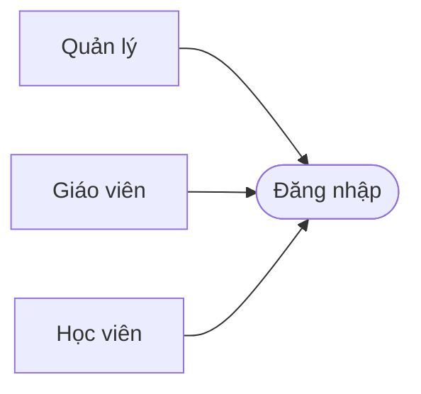

## 2. Đăng xuất

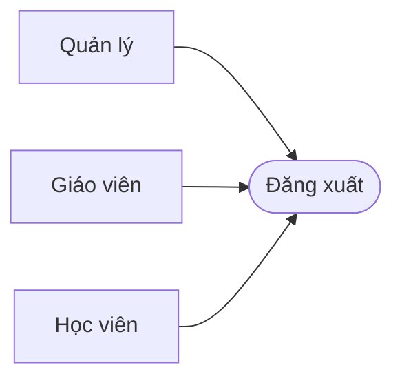

## 3. Quản lý tài khoản cá nhân

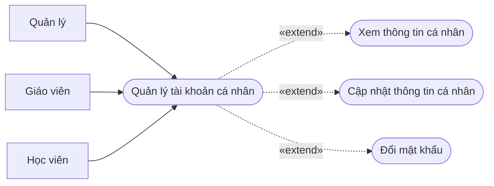

## 4. Quản lý tài khoản người dùng

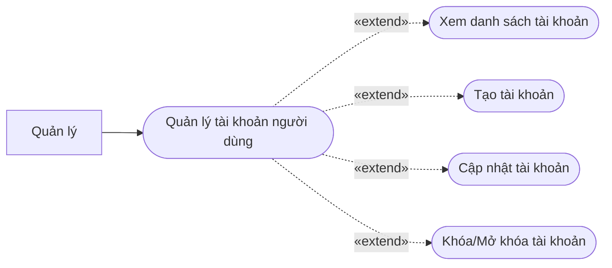

## 5. Phân quyền người dùng

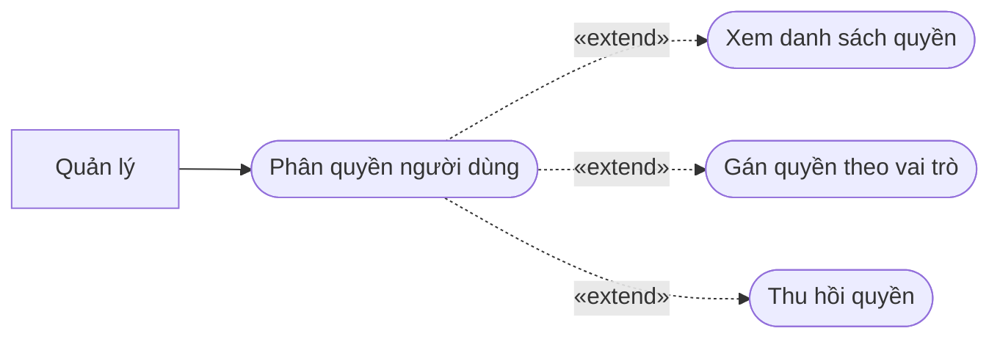

## 6. Quản lý giáo viên

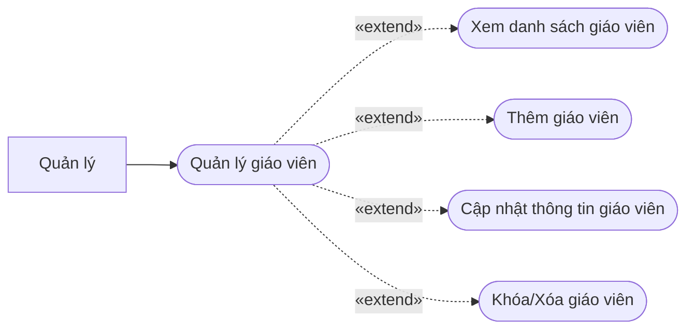

## 7. Quản lý học viên

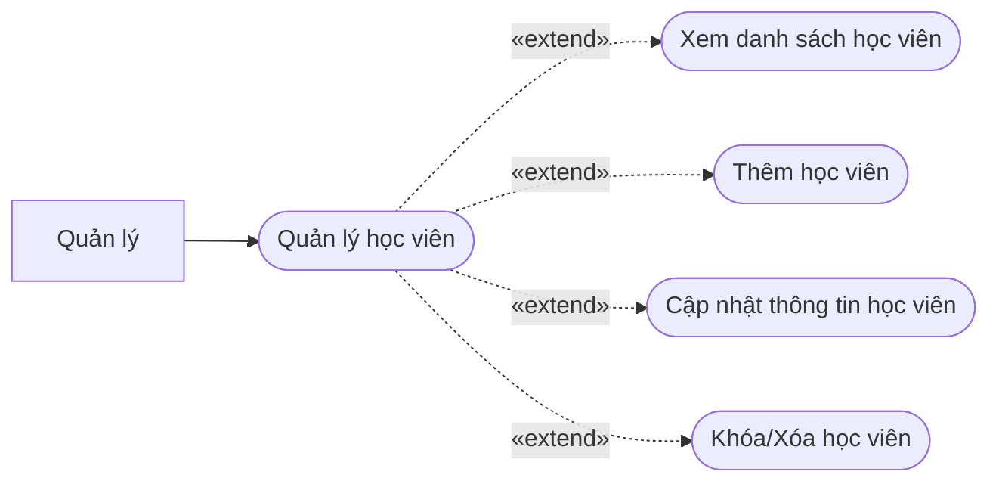

## 8. Quản lý lớp học

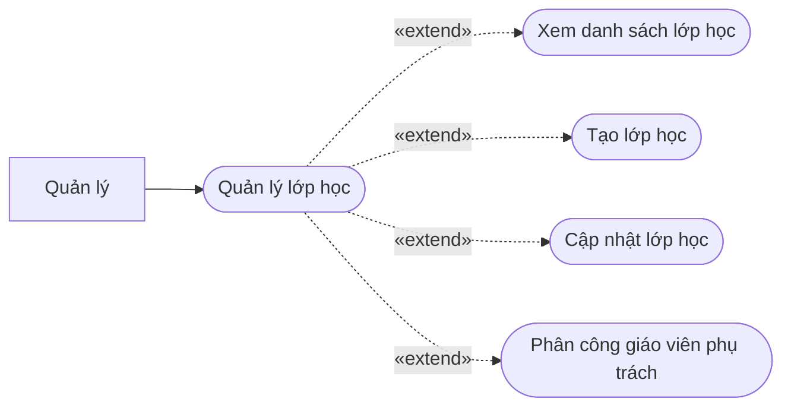

## 9. Quản lý thành viên lớp học

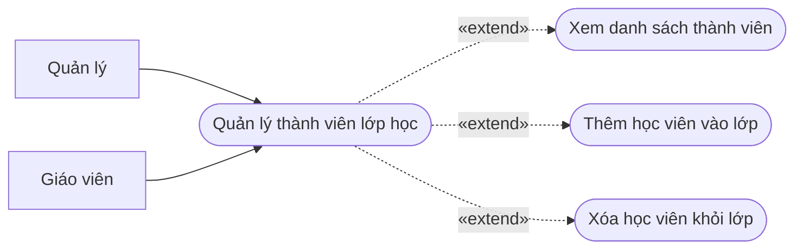

## 10. Xem danh sách lớp học

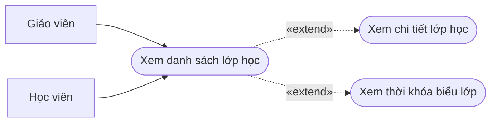

## 11. Quản lý bài tập

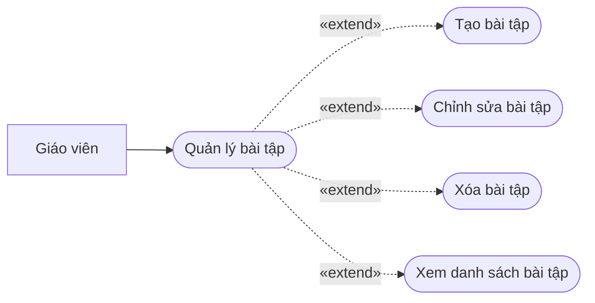

## 12. Tạo bài tập

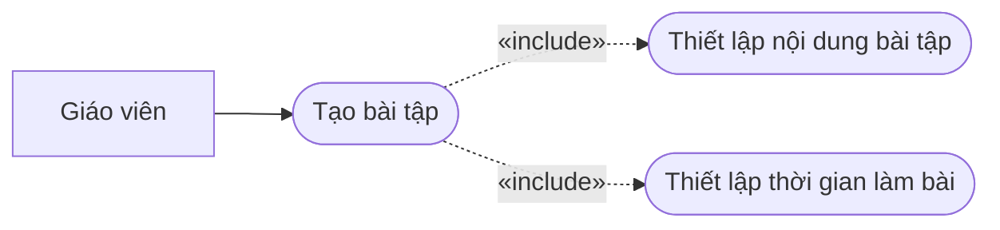

## 13. Mở bài tập

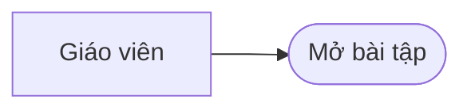

## 14. Khóa bài tập

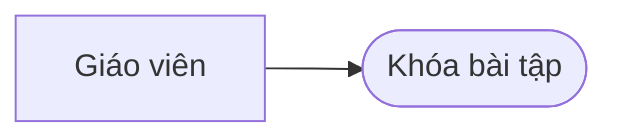

## 15. Xem bài tập

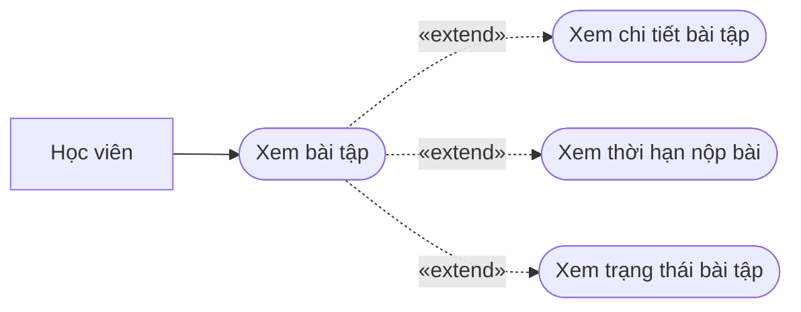

## 16. Làm bài tập viết

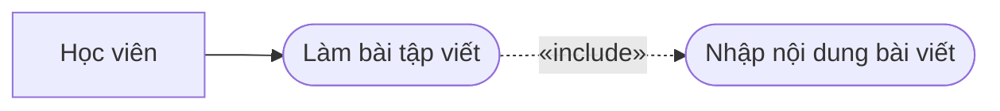

## 17. Làm bài tập nói

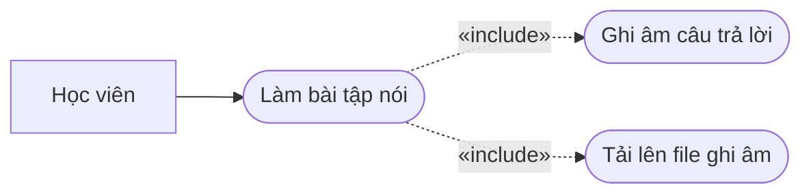

## 18. Làm bài tập đọc

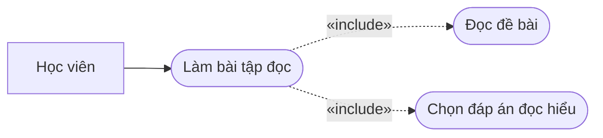

## 19. Làm bài tập nghe

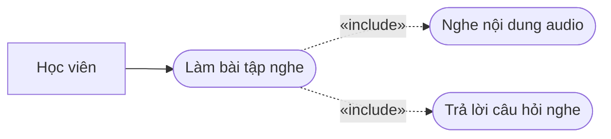

## 20. Nộp bài tập

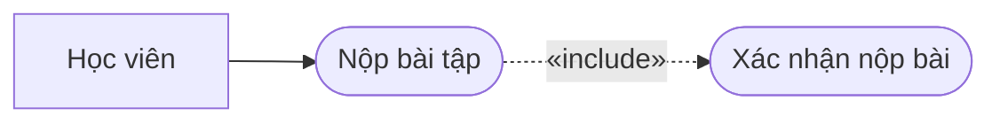

## 21. Xem trạng thái bài làm

```mermaid
flowchart LR
    A1["Học viên"]
    UC(["Xem trạng thái bài làm"])
    A1 --> UC
```

## 22. Chấm bài

```mermaid
flowchart LR
    A1["Giáo viên"]
    UC(["Chấm bài"])
    A1 --> UC
    S1(["Xem bài làm học viên"])
    UC -.->|"«include»"| S1
    S2(["Nhập điểm số"])
    UC -.->|"«include»"| S2
    S3(["Nhập nhận xét"])
    UC -.->|"«include»"| S3
    S4(["Hỗ trợ chấm chữa bài bằng AI"])
    UC -.->|"«extend»"| S4
```

## 23. Hỗ trợ chấm chữa bài bằng AI

```mermaid
flowchart LR
    A1["Giáo viên"]
    UC(["Hỗ trợ chấm chữa bài bằng AI"])
    A1 --> UC
    S1(["Hỗ trợ chấm chữa bài viết bằng AI"])
    UC -.->|"«extend»"| S1
    S2(["Hỗ trợ chấm chữa bài nói bằng AI"])
    UC -.->|"«extend»"| S2
```

## 24. Hỗ trợ chấm chữa bài viết bằng AI

```mermaid
flowchart LR
    A1["Giáo viên"]
    UC(["Hỗ trợ chấm chữa bài viết bằng AI"])
    A1 --> UC
    S1(["Phát hiện lỗi ngữ pháp"])
    UC -.->|"«include»"| S1
    S2(["Phát hiện lỗi từ vựng/chính tả"])
    UC -.->|"«include»"| S2
    S3(["Gợi ý sửa lỗi diễn đạt"])
    UC -.->|"«extend»"| S3
```

## 25. Hỗ trợ chấm chữa bài nói bằng AI

```mermaid
flowchart LR
    A1["Giáo viên"]
    UC(["Hỗ trợ chấm chữa bài nói bằng AI"])
    A1 --> UC
    S1(["Phân tích phát âm"])
    UC -.->|"«include»"| S1
    S2(["Phân tích ngữ pháp và từ vựng"])
    UC -.->|"«include»"| S2
    S3(["Gợi ý cải thiện độ trôi chảy"])
    UC -.->|"«extend»"| S3
```

## 26. Chấm bài đọc

```mermaid
flowchart LR
    A1["Giáo viên"]
    UC(["Chấm bài đọc"])
    A1 --> UC
    S1(["So sánh đáp án"])
    UC -.->|"«include»"| S1
    S2(["Tính điểm tự động"])
    UC -.->|"«include»"| S2
```

## 27. Chấm bài nghe

```mermaid
flowchart LR
    A1["Giáo viên"]
    UC(["Chấm bài nghe"])
    A1 --> UC
    S1(["So sánh đáp án"])
    UC -.->|"«include»"| S1
    S2(["Tính điểm tự động"])
    UC -.->|"«include»"| S2
```

## 28. Xem điểm số

```mermaid
flowchart LR
    A1["Giáo viên"]
    A2["Học viên"]
    UC(["Xem điểm số"])
    A1 --> UC
    A2 --> UC
    S1(["Xem chi tiết điểm theo bài tập"])
    UC -.->|"«extend»"| S1
    S2(["Xem điểm theo kỹ năng"])
    UC -.->|"«extend»"| S2
```

## 29. Xem kết quả học tập

```mermaid
flowchart LR
    A1["Học viên"]
    UC(["Xem kết quả học tập"])
    A1 --> UC
    S1(["Xem tiến độ theo kỹ năng"])
    UC -.->|"«extend»"| S1
    S2(["Xem tiến độ theo lớp học"])
    UC -.->|"«extend»"| S2
```

## 30. Xem bài chữa

```mermaid
flowchart LR
    A1["Học viên"]
    UC(["Xem bài chữa"])
    A1 --> UC
    S1(["Xem nhận xét của giáo viên/AI"])
    UC -.->|"«extend»"| S1
    S2(["Xem đáp án"])
    UC -.->|"«extend»"| S2
    S3(["Xem hướng dẫn sửa bài"])
    UC -.->|"«extend»"| S3
```

## 31. Xem và đánh giá kết quả học viên

```mermaid
flowchart LR
    A1["Giáo viên"]
    UC(["Xem và đánh giá kết quả học viên"])
    A1 --> UC
    S1(["Xem điểm số học viên"])
    UC -.->|"«extend»"| S1
    S2(["Xem bài làm học viên"])
    UC -.->|"«extend»"| S2
    S3(["Nhận xét đánh giá"])
    UC -.->|"«extend»"| S3
```

## 32. Quản lý điểm số

```mermaid
flowchart LR
    A1["Giáo viên"]
    UC(["Quản lý điểm số"])
    A1 --> UC
    S1(["Xem điểm số"])
    UC -.->|"«extend»"| S1
    S2(["Cập nhật điểm số"])
    UC -.->|"«extend»"| S2
    S3(["Xuất bảng điểm"])
    UC -.->|"«extend»"| S3
```

## 33. Theo dõi tiến độ học tập

```mermaid
flowchart LR
    A1["Giáo viên"]
    UC(["Theo dõi tiến độ học tập"])
    A1 --> UC
    S1(["Xem tiến độ theo học viên"])
    UC -.->|"«extend»"| S1
```
